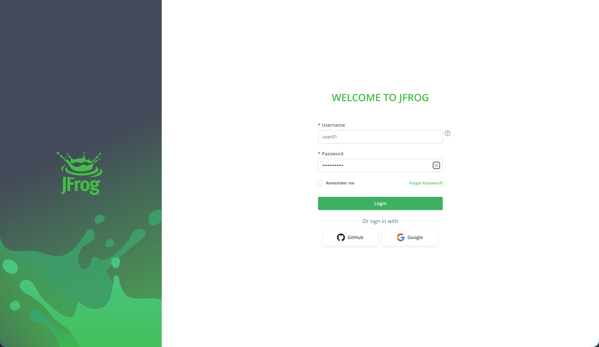
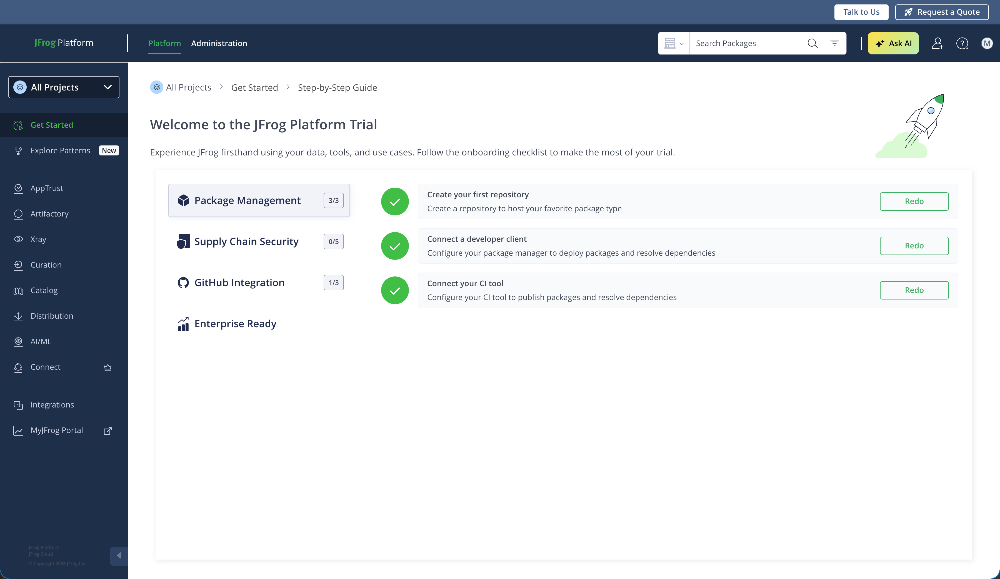
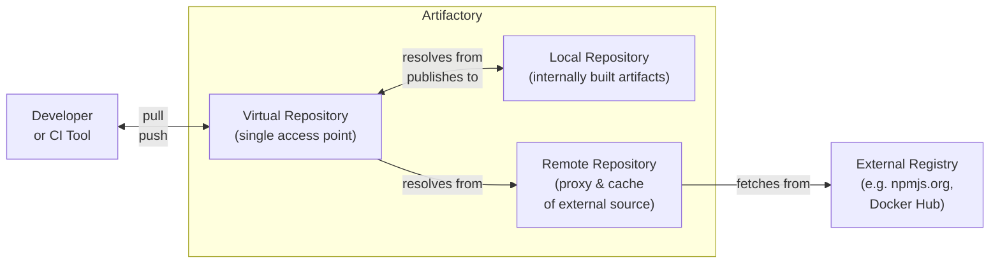

# Artifactory

| < [Previous Section: Home Page](/README.md) | [Next Section: Curation](../02%20-%20Curation/01%20-%20Curation.md) > |
| :--- | ---: |

## Accessing Artifactory

Let's start by getting signed in to Artifactory. Your workshop leader should have provided you with the URL for your JFrog Platform instance and the login credentials.

Enter the URL into your web browser and you should see the Artifactory login page. Use the credentials provided to log in.

Once you have successfully logged in, you should see a Welcome page like below. If you don't, just click the **Getting Started** link at the top of the left-hand navigation menu to access it.

At the top of the page, you'll notice that there are **Platform** and **Administration** tabs. These switch between the two main areas of the JFrog Platform. The **Platform** tab is where most day to day work will be done, while the **Administration** tab is where you can manage system settings, users, repositories and more.

## Understanding Projects

For this workshop, we've created projects for each of you to work in. Projects are a way to organize your work and resources within the JFrog Platform. Each project has its own set of repositories, users, permissions and more. Throughout the workshop, you'll be working within your assigned project to complete the exercises.

> [!IMPORTANT]
> Make sure you are working within your assigned project. You can switch between projects using the dropdown menu at the top of the left-hand navigation menu, as shown below.

## Understanding Repositories

There are three main types of repositories that you'll use most often in Artifactory:

1. **Local Repositories** - These are repositories that are hosted within your Artifactory instance. They are used to store your own artifacts, such as those generated by your builds or manually uploaded.
2. **Remote Repositories** - These are repositories that proxy external repositories, such as those hosted by third-party providers like Maven Central or npm Registry. They allow you to access and cache artifacts from these external sources while maintaining control over the artifacts that are used in your builds.
3. **Virtual Repositories** - These are repositories that aggregate multiple local and remote repositories into a single logical repository. They provide a unified view of the artifacts stored across multiple repositories and allow you to manage access and permissions more efficiently.

It's considered a best practice to use virtual repositories as the main access point for your builds and development work. This allows you to abstract away the underlying remote and local repository structure and provides a single point of access for your artifacts.

## Creating Repositories

Let's create a repository for npm packages. Click on the **Administration** tab at the top of the page, then click on **Repositories** in the left-hand navigation menu. This will take you to the Repositories page where you can manage all of your repositories.
