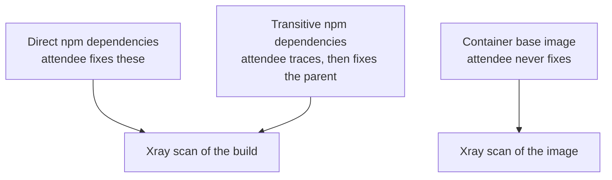

# JFrog Foundations: Build Plan (Phase 0)

Proposed structure, sample application design, devcontainer approach and
per-lab format assignment, for review before any build work starts.

Everything below is a proposal. Section 12 lists the open questions that
need an answer, and section 11 lists the places where I am deliberately
diverging from `SPEC.md` or from the reference implementations, with reasons.

---

## 1. What I read

- `SPEC.md` in full.
- `Azure/intro-to-intelligent-apps`, cloned and inspected: root README agenda
  pattern, `labs/NN-name/` layout, `.devcontainer/` with features, `docs/`.
- `markwme-org/frogstatus` via the GitHub API: `infra/Dockerfile`,
  `package.json`, `scripts/dependency-states.json`, `.github/workflows/ci.yml`,
  `.github/workflows/frogbot.yml`.
- The two drafts already in this repository's history (commit `7bc56a9`):
  the root README module outline and the partial Artifactory chapter.

Three things carried forward from the existing drafts, since they are already
right and the workshop should not lose them:

- The four-part module outline in the draft root README matches `SPEC.md`
  section 10. Keeping it.
- The repository-type explanation and its Mermaid diagram in the draft
  Artifactory chapter are good. Migrating both into `labs/01-artifactory/`,
  with one correction: the draft labels the virtual-to-local edge
  `resolves from / publishes to` and the virtual-to-remote edge
  `resolves from`. `SPEC.md` section 8.5 requires `aggregates`. Changing it.
- The `> [!IMPORTANT]` callout style from commit `7bc56a9` renders on GitHub
  and is the style `SPEC.md` section 3.4 asks for on `VERIFY:` flags. Adopting
  it as the house callout style.

The existing `01 - Setup and Configuration/` tree uses spaces in directory
names, which `SPEC.md` section 2 forbids. Phase 1 replaces it with `labs/`.
The three existing screenshots are still useful and were recovered into
`labs/00-setup/images/`, not `labs/01-artifactory/`: signing in and selecting a
project turned out to belong in lab 00 rather than lab 01.

---

## 2. Repository structure

Follows `SPEC.md` section 4, with the additions marked.

```
/
  README.md                        Agenda, outcomes, module index
  CLAUDE.md                        Already present, extended in Phase 1
  PLAN.md                          This file
  CONTRIBUTING.md                  Includes the no-dependency-bumps rule
  LICENSE                          MIT for now, see "Still open" in section 12
  .env.example
  .gitignore
  .dockerignore                    (at app level, see section 4)
  .devcontainer/
    devcontainer.json
    Dockerfile                     ADDED, see section 5
    postCreate.sh
  .github/
    workflows/
      ci.yml                       Built up across lab 07
      frogbot-pr.yml
      frogbot-scan.yml
    dependabot.yml                 Disabled
  labs/
    00-setup/
    01-artifactory/
    02-curation/
    03-xray/
    04-cli/
    05-ide/
    06-mcp/                        Optional
    07-github-actions/
    08-frogbot/
    09-artifactory-ui/
    10-xray-ui/
    11-curation-ui/
  apps/
    node-dashboard/                The Node app, see section 4
  docs/
    instructor-guide.md
    tenant-prerequisites.md
    repo-setup.md
    oidc-setup.md
    glossary.md
    verification-checklist.md
    screenshot-checklist.md
    assumed-knowledge.md           ADDED, required by SPEC section 8
    troubleshooting.md
    codespaces-troubleshooting.md  ADDED, required by SPEC section 5
    timings.md
  scripts/
    setup.sh
    verify.sh
  provisioning/
    README.md
    prep.sh
```

Each `labs/NN-*/` folder carries its own `README.md` and an `images/`
subfolder. Labs that need supporting assets (a workflow fragment, a policy
JSON) keep them in the lab folder, not in a shared directory, so a lab can be
lifted out without breaking anything else.

### Modularity rules

`SPEC.md` section 10 says the outline will change, and section 8 anticipates
optional modules for Release Bundles, Distribution and AppTrust plus a second
sample application. Three rules make that cheap:

1. **Lab numbers are permanent.** If a lab is dropped for a customer, its
   number is retired, not reused, and the numbers do not shift. Renumbering
   breaks every inbound link in the repository.
2. **Links point at lab folders, never into another lab's headings.** A lab
   links to `../04-cli/README.md`, never to `../04-cli/README.md#step-3`.
   Anchor links break silently when the target lab is rewritten.
3. **Every lab declares its prerequisites in its header and links back to
   them.** The `Next` section is the only forward link. That makes the
   dependency graph explicit and lets the instructor see what a removal costs.

Optional labs are marked `(optional)` in the root README and in their own
header, and no required lab lists an optional lab as a prerequisite.

---

## 3. Vulnerability layering and the remediation sequence

This is the load-bearing design decision in the workshop, so it comes before
the application design rather than after it. `SPEC.md` section 6.1 warns that
remediation is one-way: once an attendee fixes a dependency, every later lab
loses it as teaching material.

Three layers, per `SPEC.md` section 6.1:



### Verified dependency set

I checked every candidate in `SPEC.md` section 6.1 against the JFrog Catalog.
All eight are genuinely vulnerable at the suggested versions. Counts are what
the Catalog returned, truncated at ten per package:

| Package | Version | Severities returned | Role |
| --- | --- | --- | --- |
| `axios` | 0.21.0 | 3 Critical, 7+ High | Direct, first remediation |
| `lodash` | 4.17.15 | 1 Critical, 2 High, 3 Medium | Direct, IDE remediation |
| `jsonwebtoken` | 8.5.1 | 2 High, 1 Medium | Direct, never fixed |
| `moment` | 2.29.1 | 2 High | Direct, challenge remediation |
| `tar` | 4.4.8 | 10+ High | Direct, carrier of the transitive Critical |
| `node-fetch` | 2.6.0 | 2 Medium | Direct, challenge remediation |
| `express` | 4.16.0 | 2 Medium | Direct, never fixed |
| `minimist` | 1.2.5 | 1 Critical | **Transitive**, via `tar` to `mkdirp@0.5.5` |
| `highcharts` | latest | none relevant | Direct, **license** trip for Curation |

Two deliberate choices in that table.

**`minimist` is transitive, not direct.** `SPEC.md` lists it as a direct
candidate. Leaving it out of `package.json` and letting it arrive through
`tar@4.4.8` to `mkdirp` gives lab 10's impact analysis a real two-hop trace to
follow, and gives lab 07 a Critical that cannot be fixed by editing the line
that caused it. That is a much better exercise than a direct pin.

The exact version matters here, and the first version of this plan had it
wrong. `tar@4.4.8` declares `mkdirp@^0.5.0`, which **resolves today to
`mkdirp@0.5.6`, and that pulls `minimist@1.2.8`, which is patched.** Resolved
against late 2020 instead, `mkdirp@0.5.5` pulls `minimist@1.2.5`, which carries
CVE-2021-44906 at Critical. The transitive Critical therefore exists only if
the dependency tree is resolved as it stood at the time, which section 4 covers
under lock file generation. Verified via the resolved graph on `deps.dev` and
the JFrog Catalog.

**`highcharts` is the non-CVE Curation trip.** The Catalog reports its license
as `LicenseRef-jfrog-highcharts`, a non-OSI license reference rather than a
permissive SPDX identifier. A Curation policy that allows only an approved
license list blocks it on license grounds with no CVE involved, which is
exactly what `SPEC.md` section 6.1 asks for. It is also a charting library, so
it belongs in a status dashboard without contrivance. `request@2.88.0`
(Apache-2.0, last published February 2020) is the second non-CVE candidate,
used in lab 06 as a package the attendee evaluates but never installs, since
an unmaintained-package condition catches it on age rather than license.

### The remediation ledger

Xray policy configured in lab 03 fails on **Critical only**, direct and
transitive. Everything below Critical is a finding, not a violation. That
choice does two jobs: it makes the lab 07 green build achievable, and it makes
`SPEC.md` section 6.2's second point (scan surface is wider than enforcement
surface) true of the application itself, not only of the base image.

| Dependency | Fixed in | Kept alive for |
| --- | --- | --- |
| `axios` 0.21.0 | 04, guided | |
| `node-fetch` 2.6.0 | 04, challenge | |
| `lodash` 4.17.15 | 05, guided, via the IDE | |
| `moment` 2.29.1 | 05, challenge | |
| `minimist` 1.2.5 (transitive) | 07, by bumping `tar` | Impact analysis in 07 |
| `tar` 4.4.8 | 07, as the carrier above | |
| `express` 4.16.0 | never | 09, 10: findings that are not violations |
| `jsonwebtoken` 8.5.1 | never | 10: scan results, SBOM, impact analysis |
| `highcharts` | never, waived | 02 block, 11 waiver approval |
| Base image OS packages | never | 07 reveal, 10 Xray UI |

Traced end to end, no lab depends on a vulnerability an earlier lab removed.
Two consequences worth stating out loud:

- **Lab 07 is where the build turns green**, and it turns green because the
  attendee clears the last Critical, which happens to be transitive. The
  sequence in that lab is therefore: build fails, trace the Critical to
  `mkdirp` under `tar`, bump `tar`, build passes, publish build info, scan
  build, build image, scan image, and only then look at the image results. The
  base image findings arrive after a green build, which is the moment
  `SPEC.md` section 6.2 is asking for.
- **`highcharts` spans labs 02 and 11.** In lab 02 the attendee's own policy
  blocks their own install, which is an uncomfortable and instructive moment.
  They resolve it by requesting a waiver rather than by removing the package,
  which leaves a pending waiver request for lab 11 to approve. This
  intentionally lets a Curation policy break `npm install` mid-workshop, and
  is confirmed as the design. See R4.

---

## 4. Sample application

`apps/node-dashboard/`. The folder name is ecosystem-tagged so the second
application slots in alongside as `apps/python-service/` without any lab
having to change a path.

### What it is

A small Express service that renders a status dashboard for a handful of
fictional internal services, plus a JSON API. Server-rendered HTML, no
bundler, no frontend framework, no build step beyond `node --check`. The
point is that the attendee never has to debug the application, only its
dependencies.

| Route | Purpose | Dependency it justifies |
| --- | --- | --- |
| `GET /` | Dashboard page, chart of recent uptime | `express`, `highcharts`, `moment` |
| `GET /api/status` | Aggregated status JSON | `lodash`, `axios` |
| `GET /api/upstream` | Polls a configured upstream | `node-fetch` |
| `GET /api/admin` | Token-protected admin view | `jsonwebtoken` |
| `GET /api/diagnostics` | Returns a `.tar.gz` support bundle | `tar` |

`axios` and `node-fetch` both being present is mildly redundant. It is also
what real applications look like when different modules were written at
different times, and it gives lab 04 a guided remediation and a challenge
remediation in the same ecosystem. I would rather state the reason in the
application README than invent a purer justification.

### Rules for the app

- All direct dependencies pinned to exact versions. No caret, no tilde.
- `package-lock.json` **is committed.** Without it the transitive set drifts
  and the transitive Critical is not guaranteed, which would break lab 07. This
  also makes `npm ci` usable in the devcontainer prebuild.

### Lock file generation

The lock file is the single most load-bearing file in the sample application,
because it, not `package.json`, is what fixes the transitive vulnerabilities the
later labs depend on. Three constraints apply to producing it, and together they
determine exactly one method.

1. **It must resolve from public npm.** A lock file resolved through
   Artifactory embeds the tenant hostname in every `resolved` URL, and this
   repository may never contain a real tenant URL. Public URLs are also simply
   correct for it: attendees fork this repository and resolve from public npm
   until lab 07 re-points them at Artifactory.
2. **It cannot be produced on the maintainer's machine.** That machine routes
   npm to internal Artifactory instances, and its network blocks the public
   registry outright, for metadata reads as well as installs.
3. **It must be resolved as at late 2020**, or the transitive vulnerabilities
   silently patch themselves, as the `minimist` case above shows.

The method, run **inside a Codespace**, which is a clean environment with no npm
configuration:

```bash
bash scripts/regenerate-lockfile.sh
```

That wraps `npm install --before=2020-11-01`, and it exists as a script rather
than an instruction because a fourth constraint emerged in testing: **npm seeds
resolution from the existing `node_modules`.** The devcontainer installs
dependencies at create time, so by the time anyone runs the command the tree is
already populated with current versions, those satisfy the caret ranges, nothing
is re-resolved and `--before` silently does nothing. The first attempt produced
`minimist@1.2.8` for exactly this reason. The script removes the tree first,
refuses to run against a non-public registry, and verifies the resulting
transitive versions rather than trusting them.

`--before=2020-11-01` sits just after the newest direct pin, `axios@0.21.0`
from October 2020. Every direct pin therefore still resolves, and the whole
transitive tree is frozen period-accurate to that date. The result is not a
contrivance: it is what a real repository that nobody has touched since 2020
actually looks like, which is the point.

Once generated and committed, `npm ci` reproduces it exactly and the date no
longer matters.
- No reset script, no toggle script, no dual dependency sets. `SPEC.md`
  section 6.1 is explicit and the `frogstatus`
  `scripts/dependency-states.json` pattern is deliberately **not** copied.
- `apps/node-dashboard/README.md` carries the dependency table: package,
  shipped version, CVE identifiers, severity, direct or transitive, resolving
  version, and which lab remediates it. It is the instructor's answer key.

### Container image

`apps/node-dashboard/Dockerfile`, multi-stage, plus `.dockerignore`.

- Build stage: `node:22-bookworm-slim`, installs dependencies. In lab 07 this
  stage resolves through Artifactory; before then it resolves from public npm.
- Runtime stage: **`node:16.20.2-bullseye-slim`**, pinned by patch. Copies
  `node_modules` and source, no toolchain, no npm cache.

This is a deliberate divergence from `frogstatus`, which uses
`node:22-alpine`. Alpine is musl-based with a very small package set and
yields few OS-level findings, so it cannot carry the layer three story. A
pinned Debian 11 tag on an end-of-life Node line gives a credible set of
findings in Debian packages (`glibc`, `openssl`, `zlib`, `perl-base` and
similar), and critically those findings appear in Xray as **Debian package
components, not npm components**, which is the unambiguous provenance
`SPEC.md` section 6.2 says actually matters. Verify in Phase 2.

Fallback if Phase 2 measurement shows the finding set is too thin: move to
non-slim `node:16.20.2-bullseye`, then to a `buster` tag. Slim is the starting
point because the image must build in under two minutes in a Codespace, and I
would rather start inside that budget and add findings than start outside it.

---

## 5. Devcontainer and Codespaces

Node 22 LTS, docker-in-docker, GitHub CLI, pinned JFrog CLI, and a structure
built around prebuilds.

```
.devcontainer/
  devcontainer.json
  Dockerfile        Pinned JFrog CLI install, baked into the prebuild
  postCreate.sh     Banner, verify.sh, and a guard for the unprebuilt path
```

- Base: `mcr.microsoft.com/devcontainers/javascript-node:1-22-bookworm`.
- Features: `docker-in-docker`, `github-cli`.
- **JFrog CLI is installed in the Dockerfile from a version-pinned release
  URL**, `https://releases.jfrog.io/artifactory/jfrog-cli/v2-jf/<VERSION>/jfrog-cli-linux-amd64/jf`,
  with the version in a build arg. This satisfies `SPEC.md` section 5's
  requirement not to `curl | sh` an unpinned latest, and a Dockerfile is baked
  into a prebuild where a `postCreate` step is not.
- Extensions: `JFrog.jfrog-vscode-extension`, `ms-azuretools.vscode-docker`,
  `dbaeumer.vscode-eslint`, `esbenp.prettier-vscode`, `yzhang.markdown-all-in-one`.
- The container must come up with no JFrog credentials present. Nothing in the
  devcontainer touches `JF_URL` or any token. Lab 00 configures credentials.

### Prebuild placement, and a divergence

`SPEC.md` section 5 asks `postCreate.sh` to install the sample app
dependencies, and in the same paragraph asks that expensive work go somewhere
a prebuild bakes. Those pull in opposite directions: GitHub prebuilds bake
`onCreateCommand` and `updateContentCommand`, but run `postCreateCommand`
per-Codespace.

Proposal: `npm ci` for the sample apps goes in `updateContentCommand`, so a
prebuilt Codespace starts with `node_modules` already present.
`postCreate.sh` prints the welcome banner naming lab 00 and runs
`scripts/verify.sh`, and begins with an idempotent guard that runs `npm ci`
only if `node_modules` is missing. A fork with no inherited prebuild still
works, it is just slower, which is the case `SPEC.md` section 5 warns about.

`docs/repo-setup.md` documents enabling prebuilds, that they are configured
per branch and per region, that a fork does not inherit the upstream prebuild,
and that the number to measure is the attendee's path, not the maintainer's.

`docs/codespaces-troubleshooting.md` covers proxy blocking of `github.dev`,
free-account quota exhaustion, container rebuild, and port forwarding
visibility.

---

## 6. Lab format assignment

The test from `SPEC.md` section 8.1: does the attendee already have enough
knowledge to have a realistic chance of working this out from documentation?
Every guided lab closes with a challenge, per section 8.1.

| Lab | Format | Justification |
| --- | --- | --- |
| `00-setup` | Guided, **no closing challenge** | Mandated by section 8.4. Nothing here is a transferable mechanic to reapply, and a challenge at minute five costs schedule for no learning. Confirmed. |
| `01-artifactory` | Guided + challenge | An interface you have never seen cannot be deduced. Challenge: stand up the Docker repository set unaided, having just done the npm set. Same mechanic, new package type, which is the pattern section 8.1 calls highest value. |
| `02-curation` | Guided + challenge | Curation is a product the attendee has almost certainly never heard of. Guided: an approved-license policy scoped to their own repositories. Challenge: the newly-published-package scenario from section 8.2, which lands on a maturity condition. |
| `03-xray` | Guided + challenge | Policy, watch, rule and violation are four new terms with a non-obvious relationship. Guided: the Critical-severity security policy and watch. Challenge: a license policy on the same watch. |
| `04-cli` | Guided + challenge | Senior attendees know CLIs, but `jf` subcommand structure and the config model are not guessable. Guided: `jf c add`, `jf audit`, remediate `axios`. Challenge: `jf curation-audit` against their own tree, then remediate `node-fetch`. |
| `05-ide` | Guided + challenge | An extension's panels are pure discovery, and Contextual Analysis is a concept, not just a view. Guided: scan, read severities, remediate `lodash` from the editor. Challenge: remediate `moment` and explain why one finding is marked not applicable. |
| `06-mcp` (optional) | Guided setup + challenge | MCP server configuration is undiscoverable. Once connected, "should we adopt this package" is a real question with a real answer. Challenge: evaluate `request@2.88.0` against their own Curation policy and write the recommendation. |
| `07-github-actions` | Mixed, weighted challenge | Attendees know GitHub Actions, so the CI mechanics are challenge material. The JFrog CLI package alias is not discoverable and is the lab's headline, so it stays guided. Build info, build scan, image build and Job Summary are added as challenges with the previous stage as the worked example. |
| `08-frogbot` | Challenge | By here they have configured `setup-jfrog-cli`, secrets and a workflow. Frogbot is well documented and the pattern is familiar. Guided only for the repository settings that let it comment on pull requests, which are a GitHub-side gotcha rather than a learning objective. |
| `09-artifactory-ui` | Challenge | They saw the UI in lab 01 and the platform now holds their own builds. "Find which repository served this exact version" beats a click-by-click tour. |
| `10-xray-ui` | Short guided orientation + challenge | Divergence from section 8.4's "mostly challenge". Finding where scan results live for a build versus an artifact versus a release is genuinely non-obvious and a room stuck on navigation learns nothing. One guided orientation of about five minutes, then impact analysis, base image attribution and SBOM export as challenges. |
| `11-curation-ui` | Challenge | They created the policy in lab 02 and left a waiver request pending. Approving their own waiver and reading their own audit trail is discoverable and closes the loop. |

The arc that produces: labs 00 to 03 mostly guided, 04 to 06 mixed, 07 to 08
weighted to challenge, 09 to 11 almost entirely challenge. That matches
section 8.4.

Every challenge ships the four required parts: scenario in business voice,
explicit success criteria, two or three documentation links, a stated timebox,
and a full collapsible `<details>` solution with text saying that reading it
is a legitimate exit.

---

## 7. Multi-attendee isolation

Projects do the work, one per attendee, keyed `user01` upward.

- Lab 00 establishes `JF_PROJECT` as an environment variable and confirms
  access. Every later lab works inside it. Repository names carry the project
  key prefix automatically.
- Teardown is deleting the project. No cleanup scripts anywhere, and labs are
  written on the assumption that nothing needs to be reversible. Lab 00 tells
  the attendee this explicitly, since it changes how freely they experiment.

### Curation, which does not support Projects

- Policy names carry a manual attendee prefix, `user01-approved-licenses`.
- Every policy is scoped to the attendee's own repositories. Lab 02 makes the
  attendee set the scope as an explicit, checkpointed step rather than
  mentioning it in passing, with a `> [!IMPORTANT]` callout stating what an
  unscoped policy does to the rest of the room.
- The lab names the inconsistency rather than hiding it. An attendee who has
  just spent three labs inside a project boundary will notice, and explaining
  why is better than being caught.

Attendees will hold whatever tenant-level Curation permission turns out to be
necessary, up to and including platform administrator. That is settled as far
as this plan is concerned, but it has a consequence for how the labs are
written. See R1.

Confirmed against a live instance during Stage C verification: **no curation
action appears in any of the nine predefined project roles.** So this is not a
matter of picking the right project role. Curation genuinely sits outside the
project boundary today.

### This constraint has a known expiry date

**Project scoping for Curation is on the JFrog roadmap, expected within one or
two months of August 2026.** Until it lands, Curation is done at the tenant
administration level, with the naming and repository-scoping discipline above
doing the isolation work by convention.

That changes how labs 02 and 11 should be built. Write them so the switch is a
small, localized edit rather than a rewrite:

- Keep every Curation instruction in labs 02 and 11 only. Do not let
  tenant-level Curation assumptions leak into other labs.
- Treat the attendee prefix on policy names and the explicit repository scoping
  as **one clearly marked block** in each lab, so it can be replaced by "work
  inside your project" when project scoping arrives.
- Say plainly in the lab text that this is a current platform limitation rather
  than a design choice, and that it is expected to change. An attendee who has
  spent three labs inside a project boundary will notice the inconsistency, and
  "this is on the roadmap" is a better answer than silence.
- `docs/instructor-guide.md` gets a dated note, so whoever picks this up in six
  months knows to check whether the workaround is still needed.

---

## 8. Provisioning

`provisioning/prep.sh`, JFrog CLI based, with its own README. A single
readable script with clear output and idempotent behavior, per `SPEC.md`
section 9. No Terraform: an SE fixing this fifteen minutes before a workshop
should not need a state file.

Scope, and nothing beyond it:

1. Create `N` projects, `user01` to `userNN`, count from a parameter.
2. Create the matching users.
3. Assign each user to their project with a role that lets them create
   repositories, policies and builds inside it.
4. Emit a handout: a table of identifier, project key, username and initial
   credential, written to `provisioning/out/` which is gitignored.

Not in scope, because every one of these is workshop content: repositories,
Curation policies, Xray policies and watches, builds, access tokens for CI.
`docs/tenant-prerequisites.md` stays short and points at
`provisioning/README.md` for detail.

I will flag rather than absorb any case where a lab would run more smoothly
with something pre-created. The CI access token was the one candidate that
looked borderline, and it stays out: the attendee creates it in lab 07, with
`jf rt ping` as the immediate checkpoint. See R2.

---

## 9. CI integration

- Hands-on path uses a **static access token** in `setup-jfrog-cli`, because
  the GitHub environment on the day is unpredictable.
- `docs/oidc-setup.md` is the full production walkthrough, both the JFrog
  identity mapping and the GitHub workflow permissions, explaining that it
  removes a long-lived credential from repository secrets. Lab 07 links to it
  at the point the token is configured, not in a footnote.
- The classroom-versus-production split is applied beyond OIDC. Every lab that
  takes a shortcut carries a short `In production` note naming the difference
  and pointing at the right pattern. Candidates so far: the static token, the
  attendee-scoped Curation policy that would be an organization policy,
  manually created repositories that would be Terraform or config-as-code, and
  the `--fail=false` scan flags that exist so a class demo survives.
- `ci.yml` is built up in stages across lab 07 in the order in section 3, so
  the build is passing and apparently finished before the image scan is read.
- Frogbot: `frogbot-pr.yml` on `pull_request_target` and `frogbot-scan.yml` on
  a schedule plus `push`, following the `frogstatus` workflow shape.
- Every workflow carries `workflow_dispatch`.
- Every workflow starts with a preflight step that checks the required
  secrets and variables are present and fails with a readable message naming
  the missing one. This is cheap and it prevents the worst classroom failure
  mode, an authentication stack trace on a projector.

---

## 10. Writing for a newcomer

- Every JFrog term defined inline on first use, and present in
  `docs/glossary.md`: repository types, virtual repository, build info, watch,
  policy, violation, waiver, project, project key, curation policy and
  condition, SCA, SAST, Contextual Analysis, SBOM, release bundle.
- Adjacent tooling is not assumed either. npm and Git are fair. Docker
  multi-stage builds, GitHub Actions syntax and OIDC each get a short concept
  block at first use.
- `docs/assumed-knowledge.md` maintained per lab as the labs are written, not
  reconstructed at the end.
- Unverifiable UI navigation is written as a best guess, flagged with
  `> [!IMPORTANT]` and `VERIFY:`, and logged in
  `docs/verification-checklist.md`.
- Screenshots use the `<!-- SCREENSHOT: path ... Capture: ... -->` comment
  form and are logged in `docs/screenshot-checklist.md`. Challenge labs get
  screenshots only inside solution blocks, since a screenshot of the
  destination gives away the answer.

---

## 11. Deliberate divergences from the spec

Each of these is a place I am proposing to do something other than what
`SPEC.md` or a reference repository says. Flagging rather than absorbing.

| # | Divergence | Reason |
| --- | --- | --- |
| D1 | `minimist` becomes transitive rather than a direct dependency | Gives lab 07 and lab 10 a genuine two-hop trace. Section 3. |
| D2 | Runtime base image is Debian 11 based, not `node:22-alpine` as in `frogstatus` | Alpine yields too few OS findings and blurs provenance. Section 4. |
| D3 | Sample app `npm ci` moves from `postCreate.sh` to `updateContentCommand` | Only the latter is baked into a prebuild. `postCreate.sh` keeps an idempotent guard so the unprebuilt fork path still works. Section 5. |
| D4 | `.devcontainer/Dockerfile` added, not in the section 4 tree | Needed to pin the JFrog CLI version into the prebuilt image. Section 5. |
| D5 | `00-setup` has no closing challenge | Section 8.4 makes it fully guided, which conflicts with section 8.1's every-guided-lab rule. Approved. |
| D6 | `10-xray-ui` gets a short guided orientation | Section 8.4 weights Part 4 to challenge. Locating scan results is navigation, not reasoning. Section 6. |
| D7 | `docs/assumed-knowledge.md` and `docs/codespaces-troubleshooting.md` added to the tree | Required by sections 8 and 5, absent from the section 4 listing. |
| D9 | Devcontainer uses Node 22 LTS, not the Node 20 LTS named in section 5 | Node 20 reached end of life in April 2026 and is no longer a maintained variant of the base image, so it receives no security patches. An unpatched base undermines the credibility of a supply chain security workshop. Approved 2026-08-27. |
| D8 | Xray policy fails on Critical only | Makes the lab 07 green build reachable and makes findings-versus-violations true of the app, not only the base image. Section 3. |

---

## 12. Resolved decisions

All eight open questions from the Phase 0 review are answered. This section is
the record, so a later session does not reopen them.

| # | Question | Decision |
| --- | --- | --- |
| Q1 | `00-setup` closing challenge | **No challenge.** Section 8.1's every-guided-lab rule does not apply to lab 00. |
| Q2 | May a Curation policy break `npm install` mid-workshop | **Yes, leave as designed.** Ship `highcharts`, let the attendee's own license policy block their own install in lab 02, resolve by waiver, approve in lab 11. To be reviewed against how it behaves in practice on a real delivery. |
| Q3 | Curation permissions for attendees | **Assume a fix exists**, up to and including platform administrator if that is what it takes. Not a blocker for the build. |
| Q4 | CI access token | **Project-scoped token, created by the attendee in lab 07**, with `jf rt ping` as the validation step. Correct later if the scope proves insufficient. |
| Q5 | `express@4.16.0` contributing only Medium findings | **Fine as designed.** |
| Q6 | Lab 06 in the day | **Optional, and not assumed by anything.** An AI coding agent may not be available on the day depending on the customer's setup. |
| Q7 | Frogbot in a personal fork | **Keep as designed.** Configuring Frogbot is itself part of what the lab teaches. |
| Q8 | The `01 - Setup and Configuration/` draft | **Free to mine.** It was a manual first attempt, deleted to give a clean slate. Recover anything useful. |

### Residual risks these answers create

Four consequences that need carrying into later phases rather than
rediscovering.

**R1. Platform admin weakens the isolation story (from Q3).** If attendees hold
platform administrator, Projects organize their work but no longer *enforce*
the boundary. An attendee can wander into, or delete, another attendee's
project. Consequences: lab 00 gets a `> [!IMPORTANT]` callout naming the
attendee's own project key and saying to stay inside it;
`docs/instructor-guide.md` gets a note that the permission level is
deliberately generous and why; and no lab step is written in a way that reads
naturally if you are in the wrong project, so the checkpoints catch it early.

**R2. Project-scoped token scope is unverified (from Q4).** `jf build-scan`,
`jf docker push` and `jf docker scan` may need broader scope than a
project-scoped token grants. This goes into
`docs/verification-checklist.md` as a live-tenant check with a named fallback,
rather than being discovered in front of a room. Lab 07's troubleshooting
section covers the failure explicitly, since an insufficient-scope error looks
like an authentication error.

**R3. Lab 06 must not be the only place a concept appears (from Q6).** Because
an AI coding agent may be unavailable, nothing taught only in lab 06 can be
load-bearing. Checking a candidate package against Curation policy before
committing it is therefore also reachable through `jf curation-audit` in lab
04, and lab 06 becomes the more ergonomic route to a capability the attendee
already has rather than the sole route to it. Lab 06 is also written host
agnostically rather than assuming one particular agent.

**R4. The lab 02 block needs a visible exit (from Q2).** An attendee whose own
policy is blocking their own install, possibly having scoped it wrongly, must
be able to get unstuck without the instructor. Lab 02's troubleshooting section
and `docs/troubleshooting.md` both cover it: how to tell a Curation block from
a network failure, how to read the block message, and the two legitimate exits,
waiver request or policy correction.

### Still open

**The repository license.** `LICENSE` is MIT, chosen to match the reference
workshop. Mark is confirming the correct choice with JFrog's open source team.
Not blocking any build phase: it is a single file swap, and the only other
place the license is named is the last line of the root README. Tracked as A5
in `docs/verification-checklist.md`.

---

## 13. What Phase 1 will produce

For clarity on what I would build next, if this plan is approved:

Repository skeleton, `.devcontainer/` with Dockerfile and `postCreate.sh`,
`scripts/setup.sh` and `scripts/verify.sh`, `provisioning/prep.sh` with its
README, root `README.md` with a clearly marked placeholder agenda, extended
`CLAUDE.md`, `CONTRIBUTING.md`, `LICENSE`, `.env.example`, `.gitignore`,
`.github/dependabot.yml` disabled, `docs/repo-setup.md`,
`docs/tenant-prerequisites.md`, `docs/codespaces-troubleshooting.md`, and
`labs/00-setup/`.

Independently testable as `SPEC.md` section 11 requires: prep script against a
trial instance, then fork, then Codespace launch, ending at a verified
environment. One commit per unit, conventional messages.

No timings anywhere except explicitly marked placeholders, per section 11
Phase 8.
