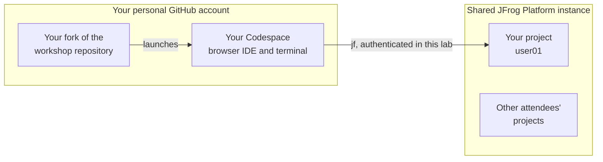
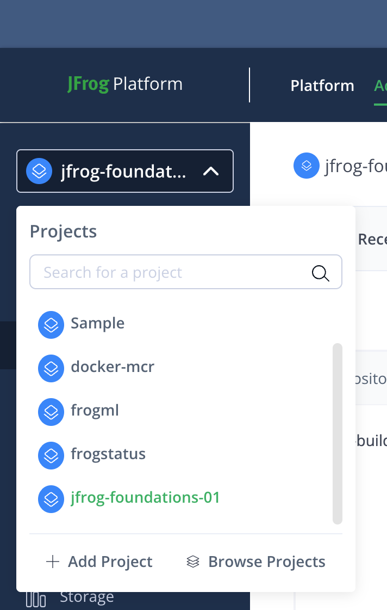

# 00 - Setup

**Format:** Guided
**Duration:** _placeholder, set in Phase 8_
**Prerequisites:** none

## What you will learn

- How to launch the workshop environment in your browser, with nothing
  installed on your laptop
- How to sign in to the JFrog Platform and find your way around the two main
  areas of it
- What a JFrog Project is, and how to tell which one is yours
- How to connect the JFrog CLI to the platform, and how to prove the
  connection works
- How to run the environment health check when something looks wrong

## Why this matters

Every other lab depends on this one. Ten minutes spent here confirming that
your tools work is ten minutes you do not spend, three labs later, debugging
an authentication error that looks like a broken exercise.

It is also the shape of a real onboarding. When you go back to your own
environment and connect a build to Artifactory for the first time, you will do
these same steps: point a tool at an instance, authenticate it, prove it
works.

## Concept

You are about to work with two separate systems, and keeping them straight
saves confusion later.

**GitHub** holds the workshop content and gives you a development environment
in your browser. **The JFrog Platform** is the product you are here to learn.
They are connected by one thing: the JFrog CLI in your Codespace, authenticated
with your credentials.



Some terminology, all of which is in the [glossary](../../docs/glossary.md):

- **The JFrog Platform** is the whole product. The pieces you will meet today
  are **Artifactory**, which stores and serves packages and container images;
  **Xray**, which scans them for security and license problems; and
  **Curation**, which decides what is allowed in from the outside world.
- A **fork** is your own copy of a GitHub repository, in your own account. You
  can change it freely without affecting anyone else.
- A **Codespace** is a development environment that runs on GitHub's
  infrastructure and appears in your browser: an editor, a terminal, and a
  Linux container with the tools already installed. Nothing is installed on
  your laptop.
- The container's contents are defined by a **devcontainer**, a configuration
  file in the repository. That is why everyone in the room gets an identical
  environment.
- A **JFrog Project** is a workspace inside a JFrog Platform instance, with its
  own repositories, users and permissions. Everyone in this room shares one
  instance and has their own project inside it, so your work does not collide
  with anyone else's.
- A **project key** is the project's short identifier, for example `user01`.
  The platform automatically puts it in front of the names of things you create
  inside the project, which is how fifteen people create a repository called
  "npm" on the same instance without a fight.

## Steps

### 1. Check what you need

- A **personal** GitHub account. If your only account is a corporate or
  enterprise-managed one, create a personal account now. Corporate accounts
  frequently carry policy restrictions that block forking or Codespaces, and
  that is a slow problem to diagnose. Sign up free at
  [github.com/join](https://github.com/join).
- The **handout** from your instructor. It has four things on it: the instance
  URL, your project key, your username and your password. You need all four.
- A browser.

That is the whole list. You will not install anything.

### 2. Fork this repository

Go to the workshop repository on GitHub and select **Fork**, then **Create
fork**. Accept the defaults, and make sure the owner is your personal account.

<!-- SCREENSHOT: labs/00-setup/images/github-fork-dialog.png
     Capture: the GitHub "Create a new fork" dialog with a personal account
     selected as Owner, taken on the workshop repository. -->

You now have your own copy. Everything you do from here happens in your fork,
so you can change any file, break anything and commit freely.

### 3. Create a Codespace

In **your fork**, select the green **Code** button, then the **Codespaces**
tab, then **Create codespace on main**.

<!-- SCREENSHOT: labs/00-setup/images/github-create-codespace.png
     Capture: the Code button expanded on the Codespaces tab, showing the
     "Create codespace on main" button. -->

> [!IMPORTANT]
> Create the Codespace on **your fork**, not on the original repository. Check
> the owner in the address bar. Later labs have you commit changes and run
> workflows, and both need to be in your own copy.

A browser editor opens and starts building your environment. This takes a
couple of minutes, sometimes up to five the first time. It is doing real work:
pulling a container image, installing the JFrog CLI, the GitHub CLI and Docker,
and installing the sample application's dependencies.

While it builds, keep reading.

### 4. Meet your environment

When the container is ready, a terminal appears at the bottom of the editor and
prints a welcome banner:

```
==============================================================
  JFrog Foundations
==============================================================

  Your workshop environment is ready.

  Start here:  labs/00-setup/README.md
  ...
```

Underneath it, a health check runs automatically and lists your tools:

```
Tools
------------------------------------------------------------
  [ ok ] Node.js          v22.11.0
  [ ok ] npm              10.8.2
  [ ok ] JFrog CLI        jf version 2.120.0
  [ ok ] Docker           Docker version 27.3.1
  [ ok ] GitHub CLI       gh version 2.63.2
  [ ok ] jq               jq-1.7.1
  [ ok ] Git              git version 2.47.1
```

Further down, under **JFrog connection**, it says there is no server
configured. That is correct. You have not connected anything yet, and the
environment is deliberately built to come up cleanly without credentials.

You can run this check whenever you want:

```bash
bash scripts/verify.sh
```

Get used to it now. It is the first thing to run whenever something stops
working.

### 5. Sign in to the JFrog Platform

Open the instance URL from your handout in a new browser tab. You will get a
sign-in page.


Sign in with the username and password from your handout. There is no password
change to do: the password on your handout is the one you keep.

You land in the **All Projects** view, on a Best Practices page under
**Get Started**.

<!-- SCREENSHOT: labs/00-setup/images/all-projects-landing.png
     Capture: the page a freshly provisioned attendee user lands on after first
     sign-in, showing the All Projects context and the Get Started section in
     the left-hand navigation. Replaces the stale
     jfrog-platform-trial-welcome-screen.png. -->

Have a quick look around, then read the next step before clicking anything else,
because what you can see right now is **not** what you will be working with.

### 6. Switch to your project

This step matters more than it looks. Until you do it, you are in the
**All Projects** context, and the platform shows you a deliberately reduced
view: no **Administration** area, and only a fraction of the menu. That is not a
permissions problem and nothing is broken. It is simply that your access is
scoped to one project, and you have not entered it yet.

Your project key is on your handout. Open the project selector at the top of the
left-hand navigation menu:



You will see **All Projects**, your own project, and everyone else's projects
too. That is expected, and it is worth understanding rather than worrying about:
you can *see* other projects but you cannot change anything in them. Read-only
visibility comes bundled with a platform-level permission you need later, for the
Curation labs.

Isolation here is about **who can change what**, not about who can see what. Your
project is the only one you can write to.

**Select your project.**

Now look at the top of the page. Two tabs have appeared that were not there a
moment ago:

- **Platform** is day-to-day work: browsing artifacts, looking at builds,
  reading scan results.
- **Administration** is configuration: creating repositories, managing
  permissions, setting up policies.

You will move between them constantly today. When a lab says "go to
Administration", that tab is what it means, and if you cannot see it, **the
first thing to check is whether you are still in All Projects.**

> [!IMPORTANT]
> Stay in your own project for the whole workshop. You share this instance with
> everyone else in the room, and your permissions are deliberately generous so
> that the Curation labs work later on. Generous permissions mean you *can*
> affect other people's work. Do not.

One thing you will notice is missing: there is no **Curation** entry in the
project menu. That is expected, and it is a real characteristic of the platform
rather than something wrong with your account. Curation does not yet support
projects, so it is administered at the instance level instead. Lab 02 deals with
this directly, including what it means for sharing an instance with fourteen
other people.

### 7. Connect the JFrog CLI

Back in your Codespace terminal, run:

```bash
bash scripts/setup.sh
```

It asks for four things:

1. The instance URL from your handout.
2. Your project key.
3. How you want to authenticate. Choose **1**, username and password.
4. Your username, then your password, both exactly as they appear on your
   handout. The password is not echoed to the screen as you type, which is
   deliberate.

The script then tests the connection and prints:

```
  Connection confirmed.
```

If it fails, it tells you the three things that are usually wrong. Fix and run
it again. Running it more than once is fine and is expected.

Two things the script did:

- Created a JFrog CLI **server configuration** named `workshop`, holding the
  URL and your credentials. The CLI keeps this in its own config, in your
  container.
- Wrote `JF_URL`, `JF_PROJECT` and `JF_SERVER_ID` to a file called `.env` in
  the repository root.

Your password is **not** in `.env`. Only non-secret configuration goes there,
so that opening `.env` in a shared screen is safe. `.env` is also gitignored,
so it never reaches your fork.

### 8. Confirm everything

```bash
bash scripts/verify.sh
```

You are looking for the **JFrog connection** section to have changed:

```
JFrog connection
------------------------------------------------------------
  [ ok ] connection       server "workshop" configured
  [ ok ] jf rt ping       Artifactory reachable and credentials accepted
  [ ok ] project access   project "user01" queried successfully
```

And in **Workshop configuration**, your URL and project key should now be
listed rather than showing "not set yet".

## Checkpoint

You are ready for lab 01 when all four of these are true.

1. A Codespace is running on **your own fork**.
2. This returns `OK`:

   ```bash
   jf rt ping
   ```

3. This prints your project key, and it matches your handout:

   ```bash
   grep JF_PROJECT .env
   ```

4. `bash scripts/verify.sh` exits without any `[FAIL]` lines, and the JFrog
   connection section shows `[ ok ]`.

If any of these is not true, fix it now rather than moving on. Ask, or see the
troubleshooting section below.

## What just happened

You did three separate things, and it is worth separating them because they
recur constantly in real work.

**You got a reproducible environment.** The Codespace is defined by
`.devcontainer/` in the repository, so the environment is a version-controlled
artifact rather than a set of instructions someone follows differently. This is
the same reason teams pin tool versions in CI. Everyone in the room is running
the identical JFrog CLI version, which means when something breaks it breaks
the same way for everyone.

**You authenticated a tool, not a person.** Signing in to the web UI in step 5
and configuring the CLI in step 7 are two different acts. The browser session
is yours; the CLI configuration belongs to the container. If you delete this
Codespace and make a new one, the CLI configuration goes with it and you run
`setup.sh` again. Your work on the platform is untouched, because it lives on
the platform.

**You located yourself inside a shared instance.** Fifteen people share this
instance, isolated by Projects. Because your project key prefixes the things
you create, you do not have to invent unique names, and you will see that
prefix appear automatically from lab 01 onward.

One more thing, and it changes how you should treat today: **this instance is
destroyed after the workshop.** There is no shared state to protect and no
cleanup to do. So experiment. Click the thing you are curious about. Try the
destructive option and see what the platform says. You will learn more from
that than from following the steps precisely.

## Going further

Optional, for while the room catches up. None of this is needed later.

**Look at how your environment is defined.** Open
`.devcontainer/devcontainer.json` and `.devcontainer/Dockerfile`. The JFrog
CLI version is pinned deliberately. Ask yourself what would go wrong in a
fifteen-person workshop if it were not.

**Look at what the CLI stored:**

```bash
jf config show
```

Note what is recorded and what is not. Then consider that the workshop's `.env`
holds no credentials at all, and that lab 07 will need to give a credential to
GitHub Actions instead. How should that one be stored?

**Explore the platform UI.** Move between the Platform and Administration tabs
and get a feel for what lives where. You will be asked to find things without
step-by-step directions later in the day, and time spent wandering now pays
off then.

**Ask the CLI what it can do:**

```bash
jf --help
jf rt --help
```

## Troubleshooting

**The Codespace never finishes, or the tab hangs.** Usually a corporate proxy
blocking `github.dev`, which is separate from `github.com`. Tethering to a
phone is the fastest fix. Full detail in
[`docs/codespaces-troubleshooting.md`](../../docs/codespaces-troubleshooting.md).

**`scripts/setup.sh` says the connection failed.** Three usual causes:

- The URL has a path on the end. It should be the host only, for example
  `https://example.jfrog.io`, not `https://example.jfrog.io/ui/login`. The
  script strips a `/ui` path for you, but check it anyway.
- A typo in the password. It is not echoed as you type, so this is easy to do
  and impossible to see. Just run `bash scripts/setup.sh` again.
- You have not yet signed in to the web UI. Do step 5 before step 7, in that
  order.

**`jf: command not found`.** The container did not build correctly. Run
`bash scripts/verify.sh` to see what else is missing, then rebuild: command
palette, `Codespaces: Rebuild Container`.

**A tool shows `[FAIL]` in the health check.** Rebuild the container as above.
If a rebuild does not fix it, use `Codespaces: Full Rebuild Container`.

**You cannot see your project in the selector.** Confirm the project key
against your handout, and confirm you are signed in as the username on your
handout rather than another account. If the key is right and the project is
not there, it is a permissions problem and your instructor needs to fix it.

## Next

**01 - Artifactory**: local, remote and virtual repositories, and how package
resolution actually works.

> [!NOTE]
> Lab 01 is added in build phase 3. This link becomes live then. See the
> [module index](../../README.md#modules) for what is available now.
