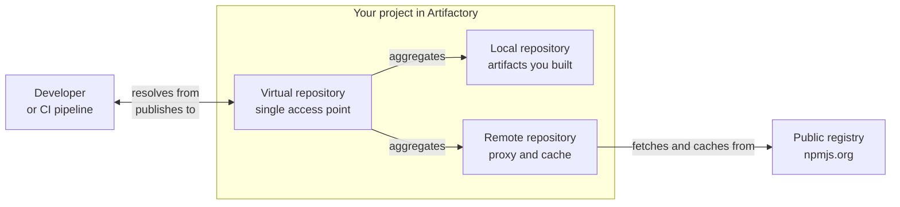
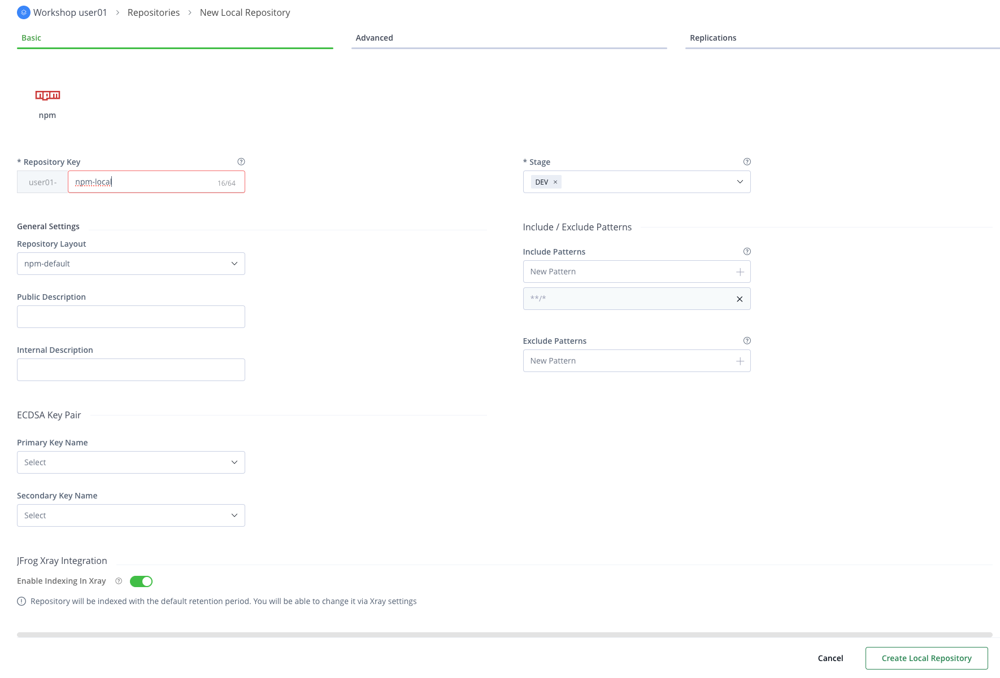
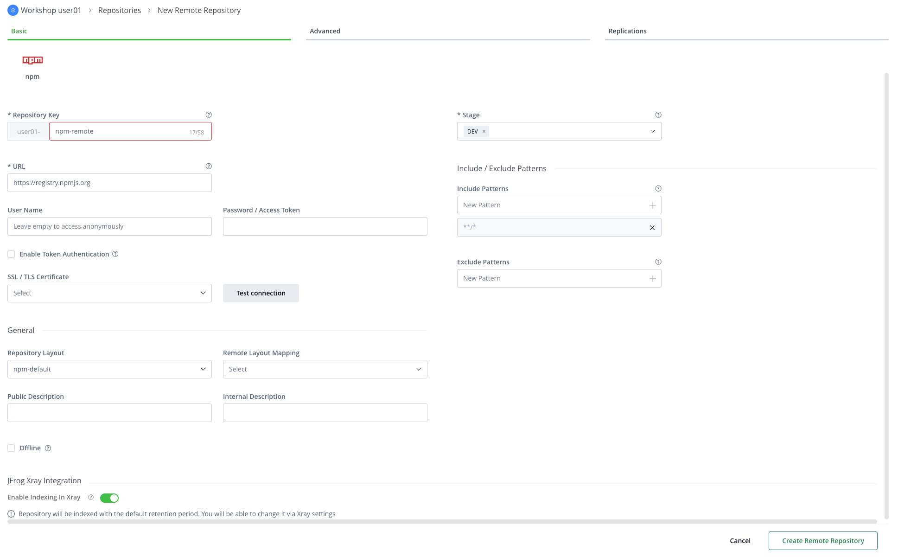
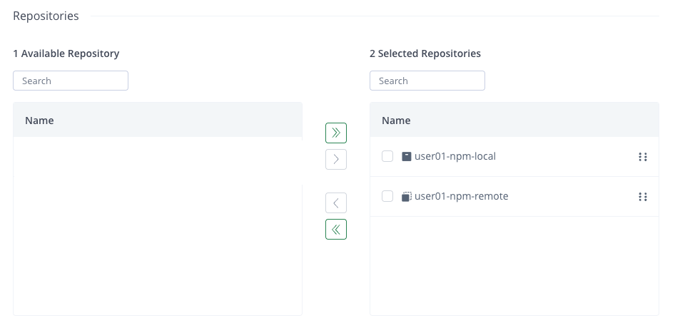
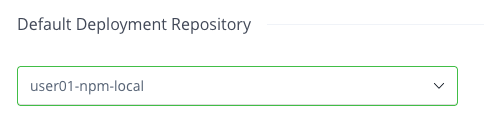
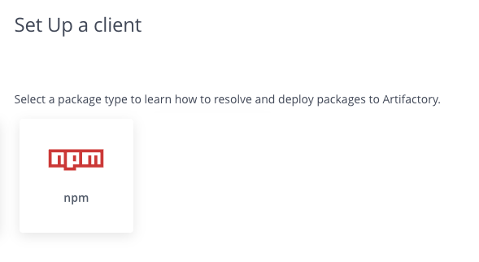
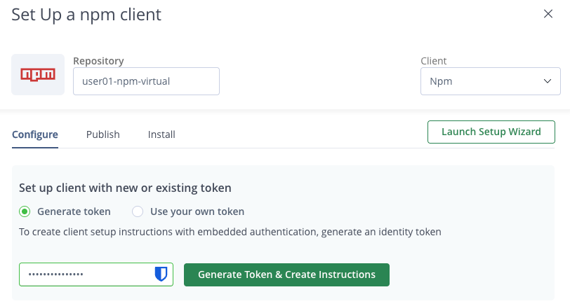
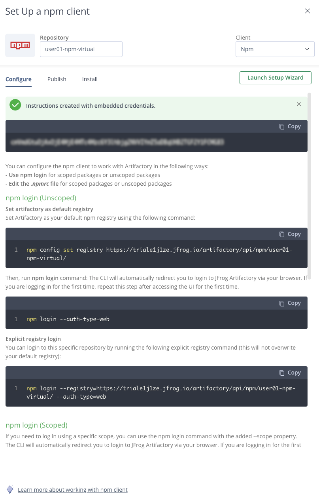

# 01 - Artifactory

**Format:** Guided, with a closing challenge
**Duration:** _placeholder, set in Phase 8_
**Prerequisites:** [lab 00](../00-setup/README.md)

## What you will learn

- The difference between a local, a remote and a virtual repository, and when to use each type
- How to create all three for npm, inside your own project
- Why a build should point at a virtual repository and never at a remote one directly
- How a remote repository caches what it fetches, and how to see that happening
- How to point a real package manager at Artifactory

## Why this matters

Everything in the platform sits on top of repositories. Curation controls which artifacts get into them, Xray continuously scans those artifacts once they are there and your builds resolve all of their dependencies from them.

## Concept

There are three main repository types that you will use most often.

- A **local repository** stores artifacts you produced. Your own builds publish here.
- A **remote repository** is a proxy for somewhere else. Let's say you're working with Node.js applications, which use the **npm** package manager. When you request a package the first time, the repository fetches the package from npm's public repository at npmjs.org and then delivers a copy to you. The next time you request that same package, it's pulled directly from the Artifactory remote repository. This removes the need to pull the package from the npm public repository, so it protects you from things like upstream outages or someone intentionally or accidentally removing a package from that upstream repository.
- A **virtual repository** aggregates local and remote repositories behind one name. It allows you to create local and remote repository structures which can be modified as needed, whilst providing a consistent endpoint for developers to work with when pulling or pushing packages.



**The benefit of the virtual repository is that it is a stable name.** Your build asks it for a package. It does not know or care whether the answer came from your local repository or from a cached copy of npmjs.org, and it does not need changing when that answer changes. Swap the upstream registry, add a second local repository: the build configuration is untouched.

Two terms you will meet in the UI, both in the [glossary](../../docs/glossary.md):

- **Package type.** A repository holds one kind of package. An npm repository holds npm packages and speaks the npm protocol. Docker repositories are optimized to work with container images, and so on.
- **Repository key.** The repository's unique name. In this workshop, yours are prefixed with your project key automatically, which you will see happen in step 2.

## Steps

### 1. Get to the right place

Open the JFrog Platform, and check two things before you create anything.

1. Make sure that your project is selected in the project selector at the top left of the page. If it says **All Projects**, switch to your project which should match your user name - i.e. "Workshop userxx"
2. At the top of the page there are two tabs - **Platform** and **Administration**. Make sure you are on **Administration**

Then select **Repositories** in the left-hand navigation.

### 2. Create the local npm repository

At the top right, you will see a "Create a repository" button. Click this and choose **Local**, and then choose **npm** as the package type.

For the repository key, type:

```
npm-local
```

> [!NOTE]
> **Look at the key field after you type.** The platform has put your project key in front of it, so the full name of the repository is actually `user<xx>-npm-local`. This helps ensure that the repository name you choose is unique across all the repositories in your JFrog Platform.

At the bottom right of the screen, click the "Create Local Repository" button. You'll see a message telling you that your npm repository was created successfully. For now, click the "I'll Do It Later" button.



### 3. Create the remote npm repository

Create another repository, but this time choose **Remote**, and then the package type **npm** again.

Key:

```
npm-remote
```

The URL it proxies should default to the public npm registry, `https://registry.npmjs.org`. Leave it as it is.

That's it. Click the "Create Remote Repository" button at the bottom right of the screen. Again, once you seen the confirmation screen, click "I'll Do It Later".



### 4. Create the virtual npm repository

Create a third repository. For this one, choose **Virtual**, and again the package type **npm**.

Key:

```
npm-virtual
```

Next we have to assign local and remote repositories to this virtual repository. At the bottom of the page, and you may have to scroll down to get to it, you will find a **Repositories** section. It should list the local and remote repositories we created in the previous steps. Next to that, you'll see some left and right pointing arrows.  If you click the top right pointing double arrow, you should see both of your repositories move from the "Available Repositories" column, to the "Selected Repositories" column.



Beneath that, you will see a section labeled "Default Deployment Repository". This lets Artifactory know which of these repositories should be used for storage of artifacts that are pushed to this virtual repository. As we only have one local repository defined, you should only see one in the list. Select that.



Finally, click the "Create Virtual Repository" button at the bottom right of the screen, and again you can dismiss the confirmation dialog by clicking the "I'll Do It Later" button.

### 5. Check the repository names

To save you retyping the same thing over and over again during the workshop, the names of your repositories are held as environment variables in the `.env` file. You don't have to do anything to set that up. This lab tells you exactly what to type for each repository key and the platform adds your project key in front, so the full names were already worked out for you when you ran `scripts/setup.sh` back in lab 00.

Let's just confirm they are there. In the Codespaces terminal:

```bash
cd /workspaces/jfrog-foundations
grep JF_NPM_VIRTUAL_REPO .env
```

You should see your own project key in front of the name:

```
JF_NPM_VIRTUAL_REPO=user01-npm-virtual
```

If that line is empty, or the project key is missing so that it just reads `-npm-virtual`, run `bash scripts/setup.sh` again and it will fill it in.

### 6. Point npm at your virtual repository

In the previous steps, we skipped over the confirmation messages that were offering to help us set things up. We can reach the same page using the "Set Me Up" button, which you should be able to see at the top of the Repositories page, next to the "Create a Repository" button. 

When you click the "Set Me Up" button, it should then ask you to select a package type. As we've only configured npm so far, you should only see one option, so click npm.



Next, click the text box marked "Search for a repository" and you should see a dropdown list with all the repositories we've created so far. Choose the virtual repo that you created, which should have a name like **user<xx>-npm-virtual**.

You'll now see a section labelled "Set up client with new or existing token". By default, the "Generate token" option should be selected.

In the text box below, enter the password you used to login to the JFrog Platform, and then click the "Generate Token & Create Instructions" button.



You'll now see a token that was generated along with instructions for different configuration options. We're going to follow the instructions in the "npm login (Unscoped)" section.



Copy the command line listed under the "Set artifactory as default registry" section and paste it into your Codespaces terminal. The command should look similar to the example below, but with the name of your actual JFrog Platform instance and virtual repositories instead.

```
npm config set registry https://<jfrog-workshop-instance>.jfrog.io/artifactory/api/npm/user<xx>-npm-virtual/
```

Next, run the `npm login` command. You will see a link to a URL that will allow you to authenticate against the JFrog Platform

```
npm login --auth-type=web
```

Click the link shown in your terminal - depending on your device type you might need to press CTRL or CMD whilst clicking the link. You should be taken to your JFrog Platform instance where you will be asked to approve the npm client connection. Complete that and return to Codespaces.

> [!NOTE]
> This process writes an access token into `~/.npmrc` inside your Codespace. That is what a developer machine really looks like, and it is safe here because the container is disposable. In production you would use a short-lived credential instead.

### 7. Fetch something through it

Now prove the whole chain works. `npm pack` downloads a package without installing it, which makes it a clean test:

```bash
cd /tmp && npm pack ms@2.1.3
```

Expected, output should look roughly like this:

```
npm notice
npm notice 📦  ms@2.1.3
npm notice Tarball Contents
npm notice 3.0kB index.js
npm notice 1.1kB license.md
npm notice 732B package.json
npm notice 1.9kB readme.md
npm notice Tarball Details
npm notice name: ms
npm notice version: 2.1.3
npm notice filename: ms-2.1.3.tgz
npm notice package size: 3.0 kB
npm notice unpacked size: 6.7 kB
npm notice shasum: 574c8138ce1d2b5861f0b44579dbadd60c6615b2
npm notice integrity: sha512-6FlzubTLZG3J2[...]SO/tXtF3WRTlA==
npm notice total files: 4
npm notice
ms-2.1.3.tgz
```

That request went to your virtual repository, which saw that it didn't have a copy of that package, so it asked your remote repository, which then fetched it from npmjs.org and kept a copy.

### 8. See the cache

So, how can we check that we did indeed just download that package via Artifactory? We can check in the JFrog Platform.

Go to the **Platform** tab, then **Artifactory**, then **Artifacts**, and expand your repositories.

You will find a repository you did not create: **`user01-npm-remote-cache`**. Expand the contents until you reach a folder called `ms`. Artifactory created the cache alongside your remote
repository, and that is where the fetched copies live.

<!-- SCREENSHOT: labs/01-artifactory/images/remote-cache-tree.png
     Capture: the Artifacts tree with the -cache repository expanded showing the
     ms package that was just fetched. -->

Run the same `npm pack` again and it is served from that cache. No request leaves your instance, nothing is requested from the public npm repositories.

## Checkpoint

You are ready for lab 02 when all four of the below are true.

1. Three npm repositories exist in your project, all carrying your project key prefix: `-npm-local`, `-npm-remote`, `-npm-virtual`.
2. The virtual repository includes both of the others.
3. This prints your virtual repository name:

   ```bash
   grep JF_NPM_VIRTUAL_REPO .env
   ```

4. `npm pack ms@2.1.3` succeeds, and `ms` is visible in your
   `userxx-npm-remote-cache` repository.

If the `npm pack` fails, work through the troubleshooting section rather than moving on. Later labs will require this in order to work correctly.

## What just happened

We created three repositories, a local, a remote and a virtual, which is the recommended best practice for repository configuration in Artifactory.  Doing this means that you can change those local or remote repositories, replace them etc. but so long as the developer only ever accesses them via the virtual, they'll never need to change their configuration.

**You did not point anything at npmjs.org directly.** Your npm client knows one URL - your virtual repository. That single indirection is what makes the rest of the platform possible. Curation can inspect what passes through the remote because the remote is yours. Xray can scan the cache because the cache is yours. Neither is possible if your build talks directly to npmjs.org.

**The cache is not just a speed trick.** It is also the reason an upstream outage or an unpublished package does not stop your build. If it has been fetched once, you have it. Teams discover this the hard way when a popular package is removed from a public registry.

**The prefix did the isolation work.** Multiple people created a repository called `npm-local` on one instance. The platform made them distinct without any convention for you to remember, which is what a JFrog Project is for.

## Challenge

🎯 **The scenario**

Your platform team is about to start publishing container images from CI, and they have asked you to get the registry side ready. They want the same arrangement you have just built for npm: somewhere for their own images to land, a way to pull public base images without every build reaching out to Docker Hub, and one address the pipelines can be pointed at that will not have to change later.

**Success criteria**

- Three Docker repositories exist in your project, prefixed with your project key.
- The virtual one aggregates the other two
- You can explain how a virtual repository handles both a push and a pull, and what the "Default Deployment Repository" setting is there for.
- `JF_DOCKER_REPO` in `.env` names the repository a pipeline would use.

**Documentation**

- [Repository management](https://docs.jfrog.com/artifactory/docs/repository-management)
- [Docker registry](https://docs.jfrog.com/artifactory/docs/docker-repositories)
- [Virtual repositories](https://docs.jfrog.com/artifactory/docs/virtual-repositories)

**Timebox: 10 minutes.** This should be simple to implement. Try to do it without viewing the solution below first. Only view the solution if you get stuck!

<details>
<summary>Solution</summary>

We need to follow exactly the same three steps as we did for npm earlier, but this time with Docker as the package type.

1. **Local.** Create a repository, type **Local**, package type **Docker**, key `docker-local`. It becomes `userxx-docker-local`.

2. **Remote.** Create a repository, type **Remote**, package type **Docker**, key `docker-remote`. The upstream URL should default to Docker Hub,
   `https://registry-1.docker.io`. This is where public base images come from, once, and then from the cache.

3. **Virtual.** Create a repository, type **Virtual**, package type **Docker**, key `docker-virtual`. Add `userxx-docker-local` and `userxx-docker-remote`. Set `userxx-docker-local` as the default deployment repository.

The name is already in your `.env` file, for the same reason the npm one was. Confirm it:

```bash
cd /workspaces/jfrog-foundations
grep JF_DOCKER_REPO .env
```

A pipeline pushes **and** pulls through a virtual repository. The virtual repository will automatically direct the request to either a local repository if it's a push request, or either a local or remote if it's a pull request. Which one depends on the package name. This allows us to have packages in our local repositories with the same name as packages in a remote repository, but ensure that any local version is selected ahead of a remote version with the same name.

So setting the environmenmt variable `JF_DOCKER_REPO` to our virtual repository is right.

</details>

## Going further

This section is optional. Nothing later depends on any of it.

**Look at what the platform created for you.** You made three repositories and there are four. Find `-npm-remote-cache` and consider why Artifactory keeps the cache as a separate repository rather than hiding it inside the remote. What could you now do to the cache that you could not do to a proxy?

**Find the include and exclude patterns** on your remote repository. They accept patterns like `**/lodash/**`. Consider how you might use them to keep an entire package namespace out of your instance without involving Curation at all, and what the limits of that approach are.

**Look at a package's detail view.** In Artifacts, select the `ms` package you fetched. Note what Artifactory recorded about it beyond the file itself.

## Troubleshooting

**`npm pack` fails with a 401 or 403.** The npm configuration from Set Me Up did not take, or it went to the wrong file. Check what npm is actually using:

```bash
npm config get registry
```

It should be your virtual repository URL. If it is `https://registry.npmjs.org/`, re-apply the Set Me Up configuration.

**`npm pack` fails with a 404.** Usually the registry URL is missing its trailing slash, or it names a repository that does not exist. Compare it against the repository key in the UI, remembering the project key prefix.

**`npm pack` hangs.** Your remote repository is trying to reach npmjs.org and cannot. Confirm the remote repository's URL is `https://registry.npmjs.org` and that its own test connection succeeds in the
UI.

**You cannot find Repositories under Administration.** You are almost certainly in the **All Projects** context. Switch to your project using the selector, and the Administration tab appears with it. Lab 00 step 6 covers this.

**The repository key already exists.** Someone reused a key without their project prefix, or you are editing an earlier attempt. Check the full key including the prefix. If you created something wrong, delete it and start again: this instance is disposable and nothing you do here needs to be reversible.

## Next

[02 - Curation](../02-curation/README.md): deciding what is allowed into your repositories in the first place.
