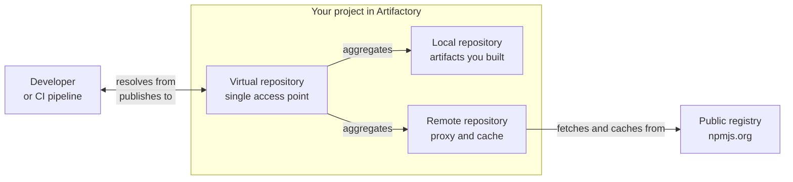

# 01 - Artifactory

**Format:** Guided, with a closing challenge
**Duration:** _placeholder, set in Phase 8_
**Prerequisites:** [lab 00](../00-setup/README.md)

## What you will learn

- The difference between a local, a remote and a virtual repository, and when
  each one is the right answer
- How to create all three for npm, inside your own project
- Why a build should point at a virtual repository and never at a remote one
  directly
- How a remote repository caches what it fetches, and how to see that happening
- How to point a real package manager at Artifactory

## Why this matters

Everything else in the platform sits on top of repositories. Xray scans what is
in them, Curation controls what gets into them, and your builds resolve from
them. Get the layout wrong and you will feel it in every lab after this one, and
in every pipeline afterwards.

There is also one decision here that customers get wrong often enough to be
worth naming: pointing builds directly at a remote repository. It works, right
up until you need to change something, and then it does not.

## Concept

Three repository types, three jobs.

- A **local repository** stores artifacts you produced. Your own builds publish
  here. Nothing outside your instance is involved.
- A **remote repository** is a proxy for somewhere else, such as npmjs.org. Ask
  it for a package and it fetches the package, hands it to you, and keeps a
  copy. The copy is the **cache**, and it is why the second request is fast and
  why you are not stopped by an outage upstream.
- A **virtual repository** aggregates local and remote repositories behind one
  name. It stores nothing itself.



**The virtue of the virtual repository is that it is a stable name.** Your build
asks it for a package. It does not know or care whether the answer came from
your local repository or from a cached copy of npmjs.org, and it does not need
changing when that answer changes. Swap the upstream registry, add a second
local repository, introduce a mirror: the build configuration is untouched.

Point a build at a remote repository directly and you have written today's
topology into every pipeline you own.

Two terms you will meet in the UI, both in the [glossary](../../docs/glossary.md):

- **Package type.** A repository holds one kind of package. An npm repository
  holds npm packages and speaks the npm protocol. You will create a separate set
  for Docker in the challenge.
- **Repository key.** The repository's unique name. Yours are prefixed with your
  project key automatically, which you will see happen in step 2.

## Steps

### 1. Get to the right place

Open the JFrog Platform, and check two things before you create anything.

1. Your project is selected in the project selector. If it says **All Projects**,
   switch to your project. Lab 00 step 6 covers this, and the giveaway is the
   **Administration** tab being missing.
2. You are on the **Administration** tab, not **Platform**.

Then select **Repositories** in the left-hand navigation.

> [!IMPORTANT]
> VERIFY: confirm the navigation to repository creation for a project-scoped
> user on a current instance. Specifically whether Repositories sits directly in
> the Administration menu or under a parent item, and what the create control is
> called. Everything below assumes a "Create a Repository" style action that then
> asks for a package type.

### 2. Create the local npm repository

Create a repository, choose **Local**, and choose **npm** as the package type.

For the repository key, type:

```
npm-local
```

<!-- SCREENSHOT: labs/01-artifactory/images/create-local-repo.png
     Capture: the local repository creation form with npm selected as the
     package type and the repository key field filled in, showing the project
     key prefix applied automatically. -->

**Look at the key field after you type.** The platform has put your project key
in front of it, so the repository is actually called `user01-npm-local`. You did
not do that and you cannot collide with anyone else in the room even though
fourteen other people are typing the same thing right now.

Save it.

### 3. Create the remote npm repository

Create another repository, choose **Remote**, package type **npm**.

Key:

```
npm-remote
```

The URL it proxies should default to the public npm registry,
`https://registry.npmjs.org`. Leave it as it is.

Save it.

> [!NOTE]
> You have just created something with real consequences: every package your
> builds pull from npmjs.org can now come through a point you control. That is
> the hook Curation uses in lab 02.

### 4. Create the virtual npm repository

Create a third repository, choose **Virtual**, package type **npm**.

Key:

```
npm-virtual
```

Then add both of the repositories you just made to it. Order matters: put
**`user01-npm-local` first** and `user01-npm-remote` second.

<!-- SCREENSHOT: labs/01-artifactory/images/create-virtual-repo.png
     Capture: the virtual repository creation form with both the local and
     remote repositories added to the included list, local ordered first. -->

**Why that order.** A virtual repository searches its members in order and
returns the first match. Local first means that if you ever publish a package
under a name that also exists on npmjs.org, yours wins. That is usually what you
want, and the alternative is a class of supply chain attack: an attacker
publishes a public package with the same name as one of your internal ones and
waits for a build to prefer it.

Save it.

### 5. Record the names

Later labs and the CI workflows read these from `.env` rather than having you
retype them. In your Codespace terminal:

```bash
cd /workspaces/jfrog-foundations
sed -i "s|^JF_NPM_VIRTUAL_REPO=.*|JF_NPM_VIRTUAL_REPO=${JF_PROJECT}-npm-virtual|" .env
grep JF_NPM .env
```

Expected:

```
JF_NPM_VIRTUAL_REPO=user01-npm-virtual
```

If `${JF_PROJECT}` came out empty, `.env` has not been loaded into this shell.
Run `set -a; . ./.env; set +a` and try again.

### 6. Point npm at your virtual repository

Artifactory can generate the configuration for you. Find the **Set Me Up**
action for your virtual repository and choose npm.

> [!IMPORTANT]
> VERIFY: confirm where Set Me Up lives for a project-scoped user, and what it
> produces for npm on a current instance. The steps below assume it yields an
> `npm config set` command or an `.npmrc` snippet containing a registry URL and
> an auth token.

It gives you a registry URL shaped like this, with your own instance and project
in it:

```
https://<your-instance>/artifactory/api/npm/user01-npm-virtual/
```

Apply the configuration it gives you in your Codespace terminal.

> [!NOTE]
> This writes an access token into `~/.npmrc` inside your Codespace. That is what
> a developer machine really looks like, and it is safe here because the
> container is disposable. In production you would use a short-lived credential
> instead, which lab 07 comes back to.

### 7. Fetch something through it

Now prove the whole chain works. `npm pack` downloads a package without
installing it, which makes it a clean test:

```bash
cd /tmp && npm pack ms@2.1.3
```

Expected, roughly:

```
npm notice filename: ms-2.1.3.tgz
ms-2.1.3.tgz
```

That request went to your virtual repository, which had no copy, so it asked
your remote repository, which fetched it from npmjs.org and kept a copy.

### 8. See the cache

Go to the **Platform** tab, then **Artifactory**, then **Artifacts**, and expand
your repositories.

You will find a repository you did not create: **`user01-npm-remote-cache`**.
Inside it is `ms`. Artifactory created the cache alongside your remote
repository, and that is where fetched copies live.

<!-- SCREENSHOT: labs/01-artifactory/images/remote-cache-tree.png
     Capture: the Artifacts tree with the -cache repository expanded showing the
     ms package that was just fetched. -->

> [!IMPORTANT]
> VERIFY: confirm the cache repository naming and that it appears in the
> Artifacts tree for a project-scoped user, on a current instance.

Run the same `npm pack` again and it is served from that cache. No request
leaves your instance.

## Checkpoint

You are ready for lab 02 when all four are true.

1. Three npm repositories exist in your project, all carrying your project key
   prefix: `-npm-local`, `-npm-remote`, `-npm-virtual`.
2. The virtual repository includes both of the others, with local ordered first.
3. This prints your virtual repository name:

   ```bash
   grep JF_NPM_VIRTUAL_REPO .env
   ```

4. `npm pack ms@2.1.3` succeeds, and `ms` is visible in your
   `-npm-remote-cache` repository.

If the `npm pack` fails, work through the troubleshooting section rather than
moving on. Every later lab resolves packages through this chain.

## What just happened

You built the shape almost every JFrog customer ends up with, and it is worth
seeing why it is that shape rather than something simpler.

**You did not point anything at npmjs.org directly.** Your npm client knows one
URL, your virtual repository. That single indirection is what makes the rest of
the platform possible. Curation can inspect what passes through the remote
because the remote is yours. Xray can scan the cache because the cache is yours.
Neither is possible if your build talks to npmjs.org.

**The cache is not just a speed trick.** It is also the reason an upstream outage
or an unpublished package does not stop your build. If it has been fetched once,
you have it. Teams discover this the hard way when a popular package is removed
from a public registry.

**The prefix did the isolation work.** Fifteen people created a repository called
`npm-local` on one instance. The platform made them distinct without any
convention for you to remember, which is what a JFrog Project is for.

**The member order is a security control.** Local before remote means your own
packages take precedence over anything with the same name upstream. That is the
mitigation for dependency confusion, and it is one line of configuration you
either got right or did not.

## Challenge

🎯 **The scenario**

Your platform team is about to start publishing container images from CI, and
they have asked you to get the registry side ready. They want the same
arrangement you have just built for npm: somewhere for their own images to land,
a way to pull public base images without every build reaching out to Docker Hub,
and one address the pipelines can be pointed at that will not have to change
later.

**Success criteria**

- Three Docker repositories exist in your project, prefixed with your project
  key.
- The virtual one aggregates the other two, with the local repository taking
  precedence.
- You can say which of the three a CI pipeline should push to, which it should
  pull from, and why they are not the same answer as each other.
- `JF_DOCKER_REPO` in `.env` names the repository a pipeline would use.

**Documentation**

- [Repository management](https://jfrog.com/help/r/jfrog-artifactory-documentation/repository-management)
- [Docker registry](https://jfrog.com/help/r/jfrog-artifactory-documentation/docker-registry)
- [Virtual repositories](https://jfrog.com/help/r/jfrog-artifactory-documentation/virtual-repositories)

**Timebox: 10 minutes.** If you are not there, open the solution. Reading it and
understanding it beats guessing for another ten.

<details>
<summary>Solution</summary>

Exactly the same three steps as the npm set, with Docker as the package type.

1. **Local.** Create a repository, type **Local**, package type **Docker**, key
   `docker-local`. It becomes `user01-docker-local`. This is where CI pushes
   images it has built.

2. **Remote.** Create a repository, type **Remote**, package type **Docker**,
   key `docker-remote`. The upstream URL should default to Docker Hub,
   `https://registry-1.docker.io`. This is where public base images come from,
   once, and then from the cache.

3. **Virtual.** Create a repository, type **Virtual**, package type **Docker**,
   key `docker-virtual`. Add `user01-docker-local` first, then
   `user01-docker-remote`.

Then record it:

```bash
cd /workspaces/jfrog-foundations
sed -i "s|^JF_DOCKER_REPO=.*|JF_DOCKER_REPO=${JF_PROJECT}-docker-virtual|" .env
grep JF_DOCKER .env
```

**On the three-part question**, which is the part that actually matters:

- A pipeline **pulls** through the virtual repository. It gets your images and
  public base images from one address.
- A pipeline **pushes** to the **local** repository. You cannot push to a remote
  repository, because it is a proxy for something you do not own.
- Pushing through a virtual repository is possible if it has a default deploy
  repository configured, and it is worth avoiding early on: being explicit about
  where your artifacts land is clearer than relying on a setting somebody may
  change.

So `JF_DOCKER_REPO` naming the virtual repository is right for resolution, and
lab 07 will name the local one explicitly when it pushes.

</details>

## Going further

Optional. Nothing later depends on any of it.

**Look at what the platform created for you.** You made three repositories and
there are four. Find `-npm-remote-cache` and consider why Artifactory keeps the
cache as a separate repository rather than hiding it inside the remote. What
could you now do to the cache that you could not do to a proxy?

**Break the member order deliberately.** Edit your npm virtual repository so the
remote comes first. Nothing visible will change today. Then work out what would
have to be true for that change to matter, and how you would notice.

**Find the include and exclude patterns** on your remote repository. They accept
patterns like `**/lodash/**`. Consider how you might use them to keep an entire
package namespace out of your instance without involving Curation at all, and
what the limits of that approach are.

**Look at a package's detail view.** In Artifacts, select the `ms` package you
fetched. Note what Artifactory recorded about it beyond the file itself.

## Troubleshooting

**`npm pack` fails with a 401 or 403.** The npm configuration from Set Me Up did
not take, or it went to the wrong file. Check what npm is actually using:

```bash
npm config get registry
```

It should be your virtual repository URL. If it is `https://registry.npmjs.org/`,
re-apply the Set Me Up configuration.

**`npm pack` fails with a 404.** Usually the registry URL is missing its
trailing slash, or it names a repository that does not exist. Compare it against
the repository key in the UI, remembering the project key prefix.

**`npm pack` hangs.** Your remote repository is trying to reach npmjs.org and
cannot. Confirm the remote repository's URL is
`https://registry.npmjs.org` and that its own test connection succeeds in the
UI.

**You cannot find Repositories under Administration.** You are almost certainly
in the **All Projects** context. Switch to your project using the selector, and
the Administration tab appears with it. Lab 00 step 6 covers this.

**The repository key already exists.** Someone reused a key without their
project prefix, or you are editing an earlier attempt. Check the full key
including the prefix. If you created something wrong, delete it and start again:
this instance is disposable and nothing you do here needs to be reversible.

## Next

[02 - Curation](../02-curation/README.md): deciding what is allowed into your
repositories in the first place.
