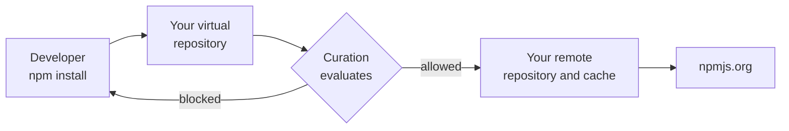

# 02 - Curation

**Format:** Guided, with a closing challenge
**Duration:** _placeholder, set in Phase 8_
**Prerequisites:** [lab 00](../00-setup/README.md), [lab 01](../01-artifactory/README.md)

## What you will learn

- The difference between Curation and Xray, and why you want both
- How to build a policy that permits only packages under licenses you have
  approved
- Why the **scope** of a policy is the single most consequential field on the
  form
- What a blocked package actually looks like to a developer at the terminal
- How a waiver works, and why the person who requests one should not be the
  person who approves it

## Why this matters

Xray tells you what is wrong with the packages you already have. Curation
decides whether they arrive at all.

That difference is the whole point. A vulnerability report on a dependency that
is already in production is a project. The same package refused at the front door
is a non-event. Curation is the only control in the platform that acts **before**
something becomes yours.

It is also where governance stops being abstract. You are about to write a rule
that blocks a real package, then watch your own terminal refuse to install it.
Most people find that moment more persuasive than any policy document.

## Concept

**Curation sits in front of your remote repositories.** When a package is
requested from upstream for the first time, Curation evaluates it before
Artifactory caches it. If a policy blocks it, it never lands.



A **Curation policy** has four parts, and it is worth knowing them before you
meet the form:

| Part | What it decides |
| --- | --- |
| **Condition** | What makes a package unacceptable. A license, a CVE severity, an age, a known-malicious flag |
| **Scope** | Which of your remote repositories the policy applies to |
| **Action** | What happens on a match. Today, block |
| **Waiver policy** | Whether anyone may ask for an exception, and who decides |

Terms, all in the [glossary](../../docs/glossary.md):

- A **condition** is the reusable test. Conditions exist independently of
  policies, so one condition can serve several policies.
- A **waiver** is a recorded, approved exception for one package. It is not the
  same as switching the policy off, and the difference is auditability.
- **Decision owners** are the group permitted to approve a waiver.

### Two things about Curation that will surprise you

**It is not scoped to your project.** Every other resource you have created today
belongs to your project and carries its key. Curation does not work that way
yet: policies belong to the whole instance. Project support is on the JFrog
roadmap, and until it lands this lab works around it in two ways that you must
follow exactly, because the consequences land on other people:

1. Your policy name carries your own prefix, so fifteen policies do not become
   an unreadable list.
2. Your policy is **scoped to your own remote repository**. A policy left
   applying to all repositories blocks packages for everyone in the room.

**You need a different account.** Because Curation is instance-level, a
project-scoped account like yours cannot see it at all. Your handout has a shared
administrator account for this. That is not a workaround bolted on for the
workshop: it is what platform permissions look like when you meet their edge, and
noticing where that edge is worth more than the five minutes it costs.

## Steps

### 1. Sign in as the shared administrator

Open a **private or incognito browser window** and sign in with the
`workshop-admin` credentials from your handout.

Use a separate window rather than signing out. You will want your own session
back shortly, and the whole room is sharing this one account.

> [!IMPORTANT]
> Everything you create as this account is visible to, and editable by, everyone
> else in the room. Prefix your policy name with your own attendee name, touch
> nothing that is not yours, and switch back to your own account when you are
> finished with this lab.

### 2. Find Curation

Go to the **Administration** tab, then **Curation**.

Compare that with your own account, where there is no Curation entry anywhere.
Same platform, same instance, different permissions.

> [!IMPORTANT]
> VERIFY: confirm the navigation to Curation policy management on a current
> instance, and the exact labels for creating a condition and a policy. The
> steps below assume Administration then Curation, with separate areas for
> conditions and for policies.

### 3. Create the license condition

Create a new condition, and choose the **Allow List by License** template.

Add the licenses you are willing to accept:

```
MIT
Apache-2.0
BSD-2-Clause
BSD-3-Clause
ISC
```

Name it with your prefix:

```
user01-approved-licenses
```

<!-- SCREENSHOT: labs/02-curation/images/allow-list-condition.png
     Capture: the Allow List by License condition form with the five permissive
     licenses entered and the attendee-prefixed name visible. -->

**Note what you have just chosen.** An allow list is default-deny: anything whose
license is not on that list is refused, including licenses nobody has thought
about yet. A block list is the opposite, and it only ever catches what you
already knew to fear. For licenses, default-deny is usually the right posture and
it is also the one that generates awkward conversations, which is rather the
point.

### 4. Create the policy, and get the scope right

Create a new policy using the condition you just made.

| Field | Value |
| --- | --- |
| Name | `user01-approved-licenses` |
| Condition | `user01-approved-licenses` |
| Action | Block |
| Scope | **Specific repositories**, then select `user01-npm-remote` |
| Waiver requests | Allowed, requiring approval |

> [!IMPORTANT]
> **Stop and check the scope before you save.** The default may be all
> repositories. If you leave it there, you will block packages for all fifteen
> people in this room, and the first they will know of it is a build failing for
> reasons that are nothing to do with them.
>
> The field you want names **only** `user01-npm-remote`. Read it back before
> saving.

<!-- SCREENSHOT: labs/02-curation/images/policy-scope-specific.png
     Capture: the policy form with scope set to specific repositories and a
     single attendee remote repository selected, with the all-repositories
     option visible but unselected. -->

Save it.

### 5. Watch it block something

Back in your Codespace terminal, as yourself:

```bash
cd /tmp && npm pack highcharts@8.2.0
```

This fails. The important part is the message, so read it rather than scrolling
past it.

`highcharts` is a charting library your sample application uses, and its license
is not MIT, Apache or BSD. It is a commercial license, recorded in the JFrog
Catalog as a non-public license reference. Your allow list does not include it,
so Curation refused to let it through.

> [!IMPORTANT]
> VERIFY: capture the exact text npm prints when Curation blocks a package on a
> current instance, and put it here as expected output. An attendee needs to be
> able to tell this apart from a network failure, and right now this lab cannot
> show them what to look for.

Compare this with lab 01, where `npm pack ms@2.1.3` worked. Same repository, same
command, different package. Nothing about your npm setup changed.

### 6. Find out why, from the platform

In the admin window, go to **Curation**, then the audit or blocked-packages view.

Your block is there: the package, the version, the policy that stopped it, and
the condition it failed. That record is the difference between a policy and a
firewall rule. Someone can answer the question "why can I not install this" in
ten seconds without guessing.

<!-- SCREENSHOT: labs/02-curation/images/curation-audit-blocked.png
     Capture: the Curation audit view showing the blocked highcharts request,
     with the policy name and failed condition visible. -->

### 7. Request a waiver, then approve it

The developer's next question is "so how do I get it?", and the answer is not
"turn the policy off".

Request a waiver for `highcharts@8.2.0`, giving a reason. Something honest:

```
Commercially licensed charting library, purchased. Approved by legal on
2026-01-15. Needed by the status dashboard.
```

Then, still as the administrator, approve it.

> [!IMPORTANT]
> **You have just approved your own waiver, and that is wrong.** It works here
> only because the workshop gives everyone the same admin account.
>
> In a real organization the **decision owners** field on the policy points at a
> group, and the person who wants the package is not in it. The developer asks,
> somebody accountable decides, and the record shows who. That separation is the
> entire value of a waiver over an exception granted verbally in a corridor.
>
> Lab 11 comes back to this record.

Confirm the waiver worked:

```bash
cd /tmp && npm pack highcharts@8.2.0
```

It succeeds this time. The policy is unchanged and still blocking everything else
that is not on your allow list. One package has a recorded, attributed exception.

### 8. Go back to being yourself

Close the private window. Your own session is untouched in your original window,
still scoped to your own project.

Every remaining lab is done as yourself, apart from lab 11.

## Checkpoint

1. A Curation condition named with your prefix exists, of the allow-list-by-
   license type.
2. A policy named with your prefix exists, and its scope names **only your own**
   `-npm-remote` repository. Read it back and be certain.
3. `npm pack highcharts@8.2.0` failed before the waiver and succeeds after it.
4. The blocked request appears in the Curation audit view, and the approved
   waiver is recorded against the package.
5. You are back in your own account.

> [!IMPORTANT]
> Item 2 is the one to be sure about. Everything else in this lab affects only
> you. That one affects everybody.

## What just happened

**You moved a control from detection to prevention.** Everything else today
reports on artifacts you already have. This refused one. That is a different
category of control and it is the only one that keeps a problem out of your
estate rather than describing it once it is in.

**You chose default-deny and immediately felt the cost.** An allow list of five
licenses blocked a package your own application needs. That is not a
misconfiguration, it is the policy working, and the conversation it forced,
namely who decided this library is acceptable and on what basis, is exactly the
conversation a license policy exists to force. A block list would have avoided
the awkwardness and also missed the package.

**The waiver is the part most people skip and then regret.** A policy without a
sanctioned exception route does not get respected; it gets circumvented, usually
by someone disabling it at 5pm on a Friday. A waiver keeps the control on, names
the exception, and records who accepted the risk. The reason you were told off
for approving your own is that the record is worthless if the requester and the
approver are the same person.

**Scope is where this goes wrong in the field.** You were made to check it twice
because a policy scoped wider than intended is both easy to create and hard to
diagnose: the symptom appears in someone else's build, days later, as an
unrelated failure. That is worth remembering when you configure this for real,
where the blast radius is your organization rather than fourteen colleagues.

## Challenge

🎯 **The scenario**

Your CISO has raised concerns about the recent wave of malicious packages on
npm. They want assurance that no newly published package can be pulled into a
build until someone has verified it is safe. How would you implement this?

**Success criteria**

- A second condition and policy exist, both carrying your prefix, and the policy
  is scoped to **your own** remote repository only.
- You can state the window you chose and defend it. There is no correct number,
  but there is a reasoning you should be able to articulate.
- You can explain what this catches that your license policy does not, and what
  it costs a developer who genuinely needs a package published this morning.
- Your existing license policy still works.

**Documentation**

- [Manage Curation policies](https://jfrog.com/help/r/jfrog-security-user-guide/products/curation/manage-curation/manage-policies)
- [Curation conditions](https://jfrog.com/help/r/jfrog-security-user-guide/products/curation/manage-curation/manage-conditions)
- [How to ensure only approved licenses are used](https://docs.jfrog.com/security/docs/how-to-ensure-only-open-source-packages-with-approved-licenses-are-used)

**Timebox: 15 minutes.** Reading the solution having thought about it is a good
outcome. Guessing at a form for fifteen minutes is not.

<details>
<summary>Solution</summary>

The CISO has described **package immaturity**, without using the term. A
newly published version has had no time to be examined by anyone, and the
established attack pattern is to publish a malicious version and rely on
automatic resolution picking it up within hours.

Curation has a condition template for exactly this.

1. As `workshop-admin`, create a condition using the **Package version is
   immature** template.
2. Set the age threshold. The parameter is a number of days since publication.
   **14 days** is a reasonable default and is what the shipped examples use.
3. Name it with your prefix, for example `user01-cooldown`.
4. Create a policy using it, action **Block**, scope **specific repositories**
   naming only your own `-npm-remote`, waiver requests allowed.

**On defending the window.** There is no right answer and interviewers ask this
because the reasoning is the skill:

- **Too short**, say 24 hours, and you catch almost nothing. Malicious packages
  are often found in days, not hours, and typosquats can sit unnoticed for
  weeks.
- **Too long**, say 90 days, and you have effectively banned upgrades. Security
  patches are new versions too, so an over-long window blocks the fixes you want
  alongside the attacks you fear.
- **14 to 30 days** is where most organizations land, because it is long enough
  for the community and for scanners to have looked, and short enough that
  urgent patches are only mildly inconvenient.

**What it catches that the license policy does not.** The license policy is about
terms, and a malicious package can be MIT-licensed. Immaturity is about time, and
catches things nothing yet knows are bad. Neither subsumes the other, which is
why Curation lets you stack conditions.

**What it costs.** A developer who needs a package published this morning is
blocked, and correctly so. The waiver route is the answer, and this is where the
policy design earns its keep: if waivers are hard to get, people route around the
control. That is a process question rather than a product one, and it is the
right conversation to have with a customer.

**Worth noticing:** this same condition is why the workshop instance had to be
checked for pre-existing policies. An immaturity policy scoped to all
repositories, left over from someone else's demonstration, blocks a great deal
and explains nothing.

</details>

## Going further

**Look at the other condition templates.** Curation ships with more than
licenses and immaturity, including CVE severity ranges and known-malicious
detection. Consider which of them overlap with what Xray will do in lab 03, and
which are only possible before a package arrives.

**Find the `block_from_cache` setting** on your policy. Work out what it means
for a package that was already cached before you wrote the policy, and why the
answer might be inconvenient.

**Consider the waiver as a workflow, not a button.** Look at the decision owners
field. If you were designing this for a 500-developer organization, who is in
that group, how quickly do they respond, and what happens at 2am?

**Set a policy to dry run instead of block**, if the option exists on your
instance, and think about how you would use that to introduce Curation to a team
that has never had it.

## Troubleshooting

**You cannot find Curation.** You are signed in as yourself. Curation needs the
`workshop-admin` account from your handout, in a private window. This is expected
and lab 00 step 6 explains why.

**`npm pack highcharts@8.2.0` succeeds when it should have been blocked.** Three
usual causes:

- The policy scope does not include your `-npm-remote`. Check it.
- The policy is disabled. Check the enabled toggle.
- The package was already in your cache before the policy existed, and the policy
  does not block from cache. Look for the `block_from_cache` setting.

**`npm pack` fails but you cannot tell whether Curation did it.** Check the
Curation audit view in the admin window. If your request is not there, the
failure was something else, most likely the npm configuration from lab 01.

**Someone else's build broke when you saved your policy.** Your scope is too
wide. Set it to your own remote repository only, save, and tell your instructor
so they can confirm nothing else is affected. This is exactly the mistake the
callouts in step 4 exist to prevent, and it is an easy one to make.

**Your policy is not in the list.** Fifteen people are sharing this view. Filter
or sort by name and look for your prefix.

## Next

[03 - Xray](../03-xray/README.md): policies and watches for the artifacts you
already have.
