# 02 - Curation

**Format:** Guided, with a closing challenge
**Duration:** _placeholder, set in Phase 8_
**Prerequisites:** [lab 00](../00-setup/README.md), [lab 01](../01-artifactory/README.md)

## What you will learn

- How to build a policy that permits only packages under licenses you have approved
- The importance of policy **scope**
- What a blocked package actually looks like to a developer at the terminal
- How to request and approver a waiver

## Why this matters

We've configured some Artifactory repos in the first lab and saw that when you request a package, it gets pulled from the appropriate upstream repository and cached in Artifactory. But what if that package contains a vulnerability? What if it's malicious? What if it's been compromised? You wouldn't want these packages in your repositories, so how do you stop them getting in?

Curation is a control in the platform that acts **before** something gets pulled into Artifactory's cache. In this lab, you will write rules to block unwanted packages, preventing them from entering your organisation and protecting you from supply chain attacks.

## Concept

**Curation sits in front of your remote repositories.** When a package is requested from upstream for the first time, Curation evaluates it before Artifactory caches it. If a policy blocks it, it never lands.

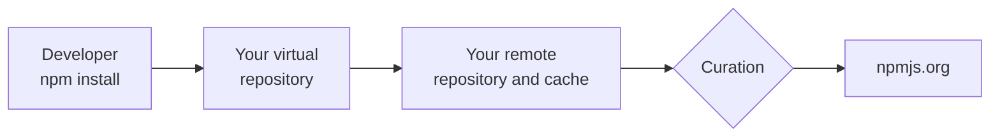

A **Curation policy** consists of several parts

| Part | What it decides |
| --- | --- |
| **Condition** | What makes a package unacceptable. A license, a CVE severity, an age, a known-malicious flag |
| **Scope** | Which of your remote repositories the policy applies to |
| **Action** | What happens on a match |
| **Waiver policy** | Whether anyone may ask for an exception, and who decides |

Terms, all in the [glossary](../../docs/glossary.md):

- A **condition** is the reusable test. Conditions exist independently of policies, so one condition can serve several policies.
- A **waiver** is a recorded, approved exception for one package.
- **Decision owners** are the group permitted to approve a waiver.

### Curation and Projects

Today, Curation **is not scoped to your project.** Every other resource you have created so far belongs to your project and carries its key. Curation does not work that way yet: policies belong to the whole instance. Project support is on the JFrog roadmap, and until it lands this lab works around it in two ways that you must follow exactly, otherwise the Curation policies you create during this lab might affect other users!

1. Your policy name should contain your own prefix, so that it doesn't clash with policies created by another lab user.
2. Your policy is **scoped to your own remote repository**. A policy configured to apply to all repositories blocks packages for everyone using this JFrog instance.

For the Curation exercises, **you need a different account.** Because Curation is instance-level, the project-scoped user account we've been working with cannot see Curation services in the JFrog Platform UI. Your handout has a shared administrator account for this.

We could have just used the shared administrator account for all of the labs, but doing it this way lets you see how permissions are configured on the JFrog platform.

## Steps

### 1. Sign in as the shared administrator

Open a **private or incognito browser window** and sign in with the `workshop-admin` credentials from your handout.

Use a separate window rather than signing out. You will want your own session back shortly, and the whole room is sharing this one account.

> [!IMPORTANT]
> Everything you create as this account is visible to, and editable by, everyone else in the room. Prefix your policy name with your user name, touch nothing that is not yours, and switch back to your own account when you are finished with this lab.

### 2. Enable Curation

> [!IMPORTANT]
> You must be signed in to the shared administrator account and have "All Projects" selected in the project selector at the top left of the page.

Go to the **Administration** tab, then **Curation Settings**.

By default Curation is not enabled, so the first thing you would normally do is enable the service from the **General** tab. You should see a "Curation On" slider like below.

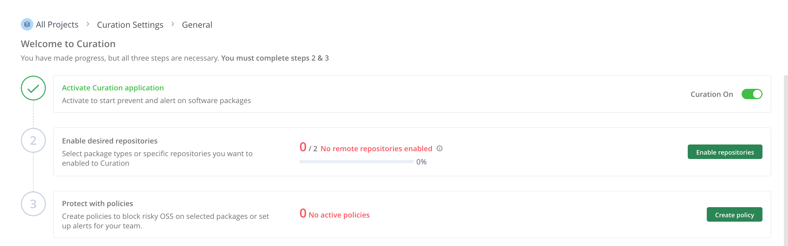

> [!NOTE]
> Curation only has to be enabled once for the entire JFrog instance, so as we're in a shared instance for this lab it's likely another user may have already enabled Curation and configured the settings below.

The next stage after enabling Curation is to enable the repositories you want Curation to cover. Click the "Enable Repositories" button.

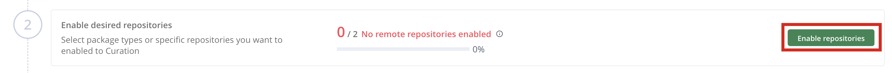

On the next page, you should see both the Docker and npm repository types listed, as we've already created Artifactory repositories for both of these. If it's not already been done, enable the slider on the left under the "Connect current and future" column. You'll see a confirmation dialog, just click the "Connect" button to confirm. Do this for both Docker and npm.

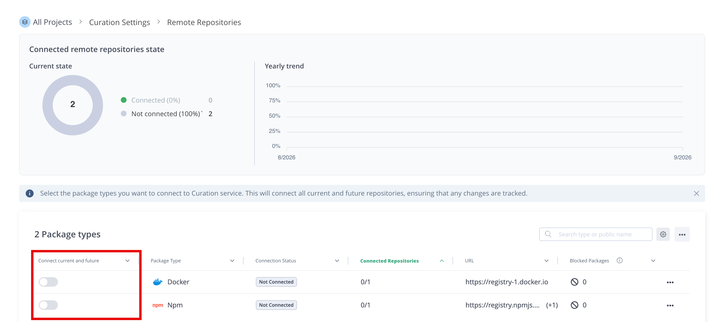

### 3. Curation Conditions

Conditions are the rules we define in Curation to determine which types of packages we want to exercise control over. There are a number of pre-defined conditions that are ready to use out of the box, or you can create a custom condition to suit your specific needs.

To start, from the **Administration** tab, under **Curation Settings** choose **Conditions**

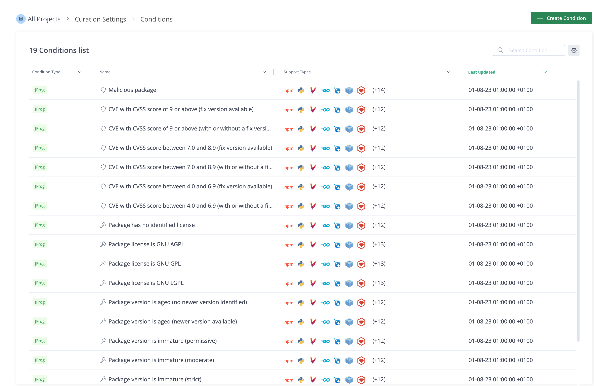

You'll see a page with a list of conditions as above. These break down into the following categories:

| Condition Category | Purpose |
| --- | --- |
| Malicious Package | Packages that are known to be malicious |
| CVE | Conditions that cover CVE's of different severity levels |
| Licence | Conditions that cover different types of open source licence |
| Package Age | Conditions that cover recently released or aged packages |
| Package Specific | Covers a specfic package or version of a specific package |

These packages are all tagged with the **JFrog** Condition Type, to indicate that these are the built-in conditions.

You also have the option to create custom conditions, which we will do now. We'll create a custom condition that will block packages that don't have a specific licence type.

From the Conditions page, click the "Create Condition" button at the top right. You'll see a list of custom condition templates.

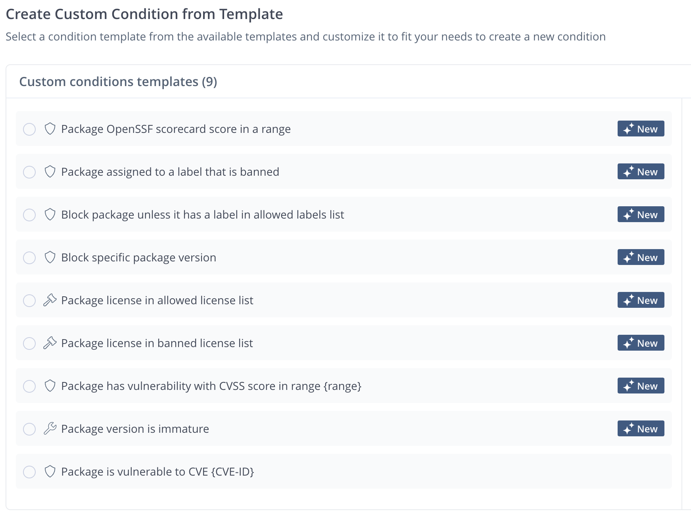

Choose the "Package license in allowed license list" template. On the right, the template will appear.

For the condition name, use the following with your user prefix:

```
user<xx>-approved-licenses
```

The next field lets you select the allowed licences. This rule will block any package whose licence isn't in this list. Add the following items:

```
MIT
Apache-2.0
BSD-2-Clause
BSD-3-Clause
ISC
```

When finished, you'll notice a "Preview Condition" button to the top right. Click on that and you'll be able to see the full details of the new custom condition:

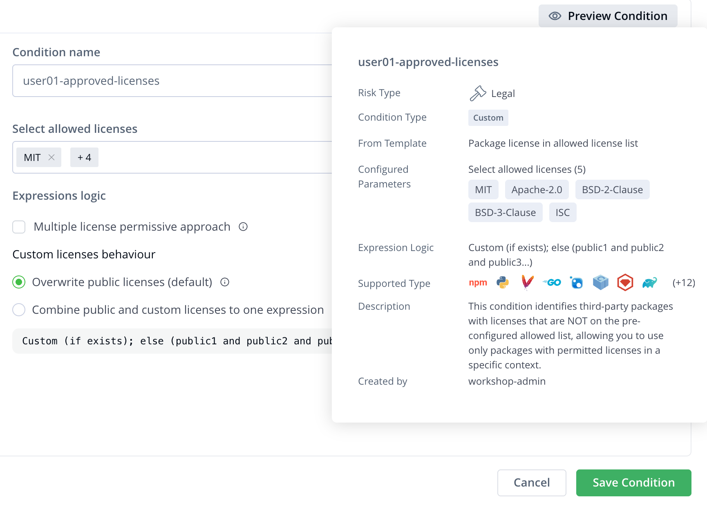

If everything loooks good, click the **Save Condition** button.

**Note what you have just created.** An allow list is default-deny: anything whose license is not on that list is refused, including licenses nobody has thought about yet. A block list is the opposite, and it only ever catches what you explicitly want to block. For licenses, default-deny is usually the right posture.

### 4. Curation Policies

Next, we need to create a new Curation policy using the custom condition you just made.

For this, you will need to go to the **Platform** tab, then choose **Curation** and then **Policies**. Then, choose the **Create Policy** button at the top right of the screen.

Work through each section clicking **Next** to progress to the next one. First we define a policy name. This will be prefixed with your user - `user<xx>-approved-licenses`

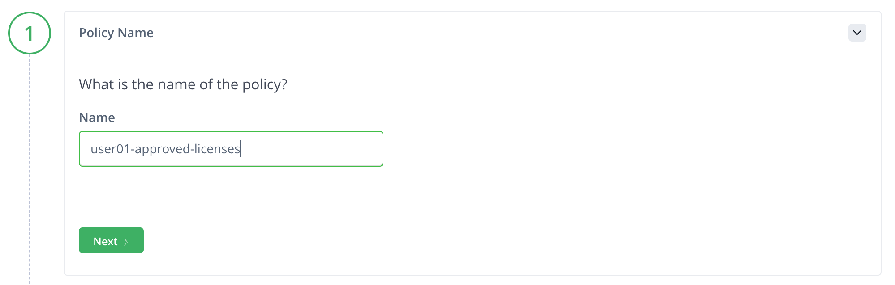

Next we choose the scope of our policy. Policies can be configured to apply to your whole organisation - i.e. to every repository and group in your JFrog Platform - or to specified repositories or groups only. As we want to make sure we don't affect other lab users, we need to apply this to specfic repositories only.

Select the **Specific remote repositories** option and then choose **Specific repositories**. You'll then see a **Select Repositories** button appear. Click this and you should see a list of all the repositories currently configured. Find the **npm** remote repository that you created earlier, the one with your user name prefix - `user<xx>-npm-remote`, tick the box next to it and then click **Save**.

When you've completed the Scope section correctly, it will look like this:

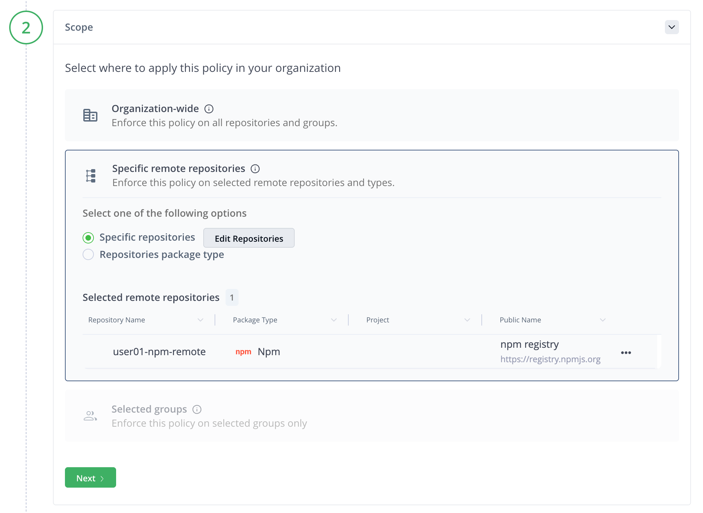

Next we choose the Policy Condition. Find the custom licence condition you created and select it.

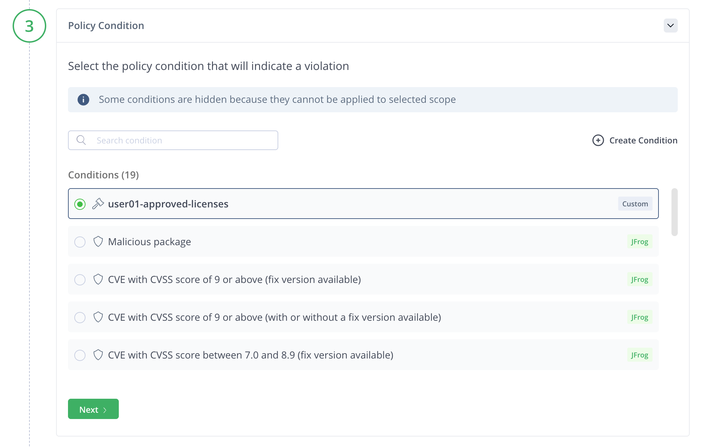

In the next section, we have the option to configure waivers. There are a couple of ways to configure waivers - this section allows us to define waivers either by specific package names and versions, or using labels. For now, we won't configure anything here, we'll just move on to the next section, which is where we define the Notifications and Actions.

The first part of this section allows us to define what happens if a policy violation occurs. We have two options:

- **Block** - this is the default action. Any package that violates this policy will be blocked by Curation.
- **Dry run** - this action does not block any packages, but the violation will be recorded in the audit log.

The dry run option is ideal for testing new policies and conditions without impacting package consumers, or if you have a condition or policy that just needs to report on violations rather than actually block them.

For this policy, we'll configure it to Block.

In the next part, you can choose Waiver Request Settings. In here, we can set options that allow a package consumer to request a waiver. There are three options here.

- **Not allowed** - Requesting a waiver for a package that violates this policy will result in immediate rejection
- **Manually approved** - Requesting a waiver for a package that violates this policy will trigger a manual review, needing a member of a specific group to approve or reject the request.
- **Automatically approved** - Requesting a waiver for a package that violates this policy will result in immediate approval

For this policy, we will configure a manual waiver. Click the drop down box and choose the "Manually approved" option. Next, you will see an option to **Select Owner Groups**. Click this and you'll be able to select one or more groups. The members of these groups will be the ones who are able to review the waivers requested for this policy.

That's all we need to configure in this last section.

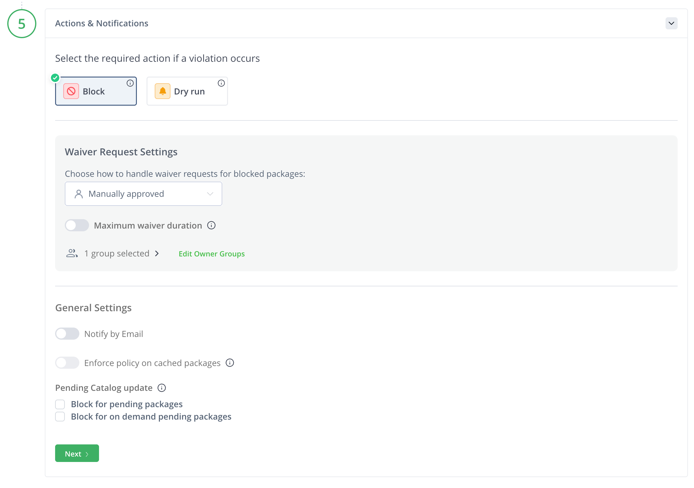

On the right, you will see a summary of the policy configuration. Check this to ensure all of the settings look correct. In particular, don't forget to ensure that the policy has been scoped only to your own repositories.

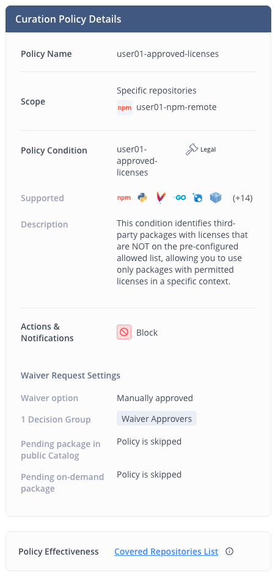

If everything looks right, click the **Save Policy** button.

### 5. Confirm the Curation Policy is working

Let's try and download a package that doesn't comply with our new licence policy. In your Codespaces terminal, run the following commands.

```bash
npm cache clean --force
cd /tmp && npm pack highcharts@8.2.0
```

We run the `npm cache clean --force` command first to make sure we don't have any locally cached copy of the package before attempting to download it.

The second command will attempt to download a package, but it will fail. When it fails, read the message npm displays. It should be something like this:

```
npm notice package highcharts:8.2.0 download was blocked by jfrog packages curation service due to the following policies violated {user01-approved-licences,user01-approved-licences,This package has licenses that are not allowed: [LicenseRef-jfrog-highcharts],Please replace it with an alternate package with license approved by the company for use.}. For details and alternatives, visit: https://<jfrog-workshop-instance>.jfrog.io/ui/catalog/packages/details/npm/highcharts/8.2.0?ecosystem=generic&showVersions=true
npm error code E403
npm error 403 In most cases, you or one of your dependencies are requesting
npm error 403 403 Forbidden - GET https://<jfrog-workshop-instance>.jfrog.io/artifactory/api/npm/user01-npm-virtual/highcharts/-/highcharts-8.2.0.tgz
npm error 403 a package version that is forbidden by your security policy, or
npm error 403 on a server you do not have access to.
```

`highcharts` is a charting library your sample application uses, and its license is not MIT, Apache or BSD. It is a commercial license, recorded in the JFrog Catalog as a non-public license reference. Your allow list does not include it, so Curation refused to let it through.

Compare this with lab 01, where `npm pack ms@2.1.3` worked. Same repository, same command, different package. Nothing about your npm setup changed.

### 6. Find out why, from the platform

In the JFrog UI, select the **Platform** tab, go to **Curation** and then **Audit Events**. In the list of **Blocked** events, you should see an entry relating to the package that just got blocked.

If you click on that line, you'll see a more detailed view, which includes information about the blocked package and the Curation policy that caused the block.

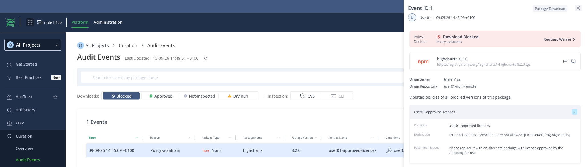

### 7. Request a waiver, then approve it

We set policies to block packages that are actually dangerous or potentially risky. In some circumstances a developer might have a legitimate reason to have access to a particular blocked package, and in that case they can request access using a waiver.

On the detail page for the blocked audit events we're currently looking at, at the top right you'll see a "Request waiver" link. Click that and you'll see the following:

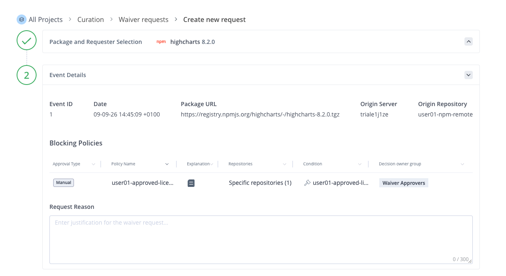

> [!NOTE]
> It's also possible to request a waiver by going to the **Platform** tab, selecting **Curation**, then **Waiver Requests** and then choosing **Create a new request** from the top right of that page
>
> There's also a method to create waivers from the command line, which we'll explore in later labs

At the top you can see the details of the package you're requesting a waiver for. Under that are details relating to the block event from the audit log. You can also see details of which policy is causing the block and details of who will approve the request.

In the request reason box, enter the following:

```
Commercially licensed charting library, purchased. Approved by legal on
2026-01-15. Needed by the status dashboard.
```

When finished, click the **Submit** button.

> [!IMPORTANT]
> In this lab scenario, we're currently logged in as the workshop administrator, and that user is a member of the approvers group for waivers. So, in this case, we can approve our own waiver. However, in a real world environment, that would not be a good practice! The approvers would normally be a separate group of users who would review each waiver request, and decide whether that package should be allowed or not.

Let's go ahead and approve our waiver, just so we can see the process in action. If you're not there already, from the **Platform** tab, select **Curation**, then **Waiver Requests**.  You should be on the **Pending Requests** view and be able to see something like this:

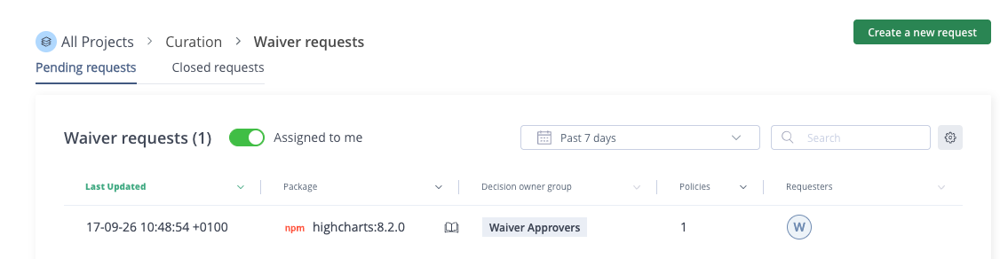

Click on the waiver request and you'll see the following:

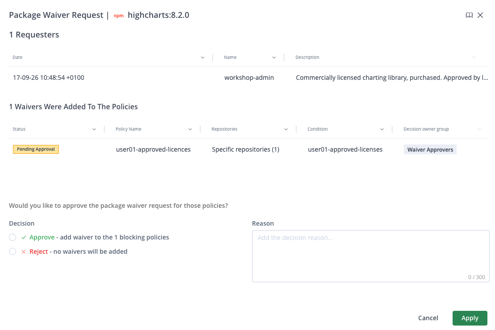

Here you can see the details of the waiver request and reason provided by the requester. At the bottom, you can see there are options to Approve or Reject, and there's space to add a reason for the decision.

Click the **Approve** option and then add the following to the Reason

```
Confirmed with legal that licence has been acquired.
```

Then click the **Apply** button at the bottom right of the screen, and confirm that you want to apply the waiver to the policy.

Finally, let's confirm the waiver worked. In the Codespaces terminal, type the following:

```bash
cd /tmp && npm pack highcharts@8.2.0
```

The package download will succeed this time. The policy is unchanged and still blocking everything else that is not on your allow list. But one package has a recorded, attributed exception.

## Checkpoint

1. A Curation custom condition named with your prefix exists.
2. A Curation policy named with your prefix exists, and its scope names **only your own** `<userxx>-npm-remote` repository. Read it back and be certain.
3. `npm pack highcharts@8.2.0` failed before the waiver and succeeds after it.
4. The blocked request appears in the Curation audit view, and the approved waiver is recorded against the package.

## What just happened

**You moved a control from detection to prevention.** Historically, detection tools were used to scan artifacts we already have to look for potential vulnerabilities or malicious packages. With Curation, we can prevent these artifacts from ever entering our environment in the first place.

**You chose default-deny and immediately felt the cost.** An allow list of five licenses blocked a package your own application needs. That is not a misconfiguration, it is the policy working, and the conversation it forced, namely who decided this library is acceptable and on what basis, is exactly the conversation a license policy exists to force.

**The waiver is the part most people skip and then regret.** A policy without a sanctioned exception route does not get respected; it gets circumvented. A waiver keeps the control on, names the exception, and records who accepted the risk.

**Scope is where this goes wrong in the field.** You were made to check it twice because a policy scoped wider than intended is both easy to create and hard to diagnose: the symptom appears in someone else's build, days later, as an unrelated failure. That is worth remembering when you configure this for real, where the blast radius is your organisation, not just the other participants in this lab!

## Challenge

🎯 **The scenario**

Your CISO has raised concerns about the recent wave of malicious packages on npm. They want assurance that no newly published package can be pulled into a build until someone has verified it is safe. How would you implement this?

**Success criteria**

- Block any npm package that is less than 14 days old. Don't forget to ensure any conditions or policies you create have your prefix applied, and the policy is scoped to **your own** remote npm repository only.
- Your existing license policy still works.

**Documentation**

- [Manage Curation](https://docs.jfrog.com/security/docs/manage-curation)
- [Manage Policies](https://docs.jfrog.com/security/docs/manage-policies)

**Timebox: 15 minutes.**

<details>
<summary>Solution</summary>

Your CISO is asking you to implement **package immaturity** policies. A newly published version has had no time to be examined by anyone, and the established attack pattern is to publish a malicious version and rely on automatic resolution picking it up within hours.

Curation has both built-in and custom conditions for this. These are the built-in conditions

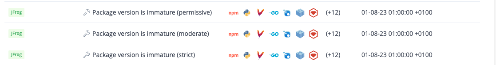

If you click any of these conditions, a window will appear showing you the details for each. You'll see that the **Package Version is Immature (Moderate)** condition is set to 14 days. If you want a different number of days, you can either choose one of the other two built-in conditions, or create a custom one.

1. As `workshop-admin`, Create a Curation policy, scoped to your npm remote repository
2. From the list of Policy Conditions, select the **Package Version is Immature (Moderate)** condition.
   immature** template.
3. Skip the Waivers section, then in Actions and Notifications, ensure the policy is set to **Block** and allow manually approved waiver requests.

The completed policy should be similar to this:

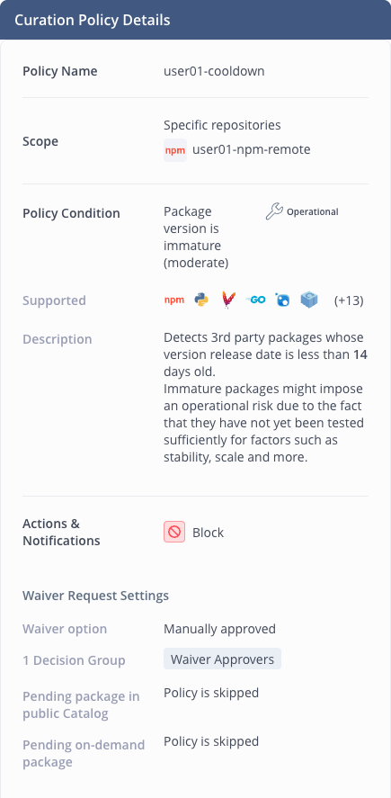

Why did we set a 14 day window? For an immature policy to be effective it has to be a time period that's long enough for most malicious packages to be detected and reported by the community, so that other policies that handle malicious or vulnerable packages can then take over managing access to them. It also can't be too long - if a package is legitimate and maybe includes important security updates, then you need to access to that quickly. A combination of a reasonable number of days and a waiver request process helps to meet these requirements.

- **Too short**, say 24 hours, and you catch almost nothing. Malicious packages are often found in days, not hours, and typosquats can sit unnoticed for weeks.
- **Too long**, say 90 days, and you have effectively banned upgrades. Security patches are new versions too, so an over-long window blocks the fixes you want alongside the attacks you fear.
- **14 to 30 days** is where most organizations land, because it is long enough for the community and for scanners to have looked, and short enough that urgent patches are only mildly inconvenient.

**What it catches that the license policy does not.** The license policy is about terms, and a malicious package can still have a valid license. Immaturity is about time, and catches things we don't know about yet.

**What it costs.** A developer who needs a package that was published this morning is blocked, and correctly so. The waiver route is the answer, and this is where the policy design earns its keep: if waivers are hard to get, people route around the control.

</details>

## Going further

**Look at the other condition templates.** Curation ships with more than licenses and immaturity, including CVE severity ranges and known-malicious detection.

**Find the "Enforce policy on cached packages" setting** on your policy. Work out what it means for a package that was already cached before you wrote the policy.

**Consider the waiver as a workflow, not a button.** Look at the decision owners field. If you were designing this for a 500-developer organization, who is in that group, how quickly do they respond, and what happens at 2am?

**Set a policy to dry run instead of block** and think about how you would use that to introduce Curation to a team that has never had it.

## Troubleshooting

**You cannot find Curation.** You are signed in as yourself. Curation needs the `workshop-admin` account from your handout, in a private window. This is expected and lab 00 step 6 explains why.

**`npm pack highcharts@8.2.0` succeeds when it should have been blocked.** Three usual causes:

- The policy scope does not include your `-npm-remote`. Check it.
- The policy is disabled. Check the enabled toggle.
- The package was already in your cache before the policy existed, and the policy does not block from cache.

**`npm pack` fails but you cannot tell whether Curation did it.** Check the Curation audit view in the admin window. If your request is not there, the failure was something else, most likely the npm configuration from lab 01.

**Someone else's build broke when you saved your policy.** Your scope is too wide. Set it to your own remote repository only, save, and tell your instructor so they can confirm nothing else is affected. 

## Next

[03 - Xray](../03-xray/README.md): policies and watches for the artifacts you
already have.
