# 03 - Xray

**Format:** Guided, with a closing challenge
**Duration:** _placeholder, set in Phase 8_
**Prerequisites:** [lab 00](../00-setup/README.md), [lab 01](../01-artifactory/README.md)

## What you will learn

- The difference between a finding and a violation
- How a policy, a rule and a watch fit together, and why there are three separate things rather than one
- How to build a policy that fails a build on Critical severity and nothing else
- What Contextual Analysis does to your policy, and why the default settings might catch nothing at all
- Where your own violations show up

## Why this matters

In lab 02, Curation decided what was allowed into your repositories. Xray looks at everything that is already in them and tells you what is wrong.

The thing that trips people up here is treating a scan result as a decision. A scanner will report hundreds of things, almost none of which should stop a release. A team that tries to fix all of them either stops shipping or stops looking at the reports. The job of a policy is to decide which subset of everything you can see you are actually going to act on, and getting that line in the right place is most of the value of the tool.

We are also going to meet the one setting that decides whether your policy catches anything at all, which for this application it does not by default.

## Concept

There are three objects involved, and they are deliberately kept separate.

| Object | What it is | Why it is separate |
| --- | --- | --- |
| **Policy** | A named set of rules, for example "fail on Critical" | Written once, then applied in many places |
| **Rule** | One condition inside a policy, plus what to do when it matches | A policy can have several |
| **Watch** | Binds policies to the things they apply to | The same policy can guard a repository, a build, or twenty of both |

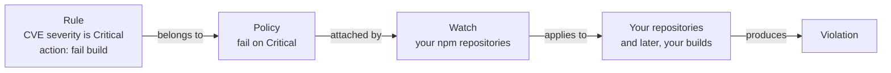

The reason there are three objects rather than one is that "what do we consider unacceptable" and "where does that apply" are different questions with different owners. A security team defines the policy once. Individual teams get watched by it. Keeping them separate is what stops you maintaining fifteen slightly different copies of the same rule.

### A finding and a violation are not the same thing

This is the distinction that the rest of the workshop leans on.

- A **finding** is something Xray observed, such as a CVE in a component you are holding. Xray reports every finding it knows about, whether you care about it or not.
- A **violation** is a finding that matched a rule, in a policy, attached by a watch. Violations have consequences, such as a failed build.

There will always be far more findings than violations, and that is how it is supposed to work. A team that cannot tell the two apart will read a long scan report as a crisis and either panic or, worse, learn to ignore the report altogether. Violations allow you to focus on the specific findings that are important to you.

### Applicability, and why it matters in this lab

Xray does more than match version numbers. Contextual Analysis looks at whether a vulnerability is actually reachable given the way you have used the component, and marks each finding with one of five verdicts.

| Verdict | Meaning |
| --- | --- |
| **Applicable** | The vulnerability can be exploited in the context of the scanned code or artifact. |
| **Not Applicable** | The vulnerability cannot be exploited in the context of the scanned code or artifact. |
| **Missing Context** | Reachability analysis cannot determine the vulnerability’s applicability due to missing context. |
| **Undetermined** | The applicability cannot be determined by static analysis. For example, exploitation requires user interaction. |
| **Not Covered** | This CVE is not one that Contextual Analysis supports. |

That matters concretely in a moment, because every Critical severity finding in our sample application is either Not Applicable or Missing Context. Not one of them is Applicable. A policy configured to act only on applicable findings will therefore find nothing to do here, and you would reasonably conclude that your policy was working when in fact it had never once been tested.

All of these terms are in the [glossary](../../docs/glossary.md), including **CVE**, **CVSS** and **severity**.

## Steps

Everything in this lab is done as yourself, in your own project. Unlike Curation, Xray respects the project boundary.

> [!IMPORTANT]
> Remember to switch back to the browser session, or log in again, using your userxx credentials, not the workshop-admin account, for the following lab.

### 1. Get to Xray

Make sure your project is selected, go to the **Platform** tab, then **Xray** and then **Watches and Policies**

### 2. Create the policy

Click the **Create a Policy** button and create a name for your new policy

```
user<xx>-critical-only
```

Notice that there are three policy types available. For this lab, we're going to create a new **Security** policy, so make sure that's selected before you click **Next**

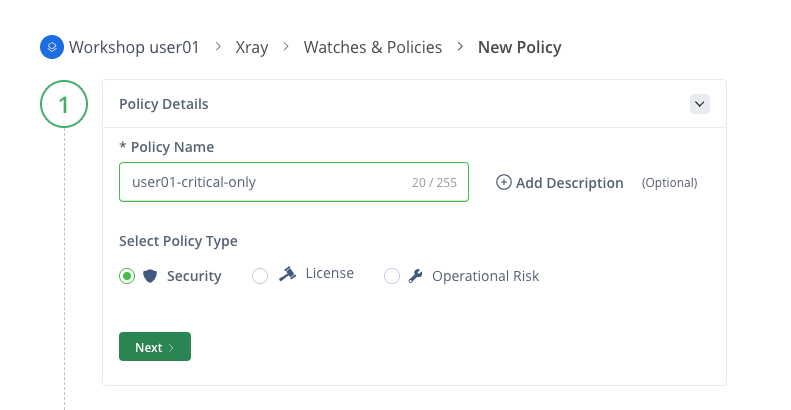

Name the rule `critical-severity`. Then in the **Rule type** dropdown, select **CVEs**. We have three options to choose from depending on how we want to handle detection of CVEs. We'll use the default **Minimal Severity** option, and then from the dropdown box marked **Select minimal severity**, we'll choose **Critical**

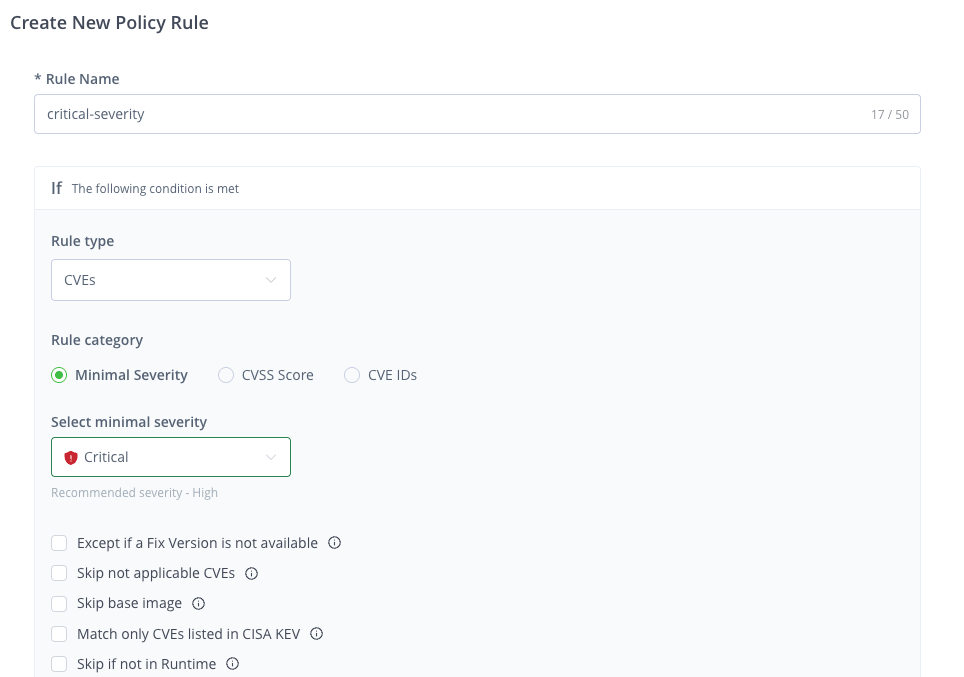

You'll notice we have some options under that allow us to further fine tune the conditions that will generate a violation. For example, we can choose not to generate a violation if a fix for the CVE is not available, or we can skip creating a violation if the CVE is not applicable.

On the right, you'll see there are a choice of actions that we can configure to take place if this policy condition is met. For this example, we'll choose the **Notify watch recipients** notification option, and the **Fail Build** block option.

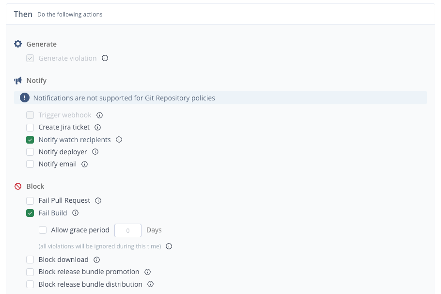

> [!NOTE]
> The **Block Download** option in this list only works on local repositories. As you saw in Lab 02, Curation is used for blocking remote repositories.

Click the **Save Rule** button to save your rule.

In this lab we're only assigning one rule to this policy, but notice that you could add additional rules here if you wanted to.

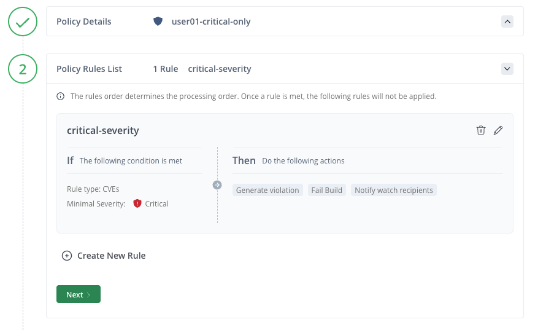

Click the **Next** button to continue.

The **Apply on Scope** section is optional and allows us to immediately assign this Policy to a Watch. If we already had some Watches defined, then it may be convenient to do that from here. However, as we're yet to create any Watches, we'll need to do that first. So, for now, simply click the **Save Policy** button to save the Policy we've created.

### 3. Create the watch

A Policy on its own does nothing at all. The Watch, is how we apply a policy.

Go to the **Watches** tab and choose **Set up a Watch**

Set the name of your Watch to `user<xx>-npm-watch`

Next, in the Watch Recipients section, you can optionally add an email address of someone who will be notified when a violation is generated. Recall that in the Policy we just defined, we set the notification option to **Notify watch recipients**. That option will cause the recipients here to be notified.

At the bottom of the page, there are four sections that specify the resource types we want our Watch to monitor. Click on the **Add Repositories** option, and in the dialog that pops up, find your npm remote `user<xx>-npm-remote`. Select that and then use the arrows in the centre of the page to move that to the right hand side.

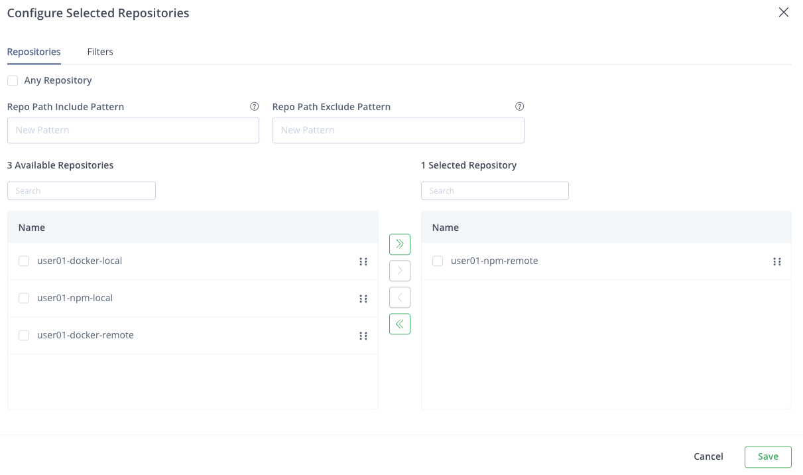

Click the **Save** button

Finally, we will assign the Policy we created to this Watch. Click the **+ Manage Policies** button.

You should only see one policy - the one you just created. Add that to the list on the right and then click **Save**

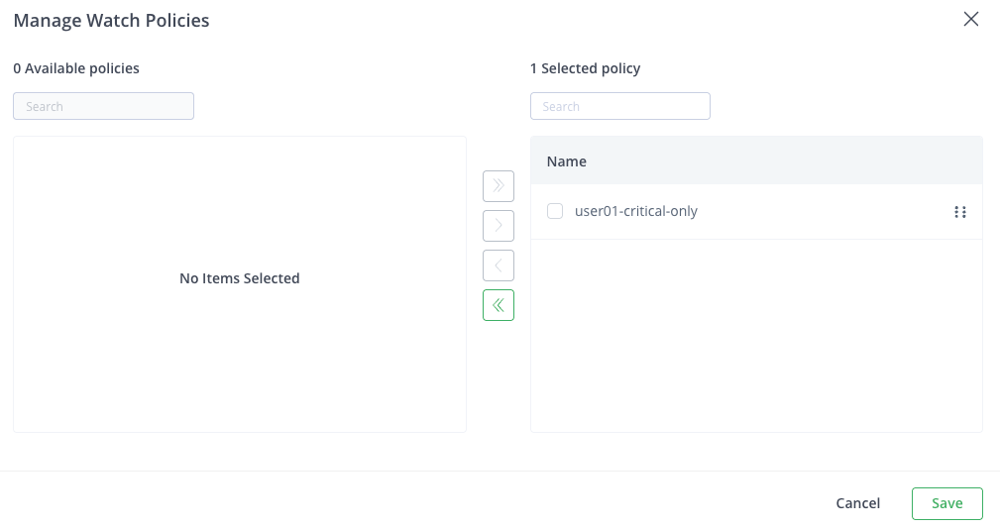

The completed Watch should now look like the following, with a name, repository and policy assigned.

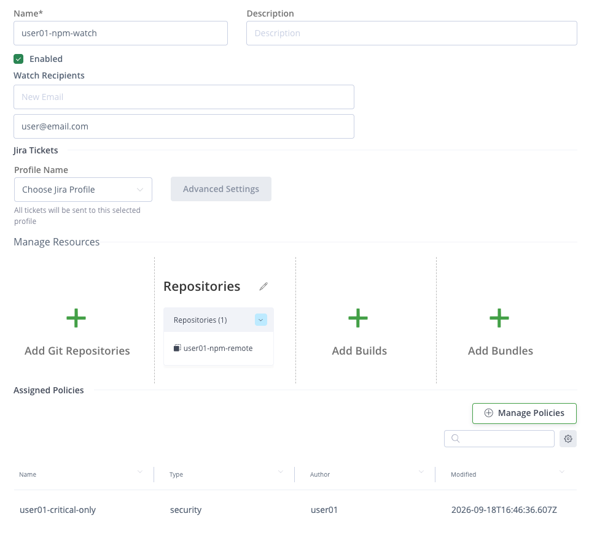

Click the **Create** button to complete the creation of your new Watch

### 4. Give it something to look at

Your watch is now guarding repositories that contain almost nothing, just the one package from lab 01 and one from lab 02. Let's fetch something with a known Critical in it:

```bash
cd /tmp && npm pack lodash@4.17.15
```

That is one of our sample application's dependencies, at the version it ships with. It will land in your remote cache, which is where your watch is looking.

Xray indexes new artifacts in the background rather than immediately. It may take a few minutes to see results. To check the scan status, from the **Platorm** tab, go to the **Xray** menu and select **Scans List**.

Then, from the **Repositories** tab, select the name of your npm remote's cache `user<xx>-npm-remote-cache`

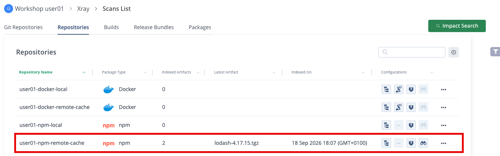

On this page, you can see artifacts being scanned and the scan status. If it says **Scanning**, then you just need to wait for that to complete. You might need to refresh the page.

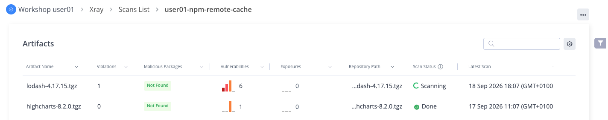

### 5. Find your violation

Now go to the **Platform** tab and from the **Xray** menu go to **Watch Violations**. On that page, you should see your watch listed. Click on the watch and you will be taken to a list of violations, which at this point should just contain one item - a CVE relating to the `lodash` dependency we just downloaded. Click on that CVE and you'll see full information about that vulnerability.

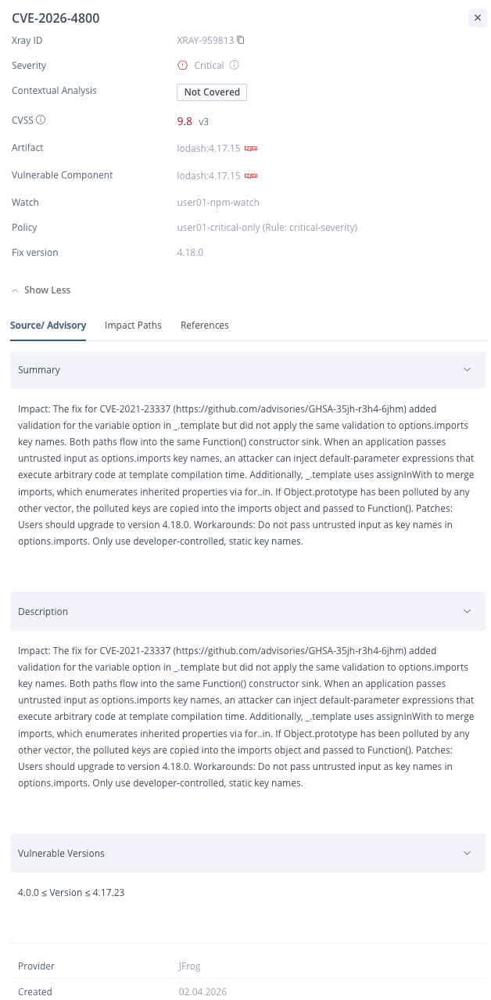

So, Xray has highlighted a critical CVE as the result of the Policy and Watch that we configured. But is that everything? Let's dig deeper.

From the **Platform** tab, go to **Xray** and then choose the **Scans List**, and again select your npm remote's cache `user<xx>-npm-remote`. At the top, you should see the line item for the `lodash` dependency that we uploaded. Note that it mentions **1 violation** and **6 vulnerabilities**

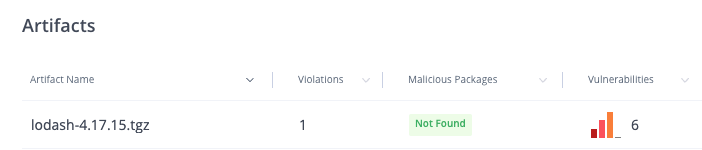

Click on the entry for `lodash` and we'll see a more detailed report.

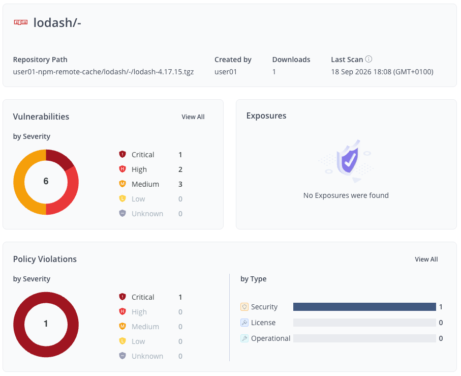

In the **Vulnerabilities** section, click **View All**

You'll now see a full, detailed list of all the CVE's associated with this dependency. One Critical vulnerability, two High vulnerabilties and three Mediums.

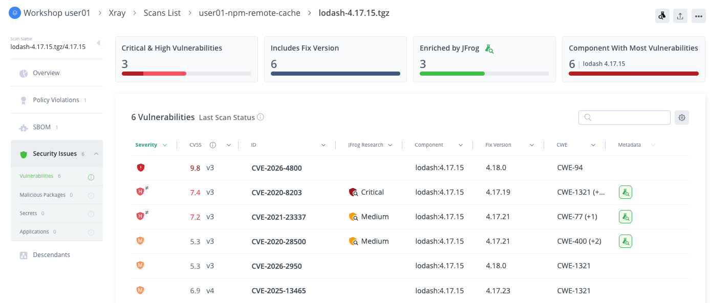

There is a lot of information available from this page, so take your time to click around and explore. Some of the things you'll find here are:

- Severity levels
- CVSS scores
- JFrog Research

JFrog's in-house security research team provide additional detailed analysis of CVE's. If you look at `CVE-2020-8203` in this list, you'll see several things. The severity level is High, but there's a marker next to the high symbol. This is because JFrog's research team has determined that they think the severity is different. If you look under the **JFrog Research** column, you'll see that it says **Critical** there.

If you click on that CVE, you'll get access to even more information. On the page that comes up, select the **JFrog Research** tab.

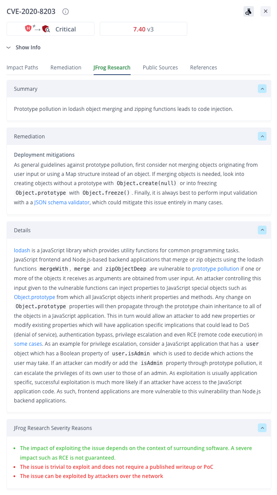

There is a lot of additional information here, including a detailed analysis of the CVE. At the bottom, you;ll find the **JFrog Research Severity Reasons** section, and in here the security team document why they think the actual severity is different to the one issued to the CVE.

## Checkpoint

1. An Xray policy exists with one Critical severity rule.
2. A watch exists, attached to that policy, targeting your npm repositories including the remote cache.
3. `lodash 4.17.15` is in your cache, and CVE-2026-4800 appears as a violation rather than only as a finding.
4. You can point at a finding on that same package that is not a violation, and say why it is not.

## What just happened

Your repositories contain several findings and produced one violation. Whilst Xray surfaces every vulnerability, giving you the full picture of the security state of your application, policies are used to make decisions about which vulnerabilites you want to take action on.

We separated the rule from the target. Policies say what is unacceptable and Watch say where.

## Challenge

🎯 **The scenario**

Your legal team has been asked to sign off on the open source that your product ships. They are relaxed about permissive licenses, but they need to know before a release rather than after it if anything copyleft or commercially licensed has found its way into a build. They have asked whether the tooling can tell them.

**Success criteria**

- A second policy exists, with your prefix, that acts on licenses rather than vulnerabilities.
- It is attached to your existing watch. You should not have created a second watch, and you should be able to say why not.
- You can name a package currently in your repositories that it flags, and one that it does not.
- You can explain how this differs from the license work you did in lab 02, and when you would want each of them.

**Documentation**

- [Create Policies](https://docs.jfrog.com/security/docs/create-policies-1)
- [Create Watches](https://docs.jfrog.com/security/docs/create-watches)
- [License Compliance](https://docs.jfrog.com/security/docs/legal)

**Timebox: 15 minutes.**

<details>
<summary>Solution</summary>

The mechanic is the one we just used. Only the type of policy changes.

1. Create a policy of type **License** rather than Security, named `user<xx>-license-compliance`.
2. Add a rule. Either list the licenses you allow, using the same permissive set as lab 02, `MIT`, `Apache-2.0`, `BSD-2-Clause`, `BSD-3-Clause` and `ISC`, or list the ones you ban. The allow list is the stronger position, for the same reason it was in lab 02.
3. Set the action. Notify rather than fail is likely the better answer here. Legal sign-off is a review gate rather than a build gate.
4. Attach it to your existing watch. Do not create a second one.

The completed license policy should look similar to this:

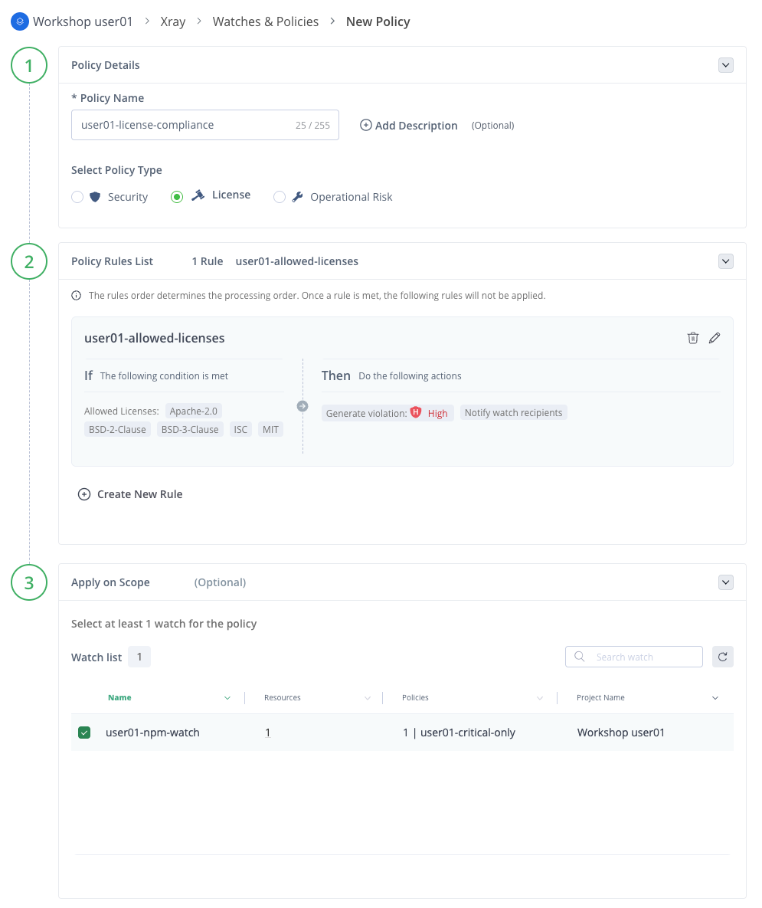

On the question of one watch rather than two. The watch answers "where does this apply", and that answer has not changed. It is still the same repositories. What changed is the policies. Adding a second watch over the same targets gives you two places to look, two things to maintain, and your violations split between them.

**What it flags.** `highcharts@8.2.0` is in your cache from lab 02, and its license is a non-public commercial reference rather than anything on your allow list. `lodash` and `ms` are both MIT and will pass. You should see results like this:

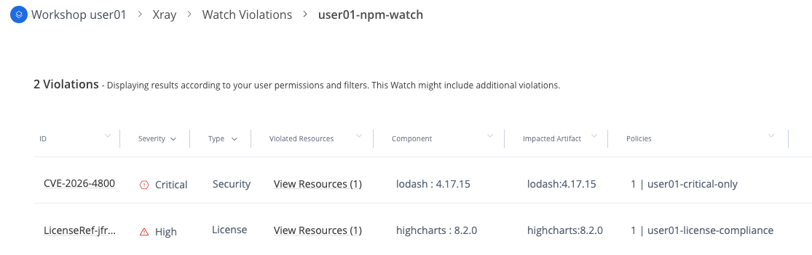

**How this differs from lab 02**, which is the real question here:

| | Curation, lab 02 | Xray license policy, lab 03 |
| --- | --- | --- |
| **When** | Before the package enters your instance | Afterwards, on everything you already hold |
| **Effect** | Refused at the door, nothing to clean up | Reported, and it is already in your estate |
| **Blind spot** | Only sees what arrives from upstream from now on | Sees everything, including what arrived before you had any policy at all |

Curation and Xray work together to protect you from issues with packages you're using for the first time, and packages you already have in your environment. In these labs, we blocked `highcharts` from entering using Curation to block it, then we allowed it using a waiver, and then the Xray license policy found it and now reports it as present in your environment under a non-permissive license.

</details>

## Going further

This section is optional. Nothing later depends on any of it.

**Add a High severity rule** to the same policy, with a notify action instead of fail. You now have a policy with two rules and two different consequences depending on severity.

**Look at what else a watch can target** besides repositories. Builds and release bundles are both options, and in a later lab we'll setup watches on builds. Have a think about which you would watch in your own environment, and why watching only repositories is not enough.

**Find the CVSS score** on the lodash violation and compare it with the severity label. Consider what JFrog Security Research adds on top of the public score, and why two scanners can disagree about the same CVE.

## Troubleshooting

**No violation appears after several minutes.** Work through these in order:

1. Is `lodash` actually in `user01-npm-remote-cache`? Have a look in Artifacts. If it is not there, then the `npm pack` did not go through Artifactory, and the npm configuration from lab 01 is the place to look.
2. Does the watch target that cache repository specifically? Targeting only the virtual or the local repository will not catch it.
3. Is the policy actually attached to the watch? A policy with no watch does nothing.

**You cannot find Xray Watches and Policies in the UI.** Check that your project is selected rather than All Projects.

**There are violations from packages you did not fetch.** Your watch targets a repository rather than a package, so anything in that repository is in scope, including the `ms` and `highcharts` from the earlier labs. That is correct behavior, and a useful thing to notice: a watch is a standing instruction rather than a one-off scan.

## Next

**04 - CLI**: doing all of this from a terminal, and finding these same findings before you ever push a commit.

> [!NOTE]
> Lab 04 is added in build phase 4. This link becomes live then. See the [module index](../../README.md#modules) for what is available now.
