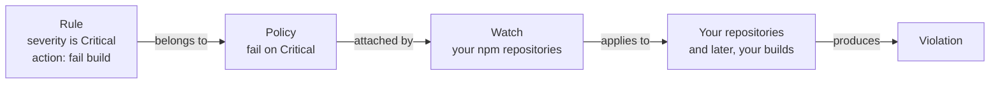

# 03 - Xray

**Format:** Guided, with a closing challenge
**Duration:** _placeholder, set in Phase 8_
**Prerequisites:** [lab 00](../00-setup/README.md), [lab 01](../01-artifactory/README.md)

## What you will learn

- The difference between a finding and a violation
- How a policy, a rule and a watch fit together, and why there are three separate things rather than one
- How to build a policy that fails a build on Critical severity and nothing else
- What Contextual Analysis does to your policy, and why the default settings might catch nothing at all
- Where your own violations show up

## Why this matters

In lab 02, Curation decided what was allowed into your repositories. Xray looks at everything that is already in them and tells you what is wrong with it.

The thing that trips people up here is treating a scan result as a decision. A scanner will report hundreds of things, almost none of which should stop a release. A team that tries to fix all of them either stops shipping or stops looking at the reports. The job of a policy is to decide which subset of everything you can see you are actually going to act on, and getting that line in the right place is most of the value of the tool.

We are also going to meet the one setting that decides whether your policy catches anything at all, which for this application it does not by default.

## Concept

There are three objects involved, and they are deliberately kept separate.

| Object | What it is | Why it is separate |
| --- | --- | --- |
| **Policy** | A named set of rules, for example "fail on Critical" | Written once, then applied in many places |
| **Rule** | One condition inside a policy, plus what to do when it matches | A policy can have several |
| **Watch** | Binds policies to the things they apply to | The same policy can guard a repository, a build, or twenty of both |



The reason there are three objects rather than one is that "what do we consider unacceptable" and "where does that apply" are different questions with different owners. A security team defines the policy once. Individual teams get watched by it. Keeping them separate is what stops you maintaining fifteen slightly different copies of the same rule.

### Finding and violation are not the same thing

This is the distinction that the rest of the workshop leans on.

- A **finding** is something Xray observed, such as a CVE in a component you are holding. Xray reports every finding it knows about, whether you care about it or not.
- A **violation** is a finding that matched a rule, in a policy, attached by a watch. Violations have consequences: a failed build, an alert, a blocked promotion.

There will always be far more findings than violations, and that is how it is supposed to work. A team that cannot tell the two apart will read a long scan report as a crisis and either panic or, worse, learn to ignore the report altogether.

### Applicability, and why it matters in this lab

Xray does more than match version numbers. Contextual Analysis looks at whether a vulnerability is actually reachable given the way you have used the component, and marks each finding with one of five verdicts.

| Verdict | Meaning |
| --- | --- |
| **Applicable** | The vulnerable code path is reachable in the way you have used it |
| **Not Applicable** | The component is there but the vulnerable path is not reachable |
| **Missing Context** | The analysis could not reach a conclusion with the information available |
| **Undetermined** | The analysis ran but was inconclusive |
| **Not Covered** | This CVE is not one that Contextual Analysis supports |

> [!IMPORTANT]
> Only `Applicable` means reachable. None of the other four mean safe to ignore. `Not Covered` in particular means that nobody looked, not that there is nothing there. Reading everything except `Applicable` as noise is the easiest mistake to make with this feature.

That matters concretely in a moment, because every Critical severity finding in our sample application is either Not Applicable or Missing Context. Not one of them is Applicable. A policy configured to act only on applicable findings will therefore find nothing to do here, and you would reasonably conclude that your policy was working when in fact it had never once been tested.

All of these terms are in the [glossary](../../docs/glossary.md), including **CVE**, **CVSS** and **severity**.

## Steps

Everything in this lab is done as yourself, in your own project. Unlike Curation, Xray respects the project boundary.

### 1. Get to Xray

Make sure your project is selected, go to the **Administration** tab, and find the Xray configuration area for policies and watches.

> [!IMPORTANT]
> VERIFY: confirm the navigation to Xray policies and watches for a project-scoped user on a current instance. Confirm in particular whether policies and watches are administered inside the project context at all, or only at instance level. If it turns out to be the latter then this lab needs the shared administrator account in the same way lab 02 does, and the concept section needs rewriting, because it currently contrasts Xray with Curation on exactly this point.

### 2. Create the policy

Create a new **Security** policy, and call it:

```
user01-critical-only
```

Your project prefixes resources automatically, but put the name in explicitly anyway. You will be glad of it in lab 09 when you are looking at a list of them.

Add a single rule:

| Field | Value |
| --- | --- |
| Rule name | `critical-severity` |
| Criteria | Minimum severity: **Critical** |
| Include non-applicable findings | **Yes.** See below, this one matters |
| Actions | Fail build, and notify |

<!-- SCREENSHOT: labs/03-xray/images/policy-critical-rule.png
     Capture: the security rule form with minimum severity set to Critical, the
     include-non-applicable setting enabled, and the fail-build action selected. -->

> [!IMPORTANT]
> VERIFY: confirm the exact label and location of the setting that controls whether non-applicable findings count towards a violation. It may be phrased the other way round, as skipping non-applicable CVEs, in which case you want it switched off. The name used above is descriptive rather than literal.

We are using Critical only, rather than High and above, because a policy that fires on everything is a policy that people switch off. Starting narrow and widening it once a team trusts it is how this succeeds in practice. You will see the consequence of that choice directly: `express` and `jsonwebtoken` in our application both carry Medium and High findings that will be perfectly visible and will not stop anything.

We are including non-applicable findings because in this application, leaving them out means the policy never fires at all. There are two honest positions here.

- Include them, which is what we are doing. You act on severity, and applicability tells you how urgently rather than whether. Noisier, and nothing gets past you.
- Exclude them, and act only on what is provably reachable. Much quieter, and you are trusting the analysis to be complete, which `Missing Context` and `Not Covered` are telling you it sometimes is not.

Most organizations start by including them and tighten up later. What you should not do is pick one without realising you have picked it, which is exactly what happens when nobody reads this field.

Save the policy.

### 3. Create the watch

A policy on its own does nothing at all. Create a watch:

```
user01-npm-watch
```

- **Target:** your npm repositories. Include the remote cache repository, `user01-npm-remote-cache`, because that is where packages fetched from upstream actually end up.
- **Policy:** attach `user01-critical-only`.

<!-- SCREENSHOT: labs/03-xray/images/watch-with-policy.png
     Capture: the watch form with the attendee's npm repositories as targets and
     the critical-only policy attached. -->

Save it.

### 4. Give it something to look at

Your watch is now guarding repositories that contain almost nothing, just the one package from lab 01 and one from lab 02. Let's fetch something with a known Critical in it:

```bash
cd /tmp && npm pack lodash@4.17.15
```

That is one of our own application's dependencies, at the version it ships with. It will land in your remote cache, which is where your watch is looking.

> [!NOTE]
> Xray indexes new artifacts in the background rather than immediately. Give it a minute or two before you expect to see results, and re-check rather than assuming it has failed.

### 5. Find your violation

Go to the **Platform** tab and open the Xray scan results or violations view for your project.

You are looking for `lodash 4.17.15` and **CVE-2026-4800**, which is a Critical.

<!-- SCREENSHOT: labs/03-xray/images/violation-lodash.png
     Capture: the violations view showing the lodash Critical violation, with
     the policy name and the Not Applicable contextual analysis verdict both
     visible in the same row. -->

> [!IMPORTANT]
> VERIFY: confirm where violations appear for a project-scoped user, and whether a repository watch surfaces them in the same place that build violations will appear later. This is the step most likely to have moved since it was written.

Now have a look at the same package's findings, rather than just its violations. There are considerably more of them: Highs and Mediums that your policy ignored completely. Same package, same scan, one violation.

### 6. Look at the applicability verdict

On the CVE-2026-4800 violation, find the Contextual Analysis verdict. It reads **Not Applicable**.

Xray is telling you three things at the same time here, and none of them contradict each other.

1. This is a Critical severity vulnerability, and it really is present.
2. The vulnerable code path does not appear to be reachable in the way this component is used.
3. Your policy failed the build anyway, because you told it to.

Whether that outcome is the right one depends on your organization's appetite rather than on the tool. It is a good conversation to have with a customer, and it does not have a correct answer.

## Checkpoint

1. A security policy exists with one Critical severity rule, and non-applicable findings are being counted.
2. A watch exists, attached to that policy, targeting your npm repositories including the remote cache.
3. `lodash 4.17.15` is in your cache, and CVE-2026-4800 appears as a violation rather than only as a finding.
4. You can point at a finding on that same package that is not a violation, and say why it is not.
5. You can say what would happen to your violation if you excluded non-applicable findings.

Item 4 is the one to be able to explain out loud, because it is the idea the rest of the workshop is built on.

## What just happened

We drew a line, deliberately and narrowly. Your repositories contain dozens of findings and produced one violation. That ratio is the configuration rather than a failure of it. Enforcement is a policy decision and visibility is a tool capability, and confusing the two is how organizations end up either ignoring their scanner or unable to release anything.

**We also found out that the default settings might have caught nothing.** Every Critical in this application is Not Applicable or Missing Context. Had we left non-applicable findings out, the policy would have been perfectly well formed and completely inert, and there would have been no way of knowing from looking at it. That applies well beyond Xray: if you have never seen a control fire, you have not tested it.

**We separated the rule from the target.** The policy says what is unacceptable and the watch says where. When lab 07 adds a build to that watch, the policy does not change and neither does anything else you configured today.

**You now have real data with your own name on it.** Labs 09 to 11 tour the platform UI, and the reason they come last in the day is so that they contain your violations rather than a demo tenant's.

## Challenge

🎯 **The scenario**

Your legal team has been asked to sign off on the open source that your product ships. They are relaxed about permissive licenses, but they need to know before a release rather than after it if anything copyleft or commercially licensed has found its way into a build. They have asked whether the tooling can tell them.

**Success criteria**

- A second policy exists, with your prefix, that acts on licenses rather than vulnerabilities.
- It is attached to your existing watch. You should not have created a second watch, and you should be able to say why not.
- You can name a package currently in your repositories that it flags, and one that it does not.
- You can explain how this differs from the license work you did in lab 02, and when you would want each of them.

**Documentation**

- [Create Policies](https://docs.jfrog.com/security/docs/create-policies-1)
- [Create Watches](https://docs.jfrog.com/security/docs/create-watches)
- [License Compliance](https://docs.jfrog.com/security/docs/legal)

**Timebox: 15 minutes.**

<details>
<summary>Solution</summary>

The mechanic is the one we just used. Only the type of policy changes.

1. Create a policy of type **License** rather than Security, named `user01-license-compliance`.
2. Add a rule. Either list the licenses you allow, using the same permissive set as lab 02, `MIT`, `Apache-2.0`, `BSD-2-Clause`, `BSD-3-Clause` and `ISC`, or list the ones you ban. The allow list is the stronger position, for the same reason it was in lab 02.
3. Set the action. Notify rather than fail is the better answer here, and it is worth being able to defend that: legal sign-off is a review gate rather than a build gate, and failing a build on a license question tends to get the policy disabled by lunchtime.
4. Attach it to your existing watch. Do not create a second one.

On the question of one watch rather than two. The watch answers "where does this apply", and that answer has not changed. It is still the same repositories. What changed is the policies. Adding a second watch over the same targets gives you two places to look, two things to maintain, and your violations split between them. Watches are per-target and policies are per-concern.

**What it flags.** `highcharts@8.2.0` is in your cache from lab 02, and its license is a non-public commercial reference rather than anything on your allow list. `lodash` and `ms` are both MIT and will pass.

**How this differs from lab 02**, which is the real question here:

| | Curation, lab 02 | Xray license policy, lab 03 |
| --- | --- | --- |
| **When** | Before the package enters your instance | Afterwards, on everything you already hold |
| **Effect** | Refused at the door, nothing to clean up | Reported, and it is already in your estate |
| **Blind spot** | Only sees what arrives from upstream from now on | Sees everything, including what arrived before you had any policy at all |

You want both, and the blind spot row is the reason. Curation cannot help you with the thousand packages you cached last year. Xray cannot stop tomorrow's arrival. `highcharts` is the case in point: Curation blocked it, you waived it in, and the Xray license policy now reports it as present in your estate under a non-permissive license. Both of those are correct, and they are answering different questions.

</details>

## Going further

This section is optional. Nothing later depends on any of it.

**Turn the non-applicable setting off** on your policy, and then re-check your violations. Your only violation disappears while the finding stays exactly where it was. Turn it back on again afterwards. That is the quickest demonstration of findings against violations available, and it is worth doing rather than just reading about.

**Add a High severity rule** to the same policy, with a notify action instead of fail. You now have a policy with two rules and two different consequences depending on severity, which is what most real policies look like.

**Look at what else a watch can target** besides repositories. Builds and release bundles are both options, and lab 07 uses the build one. Have a think about which you would watch in your own environment, and why watching only repositories is not enough.

**Find the CVSS score** on the lodash violation and compare it with the severity label. Consider what JFrog Security Research adds on top of the public score, and why two scanners can disagree about the same CVE.

## Troubleshooting

**No violation appears after several minutes.** Work through these in order:

1. Is `lodash` actually in `user01-npm-remote-cache`? Have a look in Artifacts. If it is not there, then the `npm pack` did not go through Artifactory, and the npm configuration from lab 01 is the place to look.
2. Does the watch target that cache repository specifically? Targeting only the virtual or the local repository will not catch it.
3. Is the policy actually attached to the watch? A policy with no watch does nothing.
4. Are non-applicable findings included? If they are not then there is nothing to find, because every Critical in this application is Not Applicable or Missing Context. This is the most likely cause.

**You can see the finding but there is no violation.** That is item 4 above, and it is this lab's whole point arriving through the back door. Your policy is not counting the finding. Check the severity threshold and the non-applicable setting.

**You cannot find Xray policies under Administration.** Check that your project is selected rather than All Projects. If Xray configuration turns out to be instance level on your tenant, use the `workshop-admin` account as you did in lab 02, and let your instructor know, because this lab assumes it is not.

**There are violations from packages you did not fetch.** Your watch targets a repository rather than a package, so anything in that repository is in scope, including the `ms` and `highcharts` from the earlier labs. That is correct behavior, and a useful thing to notice: a watch is a standing instruction rather than a one-off scan.

## Next

**04 - CLI**: doing all of this from a terminal, and finding these same findings before you ever push a commit.

> [!NOTE]
> Lab 04 is added in build phase 4. This link becomes live then. See the [module index](../../README.md#modules) for what is available now.
