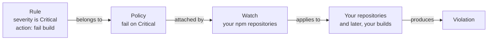

# 03 - Xray

**Format:** Guided, with a closing challenge
**Duration:** _placeholder, set in Phase 8_
**Prerequisites:** [lab 00](../00-setup/README.md), [lab 01](../01-artifactory/README.md)

## What you will learn

- The difference between a **finding** and a **violation**, which is the single
  most useful distinction in the platform
- How a policy, a rule and a watch fit together, and why there are three things
  rather than one
- How to build a policy that fails a build on Critical severity and nothing else
- What Contextual Analysis does to your policy, and why the default might catch
  nothing at all
- Where your own violations appear

## Why this matters

Curation, in lab 02, decided what was allowed in. Xray looks at everything you
already have and tells you what is wrong with it.

The trap here is treating a scan result as a decision. A scanner will report
hundreds of things. Almost none of them should stop a release, and a team that
tries to fix everything either stops shipping or stops looking. The job of a
policy is to draw a line: **of everything we can see, this is the subset we act
on.** Getting that line in the right place is most of the value of the tool.

You will also meet the setting that decides whether your policy catches
anything at all, which in this application it does not by default.

## Concept

Three objects, and the separation is deliberate.

| Object | What it is | Why it is separate |
| --- | --- | --- |
| **Policy** | A named set of rules, for example "fail on Critical" | Written once, applied in many places |
| **Rule** | One condition inside a policy, plus what to do about it | A policy can have several |
| **Watch** | Binds policies to the things they apply to | The same policy can guard a repository, a build, or twenty of both |



**Why not one object?** Because the question "what do we consider unacceptable"
and the question "where does that apply" have different answers and different
owners. Security defines the policy once. Teams get watched by it. Splitting them
is what stops you maintaining fifteen slightly different copies of the same rule.

### Finding versus violation

This is the distinction to take away from today.

- A **finding** is something Xray observed. A CVE in a component. Xray reports
  every one it knows about, whether you care or not.
- A **violation** is a finding that **matched a rule in a policy attached by a
  watch**. It has consequences: a failed build, an alert, a blocked promotion.

Findings are the map. Violations are the fence. **The scan surface is always
wider than the enforcement surface**, and that is correct rather than a gap. A
team that cannot tell the two apart will read a long scan report as a crisis, and
either panic or, worse, learn to ignore it.

### Applicability, and why it matters here

Xray does more than match version numbers. **Contextual Analysis** examines
whether a vulnerability is actually reachable in the way you have used the
component, and marks each finding:

| Verdict | Meaning |
| --- | --- |
| **Applicable** | The vulnerable code path is reachable as you have used it |
| **Not Applicable** | The component is present but the vulnerable path is not reachable |
| **Missing Context** | Analysis could not reach a conclusion with the information available |
| **Undetermined** | Analysis ran but was inconclusive |
| **Not Covered** | This CVE is not one Contextual Analysis supports |

> [!IMPORTANT]
> **Only `Applicable` means "reachable". Nothing else means "safe to ignore".**
> `Not Covered` in particular means nobody looked, not that there is nothing
> there. An attendee who reads everything except `Applicable` as noise has taken
> away the wrong lesson, and this is the single easiest mistake to make with this
> feature.

This matters concretely in a moment, because **every Critical in the sample
application is either Not Applicable or Missing Context.** Not one is Applicable.
So a policy configured to act only on applicable findings will find nothing to
do here, and you would reasonably conclude your policy worked when it had never
been tested.

Terms are all in the [glossary](../../docs/glossary.md), including **CVE**,
**CVSS** and **severity**.

## Steps

Everything in this lab is done as **yourself**, in your own project. Xray, unlike
Curation, respects the project boundary.

### 1. Get to Xray

**Administration** tab, with your project selected, then find the Xray
configuration area for policies and watches.

> [!IMPORTANT]
> VERIFY: confirm the navigation to Xray policies and watches for a
> project-scoped user on a current instance. Confirm in particular whether
> policies and watches are administered inside the project context or only at
> instance level, because if it is the latter this lab needs the shared admin
> account like lab 02 does.

### 2. Create the policy

Create a new **Security** policy.

```
user01-critical-only
```

Your project prefixes resources automatically, but name it explicitly anyway:
you will thank yourself in lab 09 when you are looking at a list.

Add one rule:

| Field | Value |
| --- | --- |
| Rule name | `critical-severity` |
| Criteria | Minimum severity: **Critical** |
| **Include non-applicable findings** | **Yes. This one matters, see below** |
| Actions | Fail build, and notify |

<!-- SCREENSHOT: labs/03-xray/images/policy-critical-rule.png
     Capture: the security rule form with minimum severity set to Critical, the
     include-non-applicable setting enabled, and the fail-build action selected. -->

> [!IMPORTANT]
> VERIFY: confirm the exact label and location of the setting that controls
> whether non-applicable findings count towards a violation. It may be phrased
> as skipping non-applicable CVEs, in which case you want it **off**. The name
> below is descriptive, not literal.

**Why Critical only, and not High and above?** Because a policy that fires on
everything is a policy people switch off. Starting narrow and widening once the
team trusts it is how this succeeds in practice. You will see the consequence
directly: `express` and `jsonwebtoken` in your application carry Medium and High
findings that will be visible and will not stop anything. That is the fence being
narrower than the map, on purpose.

**Why include non-applicable findings?** Because in this application, excluding
them means the policy never fires. Every Critical here is Not Applicable or
Missing Context. Two honest positions exist:

- **Include them**, as you are doing. You act on severity, and applicability
  informs how urgently rather than whether. Noisier, and nothing slips past.
- **Exclude them**, and you act only on what is provably reachable. Much quieter,
  and you are trusting the analysis to be complete, which `Missing Context` and
  `Not Covered` tell you it sometimes is not.

Most organizations start by including and tighten later. What you must not do is
pick one without knowing you picked it, which is precisely what happens when
nobody reads this field.

Save the policy.

### 3. Create the watch

A policy on its own does nothing. Create a watch:

```
user01-npm-watch
```

- **Target:** your npm repositories. Include the remote **cache** repository,
  `user01-npm-remote-cache`, since that is where packages fetched from upstream
  actually live.
- **Policy:** attach `user01-critical-only`.

<!-- SCREENSHOT: labs/03-xray/images/watch-with-policy.png
     Capture: the watch form with the attendee's npm repositories as targets and
     the critical-only policy attached. -->

Save it.

### 4. Give it something to look at

Your watch is now guarding repositories that contain almost nothing: one package
from lab 01 and one from lab 02. Fetch something with a known Critical in it:

```bash
cd /tmp && npm pack lodash@4.17.15
```

That is one of your application's own dependencies, at the version it ships. It
lands in your remote cache, where your watch is looking.

> [!NOTE]
> Xray indexes new artifacts asynchronously. Give it a minute or two before
> expecting results, and re-check rather than assuming it failed.

### 5. Find your violation

Go to the **Platform** tab and open the Xray scan results or violations view for
your project.

You are looking for `lodash 4.17.15` and **CVE-2026-4800**, Critical.

<!-- SCREENSHOT: labs/03-xray/images/violation-lodash.png
     Capture: the violations view showing the lodash Critical violation, with
     the policy name and the Not Applicable contextual analysis verdict both
     visible in the same row. -->

> [!IMPORTANT]
> VERIFY: confirm where violations appear for a project-scoped user, and whether
> a repository watch surfaces them in the same place as build violations. This
> is the step most likely to have moved.

Now look at the same package's **findings**, not just its violations. There are
more of them: Highs and Mediums that your policy ignored completely. Same
package, same scan, one violation.

**That is the distinction, on your own screen, with your own data.**

### 6. Look at the applicability verdict

On the CVE-2026-4800 violation, find the Contextual Analysis verdict. It reads
**Not Applicable**.

Sit with that for a moment, because it is a genuinely interesting position to be
in. Xray is telling you three things at once:

1. This is a Critical severity vulnerability, and it is really there.
2. The vulnerable code path does not appear reachable in how this component is
   used.
3. Your policy failed the build anyway, because you told it to.

None of those contradict each other. Whether that outcome is right depends on
your organization's appetite, not on the tool, and it is exactly the
conversation to have with a customer rather than a question with a correct
answer.

## Checkpoint

1. A security policy exists with one Critical-severity rule, and non-applicable
   findings are counted.
2. A watch exists, attached to that policy, targeting your npm repositories
   including the remote cache.
3. `lodash 4.17.15` is in your cache, and CVE-2026-4800 appears as a
   **violation**, not merely a finding.
4. You can point at a finding on that same package that is **not** a violation,
   and say why.
5. You can state what would happen to your violation if you excluded
   non-applicable findings.

Item 4 is the one worth being able to do out loud. It is the idea the rest of
the workshop leans on.

## What just happened

**You drew a line, deliberately and narrowly.** Your repositories contain dozens
of findings and produced one violation. That ratio is not a failure of
configuration, it is the configuration. Enforcement is a policy decision;
visibility is a tool capability. Confusing them is how organizations end up
either ignoring their scanner or unable to release.

**You discovered that the default might have caught nothing.** Every Critical in
this application is Not Applicable or Missing Context. Had you left
non-applicable findings out, your policy would have been syntactically perfect
and functionally inert, and you would have had no way of knowing. A control you
have not seen fire is a control you have not tested, and that generalizes well
beyond Xray.

**You separated the rule from the target.** The policy says what is
unacceptable. The watch says where. When lab 07 adds a build to that watch, the
policy does not change, and neither does anything you have configured today.

**You now have real data with your own name on it.** Labs 09 to 11 tour the
platform UI, and the reason they come last is that they will contain your
violations rather than a demo tenant's.

## Challenge

🎯 **The scenario**

Your legal team has been asked to sign off on the open source your product ships.
They are relaxed about permissive licenses but need to know, before a release
rather than after it, if anything copyleft or commercially licensed has found its
way into a build. They have asked whether the tooling can tell them.

**Success criteria**

- A second policy exists, prefixed with your name, that acts on licenses rather
  than vulnerabilities.
- It is attached to your existing watch. You should not have created a second
  watch, and you should be able to say why.
- You can name a package currently in your repositories that it flags, and one
  that it does not.
- You can explain how this differs from the license work you did in lab 02, and
  when you would want each.

**Documentation**

- [Create Policies](https://docs.jfrog.com/security/docs/create-policies-1)
- [Create Watches](https://docs.jfrog.com/security/docs/create-watches)
- [License Compliance](https://docs.jfrog.com/security/docs/legal)

**Timebox: 15 minutes.**

<details>
<summary>Solution</summary>

The mechanic is the one you just used. Only the policy type changes.

1. Create a policy of type **License** rather than Security, named
   `user01-license-compliance`.
2. Add a rule. Either list the licenses you **allow**, using the same permissive
   set as lab 02, `MIT`, `Apache-2.0`, `BSD-2-Clause`, `BSD-3-Clause`, `ISC`, or
   list the ones you **ban**. The allow list is the stronger position for the
   same default-deny reason as lab 02.
3. Set the action. **Notify rather than fail** is the better answer here and worth
   defending: legal sign-off is a review gate, not a build gate, and failing a
   build on a license question tends to get the policy disabled by lunchtime.
4. **Attach it to your existing watch.** Do not create a second one.

**Why one watch and not two.** The watch answers "where does this apply", and the
answer has not changed: the same repositories. Policies are what changed. Adding
a second watch over the same targets gives you two places to look, two things to
maintain, and violations split across both. Watches are per-target, policies are
per-concern.

**What it flags.** `highcharts@8.2.0` is in your cache from lab 02, and its
license is a non-public commercial reference rather than anything on your allow
list. `lodash` and `ms` are MIT and pass.

**How this differs from lab 02**, which is the real question:

| | Curation, lab 02 | Xray license policy, lab 03 |
| --- | --- | --- |
| **When** | Before the package enters your instance | After, on everything you already hold |
| **Effect** | Refused at the door, nothing to clean up | Reported, and it is already in your estate |
| **Blind spot** | Only sees what arrives from upstream now | Sees everything, including what arrived before you had any policy |

**You want both, and the reason is the blind spot row.** Curation cannot help
with the thousand packages you cached last year. Xray cannot stop tomorrow's
arrival. `highcharts` is the case in point: Curation blocked it, you waived it in,
and the Xray license policy now reports it as present in your estate under a
non-permissive license. Both are correct and they are answering different
questions.

</details>

## Going further

**Turn off the non-applicable setting** on your policy, then re-check your
violations. Watch your only violation disappear while the finding remains. Turn
it back on. That is the fastest possible demonstration of findings versus
violations, and it is worth doing rather than reading.

**Add a High-severity rule** to the same policy with a notify action instead of
fail. You now have a policy with two rules and two different consequences by
severity, which is what most real policies look like.

**Look at what a watch can target** besides repositories. Builds and release
bundles are both options, and lab 07 uses the build one. Consider which you would
watch in your own environment and why watching only repositories is not enough.

**Find the CVSS score** on the lodash violation and compare it with the severity
label. Consider what JFrog Security Research adds beyond the public score, and
why two scanners can disagree about the same CVE.

## Troubleshooting

**No violation appears after several minutes.** Work through these in order:

1. Is `lodash` actually in `user01-npm-remote-cache`? Look in Artifacts. If not,
   the `npm pack` did not go through Artifactory, and lab 01's npm configuration
   is the place to look.
2. Does the watch target that cache repository specifically? Targeting only the
   virtual or local repository will not catch it.
3. Is the policy attached to the watch? A policy with no watch does nothing at
   all.
4. Are non-applicable findings included? If they are not, **there is nothing to
   find**: every Critical in this application is Not Applicable or Missing
   Context. This is the most likely cause.

**You see the finding but no violation.** That is item 4 above, and it is the
lab's whole point arriving by the back door. Your policy is not counting the
finding. Check the severity threshold and the non-applicable setting.

**You cannot find Xray policies under Administration.** Check your project is
selected rather than All Projects. If Xray configuration turns out to be
instance-level on your tenant, use the `workshop-admin` account as in lab 02, and
tell your instructor, because this lab assumes it is not.

**Violations from packages you did not fetch.** Your watch targets a repository,
not a package, so anything in that repository is in scope, including the `ms` and
`highcharts` from earlier labs. That is correct behavior and worth noticing: a
watch is a standing instruction, not a one-off scan.

## Next

**04 - CLI**: doing all of this from a terminal, and finding these same findings
before you ever push a commit.

> [!NOTE]
> Lab 04 is added in build phase 4. This link becomes live then. See the
> [module index](../../README.md#modules) for what is available now.
