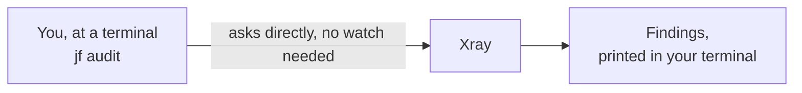

# 04 - CLI

**Format:** Guided, with a closing challenge
**Duration:** _placeholder, set in Phase 8_
**Prerequisites:** [lab 00](../00-setup/README.md), [lab 01](../01-artifactory/README.md), [lab 02](../02-curation/README.md), [lab 03](../03-xray/README.md)

## What you will learn

- How to run a security scan against your own project from a terminal, without opening a browser
- How to read `jf audit` output: severity, applicability and which version fixes a finding
- How to check your dependency tree against a Curation policy before you ever run `npm install` for real
- Why the version a scanner suggests is not always the version you should actually install
- How to remediate a vulnerable dependency properly, rather than by guessing at a version number

## Why this matters

Everything so far has happened in a browser. Curation and Xray are doing real work, but a developer does not want to open the JFrog Platform UI every time they add a dependency. They want an answer in the same terminal they are already sitting in, before they commit anything.

The JFrog CLI gives you that. `jf audit` is the same Xray engine from lab 03, run on demand against whatever is on disk in front of you, with no watch and no policy required first. `jf curation-audit` is the same idea for Curation: it tells you what would happen if you tried to install something, without you having to actually try it and find out the hard way.

Both of these also work without checking their result against `.env` or the workshop's website, so they are the thing you will actually reach for at your own desk after today.

## Concept

Lab 00 already configured the JFrog CLI. A server named `workshop` exists in its configuration, holding your URL and your credential, and every `jf` command you run uses it by default.



That is the important difference from lab 03. A watch is a standing instruction: it looks at a repository or a build continuously, and produces a violation when something matches a policy. `jf audit` is a one-off question, asked the moment you run it, against whatever dependency tree is on your disk right now. It needs no watch and no policy to produce a result, which is why it works the first time you run it, on a project nobody has configured anything for yet.

`jf curation-audit` asks the same kind of one-off question of Curation instead of Xray: given the policy that already exists for your remote repository, which of these dependencies would be allowed through, and which would not?

## Steps

### 1. Confirm your CLI is pointed at your own server

```bash
jf config show
```

You should see a server named `workshop`, with your own URL and username. This is the connection lab 00 set up. If it is missing, go back to lab 00 and run `scripts/setup.sh` before continuing.

### 2. Run your first audit

```bash
cd apps/node-dashboard
jf audit
```

This scans `package.json` and `package-lock.json` in the current directory and asks Xray about every dependency it finds, direct and transitive. Give it a minute. You should get back a table with one row per finding.

`jf audit` runs more than dependency scanning by default. It also runs static analysis and secrets detection against your source, so you will see a couple of rows that are not about a third-party package at all, they are about code in `src/`. Leave those for now. Lab 05 covers what they mean.

> [!IMPORTANT]
> VERIFY: confirm the exact column headings the default table prints on the CLI version this workshop pins. The description below assumes columns for severity, Contextual Analysis, whether the dependency is direct or transitive, the package and version, the CVE, and a fixed-versions column. Add `--extended-table` if a CVSS score or an Xray issue ID is not already visible.

Read the columns rather than just the severity. Each row tells you:

- The **severity**, the same Critical, High, Medium, Low, Unknown scale from lab 03.
- The **Contextual Analysis** verdict, one of the five you already met: Applicable, Not Applicable, Missing Context, Undetermined, Not Covered.
- Whether the dependency is **direct or transitive**.
- The **CVE identifier**.
- A **fixed versions** field: the version, or versions, that Xray's data says resolves this particular finding.

### 3. Find axios, and notice something uncomfortable

Look for the rows naming `axios`. There are several, and this is where applicability earns its place in the conversation rather than staying a lab 03 abstraction.

Every Critical severity finding against `axios` in this application comes back **Not Applicable** or **Missing Context**. Not one of them is Applicable. If you had decided, reasonably, to only ever act on Applicable findings, you would look at this list and conclude there was nothing here worth your time.

There is also a High severity finding against `axios` that **is** Applicable. That is the one that should catch your attention regardless of how you feel about the Criticals, and it is a real, working example of exactly what lab 03 warned about: a policy that skips non-applicable findings by default would have walked straight past three unpatched Critical-severity issues in a package with no scanner-suppressible history and stopped only at the one thing it was willing to look at.

### 4. Remediate axios

Read the fixed-versions field for the axios findings. It names the version, or the earliest version, that clears them.

Edit `package.json` and set `axios` to that version. Pin it exactly, no caret or tilde, matching how every other dependency in this file is already pinned.

```bash
npm install
jf audit
```

Run the audit again. The axios rows should be gone entirely, Applicable and non-Applicable alike, because the fix is a version bump rather than a suppression.

> [!NOTE]
> Do not commit this change. Remediation here is one-way and the sample application resets when a fresh Codespace is created, so there is nothing to undo, but there is also no branch or pull request expected from this lab. `node_modules` and your edited `package.json` exist only in your own Codespace for the rest of the workshop.

## Checkpoint

1. `jf config show` lists a server named `workshop` pointed at your own instance.
2. `jf audit` inside `apps/node-dashboard` ran to completion and printed a table of findings.
3. You can point at a Critical finding against `axios` that is marked Not Applicable, and explain in one sentence why that does not mean ignore it.
4. `axios` no longer appears in `jf audit` output after the version bump.

## What just happened

You asked Xray a question directly, without a watch, a policy or a browser tab, and got the same underlying analysis lab 03 showed you through the UI. That is the value of the CLI: the same engine, the same data, available at the point you are actually making a decision, which is normally the moment before you type `npm install`.

The applicability point is worth restating, because it is easy to read once and file away as theory. A scanner that only surfaces Applicable findings is not wrong, but it is answering a narrower question than "is this package safe to keep." `axios` here proves that a package can carry Critical findings that are all Not Applicable and still be worth remediating, because the one thing that was Applicable was hiding behind them.

## Challenge

🎯 **The scenario**

A colleague on another team asks you a favor. They are about to run `npm install node-fetch@latest` in a project of their own, on the strength of a StackOverflow answer that says the CVEs against the version they are on were fixed years ago. Before they do, they want to know whether that command actually does what they think it does, and whether there is anything about your own project that would tell them.

**Success criteria**

- You have used `jf curation-audit` against `apps/node-dashboard` and can say what it reports for every dependency, including `highcharts`.
- You can explain what `jf curation-audit` shows for `highcharts` and why it is allowed rather than blocked, given lab 02.
- `node-fetch` no longer appears in a fresh `jf audit` run.
- You can say, in a sentence a colleague would actually accept, why `npm install node-fetch@latest` is not the same thing as fixing the CVEs against `node-fetch@2.6.0`.

**Documentation**

- [Scan Your Source Code](https://docs.jfrog.com/security/docs/scan-your-source-code)
- [How to Use JFrog Curation as a Developer with the JFrog CLI](https://docs.jfrog.com/security/docs/how-to-use-jfrog-curation-as-a-developer-with-the-jfrog-cli)

**Timebox: 15 minutes.**

<details>
<summary>Solution</summary>

```bash
cd apps/node-dashboard
jf curation-audit --working-dirs .
```

Every dependency in the project is checked against your `user01-approved-licenses` policy from lab 02, and the summary sorts them into three groups: blocked, marked ❌, warning, marked ⚠️, and approved, marked ✅.

> [!IMPORTANT]
> VERIFY: confirm which group `highcharts@8.2.0` actually lands in. It should be allowed rather than blocked, because a waiver already exists for it from lab 02, but whether an actively-waived package is reported as approved outright or as a warning naming the waiver has not been checked against a live tenant.

Either way, this is the same waiver you approved yourself in lab 02, now visible from a terminal instead of the Curation audit view. Everything else with a permissive license reports approved without comment.

Now the actual favor. Look at what `jf audit` says about `node-fetch`:

```bash
jf audit
```

The two `node-fetch@2.6.0` findings are both Medium, and the fixed-versions field points at a later release still inside the `2.x` line, not at `3.x`.

That is the answer for your colleague. `node-fetch@3` is a major version that dropped CommonJS support entirely: it ships as an ES module only, and a project written with `require('node-fetch')` will not load it at all. Running `npm install node-fetch@latest` on a CommonJS project does not fix the CVEs so much as break the build while appearing to succeed, since npm has no way to know that the newest version is the wrong shape for this codebase.

Fix it properly instead:

```bash
npm install node-fetch@<the 2.x version jf audit's fixed-versions field names>
jf audit
```

The `node-fetch` findings clear, the package stays on the `2.x` line your `require()` calls depend on, and nothing else in the project needs to change. Pinned dependency, no ranges, exactly like `axios` above.

The one-sentence version for your colleague: the CVEs are fixed in a `2.x` release, and `latest` would have taken them to `3.x`, a different major version with a breaking change that has nothing to do with security. "Latest" answers "newest," not "safe," and definitely not "compatible."

</details>

## Going further

This section is optional. Nothing later depends on any of it.

**Run `jf audit` with a different output format.** Try `--format=json` or `--format=sarif` and think about which of those a CI pipeline would actually want. Lab 07 answers this properly.

**Look at what `jf audit` reports for `jsonwebtoken` and `express`.** Both are still unpatched by design, kept for later labs. Confirm you can see why they are Medium and High rather than Critical, and consider whether that changes how urgently you would act on them at work.

**Read the fixed-versions field for `tar`.** It carries the transitive `minimist` Critical that lab 07 deals with. Notice that bumping `tar` on its own, right now, would already clear it. Resist the temptation: lab 07 needs it for the build trace.

## Troubleshooting

**`jf audit` hangs or times out.** Confirm `jf config show` lists your own server and that `jf rt ping` succeeds. A stale or missing server configuration is the usual cause.

**`jf audit` reports nothing at all.** Confirm you ran it from inside `apps/node-dashboard`, not the repository root. It scans the manifest in the current directory.

**`jf curation-audit` reports everything as blocked, including packages you expect to be fine.** Check the Curation policy scope from lab 02 is still set to your own `user01-npm-remote` and has not been accidentally widened or disabled by someone else sharing the `workshop-admin` account.

## Next

[05 - IDE](../05-ide/README.md): the same findings, without leaving your editor.
