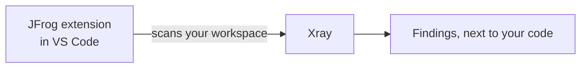

# 05 - IDE

**Format:** Guided, with a closing challenge
**Duration:** _placeholder, set in Phase 8_
**Prerequisites:** [lab 00](../00-setup/README.md), [lab 01](../01-artifactory/README.md), [lab 03](../03-xray/README.md)

## What you will learn

- How to connect the JFrog VS Code extension using the connection you already have, without retyping a credential
- How to read a finding where it actually matters: next to the code, rather than in a browser tab or a terminal
- How Contextual Analysis explains itself, not just states a verdict
- How to tell a dependency finding from a finding in your own source code, and why the second kind deserves more attention, not less
- How to remediate a dependency from inside the editor

## Why this matters

`jf audit` in lab 04 answered a question you asked. The IDE extension is built for the moment before you would have thought to ask it: you are adding a package, or just opened a file, and the finding is already sitting there in the editor.

It is the same Xray backend as labs 03 and 04, which matters more than it sounds. Three different surfaces, browser, terminal, editor, and one underlying answer. What changes is when you see it and how much explanation comes with it.

## Concept

The extension you need is already installed in this Codespace: `JFrog.jfrog-vscode-extension`, visible as a **JFrog** icon in the activity bar on the left edge of VS Code.



Two kinds of finding show up once you scan, and they are not the same kind of thing.

- **SCA findings**, software composition analysis, are about a third-party dependency. `lodash` at the version this app ships is one. These are what you have been remediating since lab 04.
- **SAST findings**, static application security testing, are about code written for this workshop. There are two of these already documented in the application's own [README](../../apps/node-dashboard/README.md#static-analysis-findings), and they are left in the codebase on purpose. A dependency CVE is somebody else's bug. A SAST finding is one you could have written yourself, in a file you can open right now, and that is exactly why it is worth reading closely rather than fixing on autopilot.

## Steps

### 1. Open the JFrog tab and sign in

Click the **JFrog** icon in the activity bar.

The extension needs to know which JFrog Platform to talk to. Rather than typing your URL and password again, look for an option to connect using your **JFrog CLI's connection details**. Lab 00 already configured that connection, so this should pick it up without asking you for anything further.

> [!IMPORTANT]
> VERIFY: confirm the exact wording of this option in the sign-in view on the extension version this workshop pins, and that it correctly reuses the `workshop` server from `jf config show` rather than prompting for fresh credentials.

<!-- SCREENSHOT: labs/05-ide/images/extension-sign-in.png
     Capture: the JFrog extension sign-in view, with the option to reuse the
     JFrog CLI's connection details visible. -->

### 2. Scan the workspace

Open the folder `apps/node-dashboard` in VS Code if it is not already your working folder, then find the **Scan** button in the JFrog tab and run it.

> [!IMPORTANT]
> VERIFY: confirm the exact label and location of the scan control, and whether results appear in a single tree or are split across separate views for local work and CI results, on the extension version this workshop pins.

This takes a little while the first time. When it finishes, you get a tree of results, organized by file and by dependency.

<!-- SCREENSHOT: labs/05-ide/images/extension-scan-results.png
     Capture: the JFrog extension results tree after a completed scan, showing
     both a dependency finding and a source code finding. -->

### 3. Read the lodash finding, all the way through

Find `lodash` in the results tree and open its Critical severity finding.

Unlike the CLI table from lab 04, the extension gives you a written explanation alongside the verdict rather than just the word. Read it. It should tell you the same thing lab 03 and lab 04 have both already shown you about this exact CVE: marked **Not Applicable**, with reasoning for why, specific to how this application actually uses the package.

Remediate it anyway. `lodash@4.17.15` carries several other findings alongside this one, and the version is old enough on its own to be worth replacing regardless of how any single CVE is marked.

```bash
cd apps/node-dashboard
npm install lodash@<the version the finding's fix suggestion names>
jf audit
```

Confirm `lodash` no longer appears.

### 4. Read the two SAST findings, and leave them alone

Find the two findings against `src/app.js`. Open each one.

You should be able to follow the explanation without needing a security background: one is a JWT verification call that does not restrict which signing algorithms it will accept, and the other is an Express application missing standard security headers. Both are described in the application's own dependency table, and both are correct, not scanner noise.

Do not fix these. They stay in the application for the rest of the workshop. The point of reading them here is the contrast with everything else you have remediated so far: `lodash` was somebody else's bug, shipped to you as a dependency. These two are not. They are lines in a file this repository owns, and if you were building this application for real, they would be exactly as easy to fix as they are to read.

## Checkpoint

1. The JFrog tab shows you as signed in, using the connection from lab 00 rather than a freshly typed credential.
2. A completed scan shows both an SCA finding and a SAST finding for `apps/node-dashboard`.
3. You can read out, in your own words, why the extension marks the lodash Critical as Not Applicable.
4. `lodash` no longer appears in a fresh scan or in `jf audit`.
5. You can name the two SAST findings and explain why neither is being fixed today.

## What just happened

You saw the same Xray verdicts from labs 03 and 04 again, but this time with the reasoning attached rather than just the label. That is the actual value the IDE adds over the CLI and the UI: not new data, the same data, delivered with enough explanation that a developer can decide for themselves whether to act, rather than trusting or ignoring a severity number.

The SAST findings did something different. Every dependency you have remediated so far, `axios`, `node-fetch`, now `lodash`, was a version number to bump. These two were not. They were a design decision in a `jwt.verify` call and a missing middleware line, both fixable with a code change rather than a package upgrade, and both entirely within this project's own control. Supply chain security tools spend most of their time talking about other people's code. It is worth noticing when a finding is actually about yours.

## Challenge

🎯 **The scenario**

Your team lead has heard you have been fixing dependency findings all morning and asks a fair question: "how do I know you are not just clearing the ones that happen to be easy, and leaving the ones that actually matter?" They want you to remediate the next one and be able to answer that question with something better than a severity number.

**Success criteria**

- `moment@2.29.1` no longer appears in a scan or in `jf audit`.
- You can name both CVEs against the version you started with.
- You can say which of the two is marked Not Applicable, what the extension's explanation says, and why remediating it anyway was still the right call.

**Documentation**

- [Scan Your Source Code](https://docs.jfrog.com/security/docs/scan-your-source-code)
- [SAST](https://docs.jfrog.com/security/docs/sast-1)

**Timebox: 15 minutes.**

<details>
<summary>Solution</summary>

```bash
cd apps/node-dashboard
```

Open the `moment` finding in the extension's results tree, or run `jf audit` from lab 04's habit if you would rather read it in the terminal. Either surface shows the same two CVEs: `CVE-2022-24785` and `CVE-2022-31129`.

> [!IMPORTANT]
> VERIFY: confirm against a live scan which of the two carries which Contextual Analysis verdict. Read whichever one comes back Not Applicable and its stated reasoning before writing your answer.

The answer for your team lead is the same shape as the axios and lodash answers already were. A Not Applicable verdict tells you this particular exploit path does not reach your code today. It does not tell you the package is safe, and it does not tell you your code will never change in a way that opens that path tomorrow. Remediating anyway is not caution for its own sake, it is the difference between "safe right now, by chance" and "safe on purpose."

Fix it the same way as the others:

```bash
npm install moment@<the version the finding's fix suggestion names>
jf audit
```

`moment` should no longer appear.

</details>

## Going further

This section is optional. Nothing later depends on any of it.

**Right-click a dependency in `package.json`** and look for a scan option in the editor's context menu, rather than going through the JFrog tab. Confirm it gives you the same result as the sidebar scan.

**Compare the explanation text for the same CVE** across the CLI, the extension and the Xray UI from lab 03. Same verdict, three different amounts of supporting detail. Think about which surface you would actually reach for at 4pm on a Friday with a release going out.

**Look at whether the extension offers a quick fix action** on either SAST finding, without applying it. If your Codespace has GitHub Copilot available, there may also be an option to hand the finding to it directly. Read what it would change, and decide for yourself whether you agree with it.

## Troubleshooting

**The JFrog tab shows no sign-in option, or fails to connect.** Confirm `jf config show` still lists your `workshop` server and `jf rt ping` succeeds. The extension depends on the same configuration lab 04 used.

**A scan finishes with no results at all.** Confirm you scanned `apps/node-dashboard` and not the repository root. Some extension versions scan whatever folder is currently open, not the whole workspace.

**The lodash Critical finding is missing its Contextual Analysis explanation.** This requires the same Xray capability lab 03 depends on. If it is missing here, it was already flagged as a risk against the tenant in `docs/verification-checklist.md`, not something wrong with your Codespace specifically.

## Next

[06 - MCP](../06-mcp/README.md) _(optional)_: asking an AI coding agent to check a package before you ever run install.
