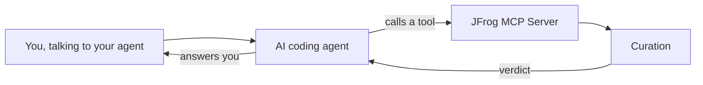

# 06 - MCP

_(optional)_

**Format:** Guided, with a closing challenge
**Duration:** _placeholder, set in Phase 8_
**Prerequisites:** [lab 00](../00-setup/README.md), [lab 01](../01-artifactory/README.md), [lab 02](../02-curation/README.md), [lab 04](../04-cli/README.md)

> [!NOTE]
> This lab is optional. It depends on an AI coding agent being available in the room, which is not guaranteed on every delivery. Nothing later in the workshop assumes you did it. If you skip it, `jf curation-audit` from lab 04 already gives you the same underlying answer.

## What you will learn

- How to connect an AI coding agent to the JFrog Platform, using the Model Context Protocol
- How to ask that agent to check a package against your own Curation policy before you install it
- How to turn a compliance verdict into a written recommendation somebody else can act on
- Why this is not a new capability so much as a new place to reach it from

## Why this matters

An AI coding agent that writes code for you will also, sooner or later, suggest a dependency for you. It has no way of knowing that your organization has an opinion about that dependency's license, its age, or whether anyone has approved it. Left alone, it will happily propose `npm install` on something your own Curation policy would refuse the moment it actually ran.

Connecting the JFrog MCP Server closes that gap. Instead of the agent guessing, it can ask, in the middle of a conversation, before anything lands in your `package.json`.

## Concept

MCP, the Model Context Protocol, is how an AI coding agent calls a tool rather than just generating text. The JFrog MCP Server exposes a set of tools an agent can call, including one that checks a candidate package against your Curation policies and returns a real verdict.



This is the same policy you built in lab 02 and the same underlying check `jf curation-audit` ran for you in lab 04. Nothing new is being enforced. What changes is that the question can now be asked in plain language, by something that was going to suggest the package to you anyway.

> [!IMPORTANT]
> VERIFY: confirm the JFrog MCP Server is enabled on this workshop's tenant. A Platform Admin has to turn it on before any attendee can connect to it, which is a tenant-level setting rather than something an attendee can enable from inside their own project.

## Steps

This lab is written host agnostically. Whatever AI coding agent you are using, whether that is this one or something else, the shape of the setup is the same: point it at a URL, authorize it, and confirm it can see your project.

### 1. Add the JFrog MCP Server to your agent

Your agent's MCP configuration needs one entry, pointed at your own instance:

```json
{
  "mcpServers": {
    "jfrog": {
      "url": "<JF_URL>/mcp"
    }
  }
}
```

Use the `JF_URL` value from your own `.env`. Some clients need one extra field in that same object, for example `"type": "http"`, and some clients keep this file in a different place entirely, for example `.vscode/mcp.json` rather than a global settings file. Check your agent's own documentation for exactly where this configuration lives.

> [!IMPORTANT]
> VERIFY: confirm the exact configuration shape and file location for the specific agent this workshop's attendees are most likely to be using, and whether the extra `"type": "http"` field is still required on the current client version.

### 2. Authorize it

Once the configuration is saved, your agent should prompt you to authorize the connection, typically by opening a browser tab and asking you to sign in and approve it. This is the same shape of approval as the `npm login --auth-type=web` step from lab 01, a browser tab confirming that the terminal, or in this case the agent, really is acting on your behalf.

> [!IMPORTANT]
> VERIFY: confirm the exact authorization flow on a live tenant. It is described here as an OAuth-style browser approval, based on documented behavior rather than a captured run.

### 3. Confirm it is connected

Ask your agent something that proves the connection works without needing a Curation policy at all, for example:

```
What JFrog tools do you have available?
```

You should get back a list that includes a Curation compliance check, alongside others for Xray and the JFrog Catalog. If your agent instead says it has no such tools, the connection did not complete. See Troubleshooting.

### 4. Add a policy for unmaintained packages

Back as `workshop-admin`, in a private window, the same account and the same discipline as lab 02.

Create a new Curation policy, named with your own prefix, scoped to your own `user01-npm-remote` repository only. This time, choose the condition for a package version that is aged with no newer version identified, rather than the immaturity one from lab 02's challenge. It catches the opposite situation: not a package too new to have been reviewed, but one so old that nobody is maintaining it at all.

> [!IMPORTANT]
> VERIFY: confirm the exact condition name and capitalization as it appears in the Curation UI. Documented as blocking package versions released more than two years ago with no newer version available.

<!-- SCREENSHOT: labs/06-mcp/images/curation-aged-policy.png
     Capture: the Curation policy form with the Package Version is Aged, No
     Newer Version Identified condition selected and the scope set to the
     attendee's own remote repository. -->

Save it, then switch back to your own account.

### 5. Ask your agent

Now ask it something closer to what would actually happen at work:

```
Check whether request version 2.88.0 for npm is allowed by my Curation policy.
```

It should call the compliance check tool and come back with a verdict. `request` was deprecated by its own maintainers in 2020 and has had no meaningful release since, which is exactly what the condition you just created is looking for.

## Checkpoint

1. Your agent's MCP configuration lists a JFrog server pointed at your own instance, and it is authorized.
2. Asking your agent what tools it has lists at least one Curation-related tool.
3. A Curation policy exists, with your prefix, scoped to your own remote, using the aged-package condition.
4. Asking your agent to check `request@2.88.0` returns a real blocked verdict, not a guess.

## What just happened

The verdict your agent gave you did not come from its own training. It came from the same Curation policy you built by hand in lab 02 and queried from a terminal in lab 04, reached this time through a tool call triggered by a plain-language question. Three surfaces, one policy, and the same answer regardless of which one you ask.

The part worth keeping is the timing. Every other check in this workshop happens after you have already decided to install something: Curation blocks the `npm install`, `jf audit` reports on what is already in `package-lock.json`. Asking your agent happens before either of those, in the middle of a conversation about what to add in the first place.

## Challenge

🎯 **The scenario**

Partway through a task, your agent proposes adding `request@2.88.0` to `package.json` to make an HTTP call. It is a well-known name and the suggestion looks entirely reasonable. Before you accept it, a teammate who is not in the room asks you to check it properly and tell them what you found, in writing, so they can decide whether to override you if they disagree.

**Success criteria**

- You asked your agent to check `request@2.88.0` and have the tool's actual verdict and stated reason in front of you, not a guess.
- You have written one paragraph a teammate could read and act on without needing to run the check themselves: what was proposed, what the policy found, and what you would use instead.
- Your recommended alternative is something actually available in this application's runtime, not just a name.

**Documentation**

- [Curation Compliance Check](https://docs.jfrog.com/security/docs/curation-compliance-check)
- [How to Prevent the Use of Deprecated or Outdated Packages in Development](https://docs.jfrog.com/security/docs/how-to-prevent-the-use-of-deprecated-or-outdated-packages-in-development)

**Timebox: 15 minutes.**

<details>
<summary>Solution</summary>

The check itself is step 5 above, repeated with intent:

```
Check whether request version 2.88.0 for npm is allowed by my Curation policy.
```

The verdict should come back blocked, against the aged-package condition, with `request`'s own deprecation as the reason it matches: no newer version exists because the maintainers stopped releasing it.

The recommendation for your teammate, in the register they would actually want:

> The agent proposed `request@2.88.0` for an HTTP call. Our Curation policy blocks it: the package was deprecated by its own maintainers in 2020 and has had no release since, so nobody is fixing anything that turns up in it from here on. This Codespace runs Node 22, which has a built-in `fetch` function needing no dependency at all, and it is what I would use instead. If there is a reason to override this, it should go through a waiver, not around the policy.

Node 18 and later ship a global `fetch`, so for a simple HTTP call there may be nothing to install at all. Where a project genuinely needs more, `axios` at the version you remediated to in lab 04 is actively maintained and already inside this workshop's own dependency tree.

The property this whole exercise depends on is that the recommendation is checkable. Anyone reading it can run the same check and get the same answer, rather than trusting your judgment on faith.

</details>

## Going further

This section is optional. Nothing later depends on any of it.

**Ask your agent to check a package it has never suggested**, one you choose yourself, against your policy. Try one you expect to pass and one you expect to fail, and confirm both match what you would have predicted from lab 02's rules.

**Ask your agent to list your pending or approved Curation waiver requests.** You should see the `highcharts` waiver from lab 02, now visible from a third surface.

**Compare the wording of the verdict your agent gives you** with the wording `jf curation-audit` gave you in lab 04. Same underlying data, and worth noticing whether the agent adds anything, or loses anything, in translation.

## Troubleshooting

**Your agent has no JFrog tools available at all.** The MCP Server connection did not complete. Recheck the configuration from step 1, and confirm your agent has actually been restarted or reloaded since you saved it, since most clients only pick up MCP configuration changes on a restart.

**Your agent has JFrog tools, but the Curation check fails or times out.** Confirm the JFrog MCP Server is actually enabled on this tenant. This is a platform administrator setting, not something you can fix from your own project, and it carries a VERIFY flag above for exactly that reason.

**The verdict for `request@2.88.0` comes back allowed.** Check the policy from step 4 is scoped to your own `user01-npm-remote`, is enabled, and is actually using the aged-package condition rather than the immaturity one from lab 02, which looks for the opposite thing.

## Next

[07 - GitHub Actions](../07-github-actions/README.md): the same tooling, running on every push instead of on request.

> [!NOTE]
> Lab 07 is added in build phase 5. This link becomes live then. See the [module index](../../README.md#modules) for what is available now.
